# 串

## 做题总结


## 知识总结


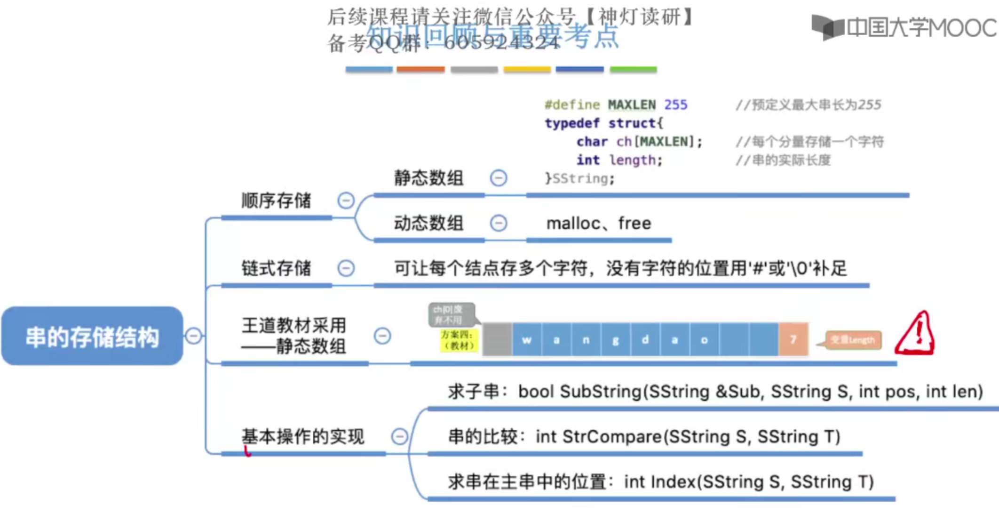

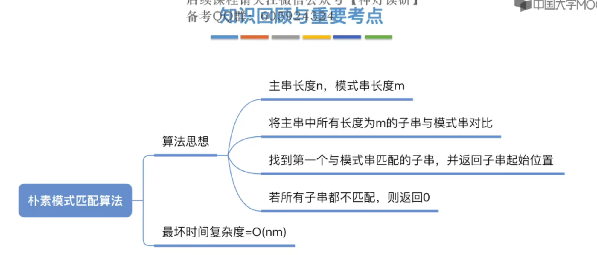

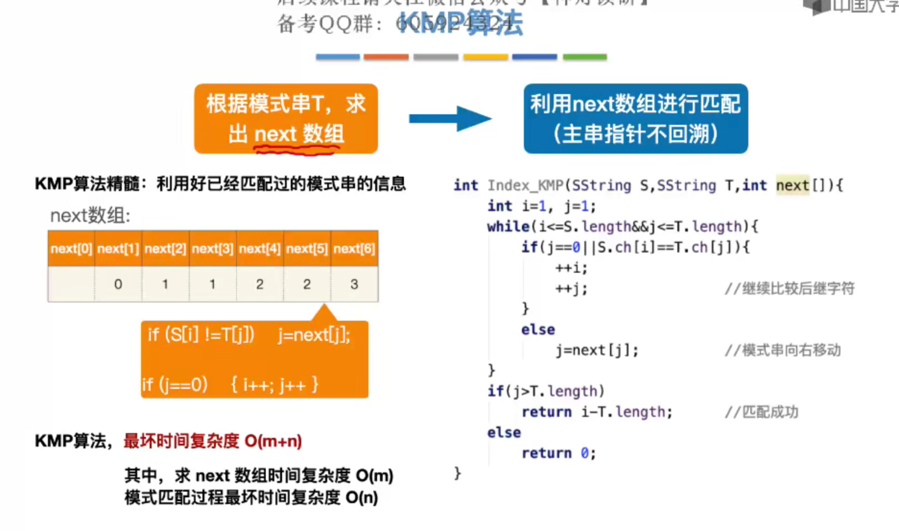

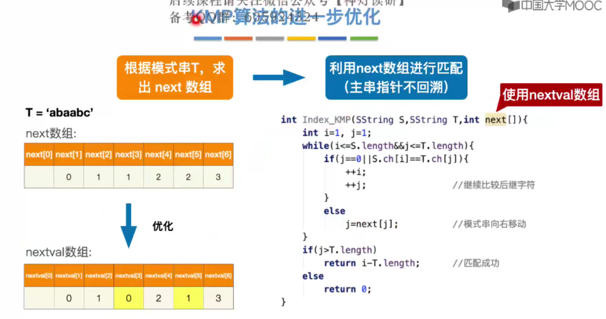](./assets/image-20230701143309420.png)


## 字符串

### 定义

由零个或多个字符组成的有限序列。一般记为S='a1,a2,a3...an'(n>= 0)

其中，S是**串名**，单引号括起来的字符序列是串的值；ai可以是数字、字母或者其他字符；串中字符的个数n称为**串的长度**。n=0时的串称为**空串**


例如：S="HelloWorld!"  T='iPhone 11 pro max?'

### 重要术语

#### 子串

串中任意个连续的字符组成的子序列

例如：‘iPhone’ 'Pro M'就是串T的子串


#### 主串

包含子串的串    

例如：T是子串'iPhone'的主串


#### 字符在主串中的位置

字符在串中的序号

例如：'1'在T中的位置是8（第一次出现）


#### 子串在主串中的位置

子串的第一个字符在主串中的位置

例如：'11 Pro'在T中的位置是8


#### 空串 VS 空格串

M = ''    M是空串

N = '   '  N是由三个空格字符组成的空格串，每个空格字符占1B


#### 串 VS 线性表

串是一种特殊的线性表，数据元素之间呈线性关系


串的数据对象限定为字符集（如中文字符、英文字符、数字字符、标点字符）

串的基本操作，如增删改查等**通常以子串为操作对象**


## 串的基本操作


- StrAssigh(&T,chars):  赋值操作。把串赋值为chars
- StrCopy(&T, S): 复制操作。由串S复制得到串T
- StrEmpty(S): 判空操作。若S为空串，则返回TRUE，否则返回FALSE
- StrLength(S): 求串长。返回串S的元素个数
- ClearString(&S): 清空操作。将S清为空串
- DestroyString(&S): 销毁串。将串S销毁（回收存储空间）
- Concat(&T,S1,S2): 串联接。用T返回由S1和S2连接形成的新串
- SubString(&Sub,S,pos,len): 求子串。用sub返回串S的第pos个字符起长度为len的子串
- Index(S,T): 定位操作。若主串S中存在与串T值相同的子串，则返回它在主串S中第一次出现的位置；否则函数值为0.
- StrCompare(S,T):比较操作。若S>T,则返回值>0; 若S=T，则返回值=0；若S<T,则返回值<0.


 

#### 求子串

```C++
//求子串。用sub返回串S的第pos个字符起长度为len的子串
bool SubString(SString &Sub, SString S, int pos, int len){
    //子串范围越界
    if(pos + len - 1 > S.length) return false;

    for(int i = pos; i < pos + len; i ++) Sub.ch[i-pos+1] = S.ch[i];
    Sub.length = len;
    return true;
}
```


#### 字符串比较

```C++
//比较操作，若S>T,则返回值>0；若S<T,则返回值<0；若S=T，则返回值=0
int StrCompare(SString S, SString T){
    for(int i = 1; i <= S.length && i <= T.length; i ++)
        if(S.ch[i] != T.ch[i]) return S.ch[i] - T.ch[i];
    
    return S.length - T.length;
}
```


#### 定位

```C++
//定位操作。若主串S中存在与串T值相同的子串，则返回它在主串S中第一次出现的位置；否则函数值为0.
int Index(SString S, SString T){
    int i = 1, n = StrLength(S), m = StrLength(T);
    SString sub;
    while(i<=n-m+1){
        SubString(sub,S,i,m);
        if(StrCompare(sub,T)!=0) ++i;
        else return i;
    }
    return 0;
}
```


### 字符串编码

任何数据存到计算机中一定是二进制数。需要确定一个字符和二进制数的对应规则，这就是编码

“字符集”：英文字符——ASCII字符集；中英文——Unicode字符集

- 基于同一个字符集，可以有多种编码方案，如UTF-8，UTF-16
- 采用不同编码方式，每个字符所占空间不同，考研只需默认每个字符占1B即可


### 拓展：编码问题


## 串的存储结构

### 串的静态结构定义

#### 静态数组实现

```C++
#include <stdio.h>
#include <stdlib.h>

/*
    字符串:静态数组实现（定长顺序存储）
*/

#define ElemType int
#define MaxLen 255  //预定义最大串长

type struct{
    char ch[MaxLen];    //每个分量存储一个字符
    int length;         //串的实际长度
}SString;


```

#### 动态数组实现

```C++
#include <stdio.h>
#include <stdlib.h>

/*
    字符串：动态数组实现（堆分配存储）
*/

#define MaxLen 255

typedef struct{
    char *ch;
    int length;
}HString;

HString S;
S.ch = (char *)malloc(MaxLen * sizeof(char)); //用完需要手动free
S.length = 0;
```


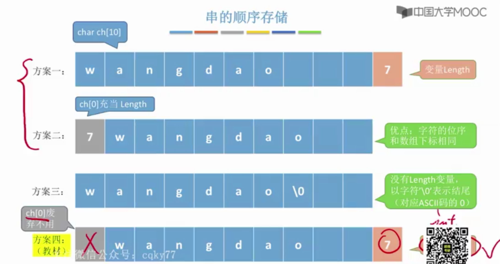

- 方案一：
- 方案二：ch[0]充当Length，最多0-255 存储256个字符
- 方案三：需要遍历才可以知道长度，经常需要长度不建议这样使用

- **方案四：舍弃第一个位序不用，在末尾加一个length变量**


### 串的链式存储

```C++
#include <stdio.h>
#include <stdlib.h>

/*
    串的链式存储
*/

#define ElemType int
#define MaxSize 10

//存储密度低，每个字符1B，每个指针4B
typedef struct StringNode{
  char ch;
  struct StringNode *String;
}StringNode, *String;


//存储密度提高
typedef struct StringNode{
    char ch[4];
    struct StringNode *next;

}StringNode, *String;


```

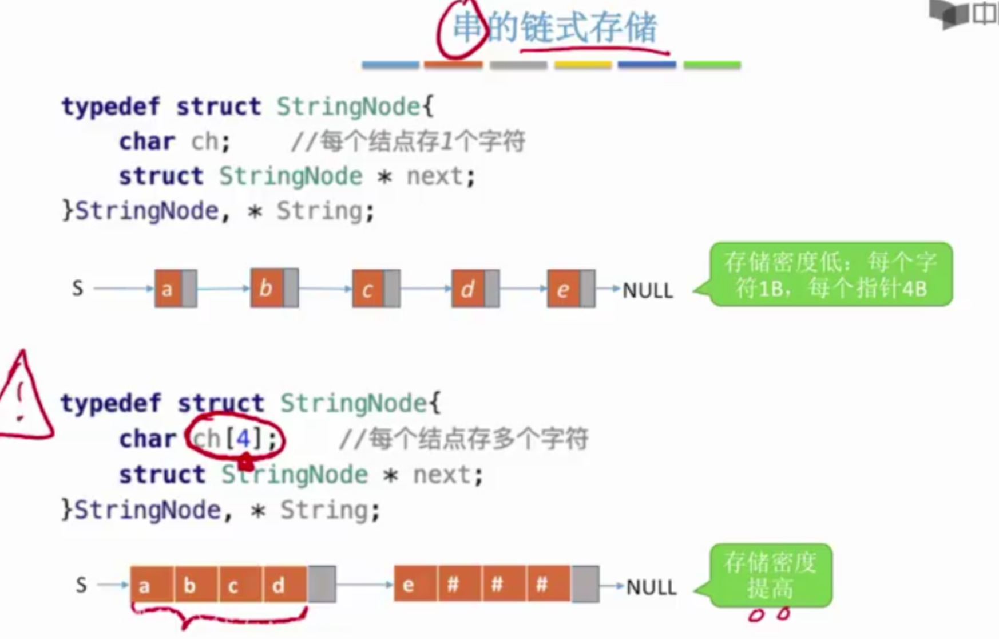

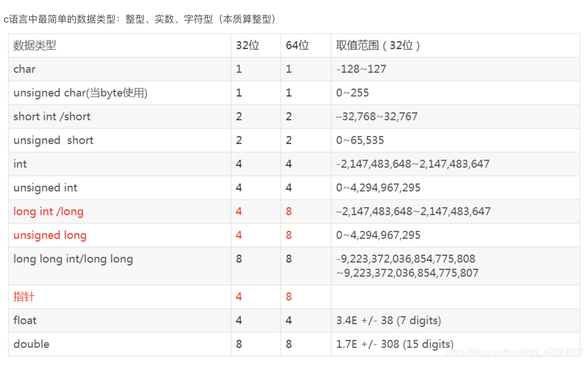

> 32位操作系统中，指针内存占用4B；4 * 8 = 32，指向地址
>
> 64位操作系统中，指针内存占用8B。8 * 8 = 64


### 字符串的模式匹配

#### 定义

在主串中找到与模式串相同的子串，并且返回其所在位置

#### 重要术语

- 模式串：不一定能在主串中找到
- 子串：主串的一部分，一定存在

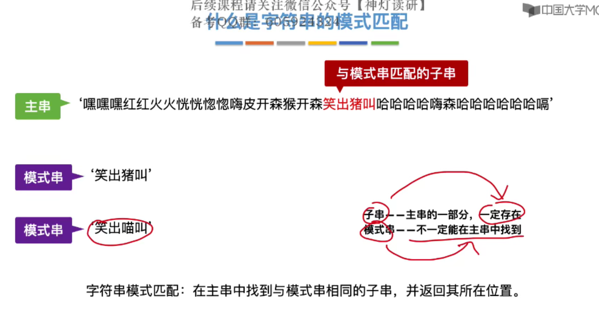

#### 朴素模式匹配算法

- 主串长度为n，模式串长度为m
- 朴素模式匹配算法：将主串中所有长度为m的子串依次与模式串对比，直到找到一个完全匹配的子串，或所有的子串都不匹配为止

- 最多对比n-m+1个子串

#### 使用字符串的基本操作实现

```C++
//定位操作。若主串S中存在与串T值相同的子串，则返回它在主串S中第一次出现的位置；否则函数值为0.
int Index(SString S, SString T){
    int i = 1, n = StrLength(S), m = StrLength(T);
    SString sub;
    while(i<=n-m+1){
        SubString(sub,S,i,m);
        if(StrCompare(sub,T)!=0) ++i;
        else return i;
    }
    return 0;
}
```


#### 使用两个指针实现

当发生失配时，应该令i = i - j + 2, j = 1

**模式串不动，移动主串**

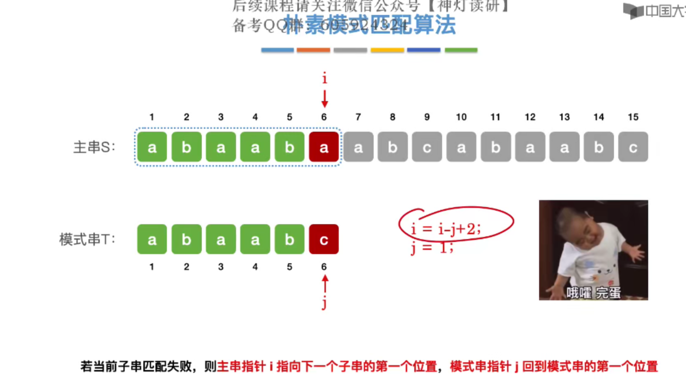

```C++
//字符串的朴素模式匹配
int Index(SString S, SString T){
    int i = 1, j = 1;
    while(i<=S.length && j <= T.length){
        if(S.ch[i] == T.ch[j]) {
            ++i; ++j;   //继续比较后继字符
        }
        else {
            i = i -j + 2;
            j = 1;      //指针后退重新匹配
        }

    }

    if(j > T.length) return i - T.length;
    else return 0;
}
```

设主串长度为n，模式串长度为m，则最坏时间复杂度=O(nm)

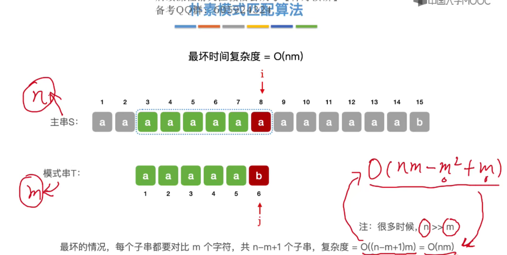

#### KMP算法

有点类似具体问题具体分析

核心思想是当发生失配的时候，前面的适配的元素都是已知并且跟模式串一致的，所以可以根据失配元素的位置具体枚举分析

所以可以从最后一个元素匹配失败依次向前进行分析**（主串不动，移动模式串）** 

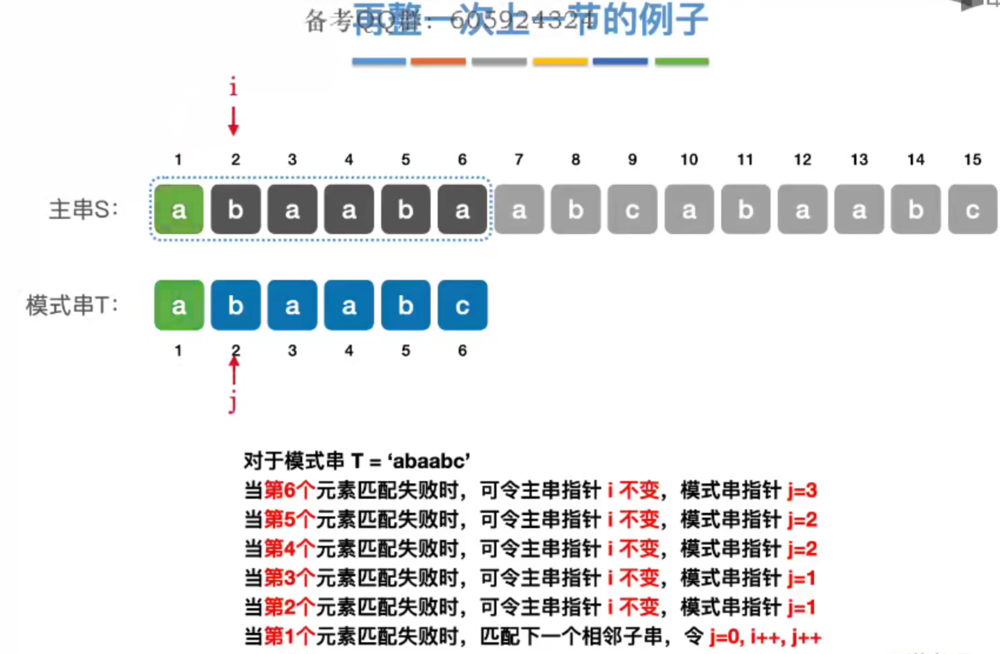

next数组表明了当发生失配的时候，j的值应该指向多少 

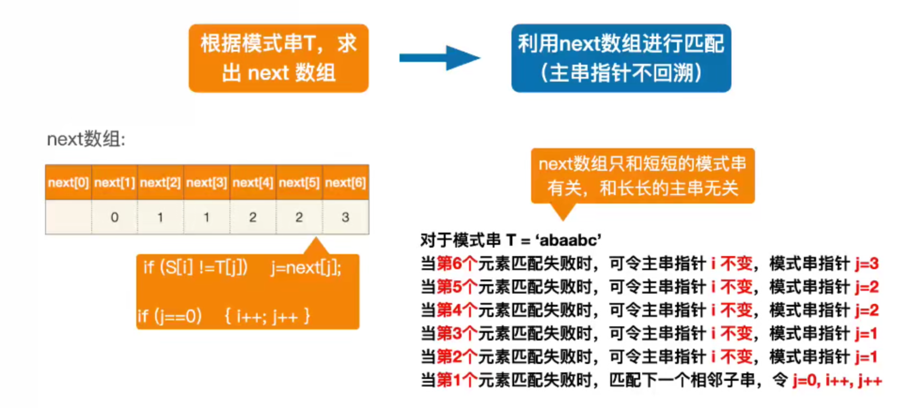

```C++
int Index_KMP(SString S, SString T, int next[]){
    int i = 1, j = 1;
    while(i <= S.length && j <= T.length){
        if(j == 0 || S.ch[i] == T.ch[j]){
            ++i;
            ++j;                //继续比较后继指针
        }
        else j = next[j];       //模式串向右移动

    }

    if(j>T.length) return i - T.length;
    else return 0;

}
```

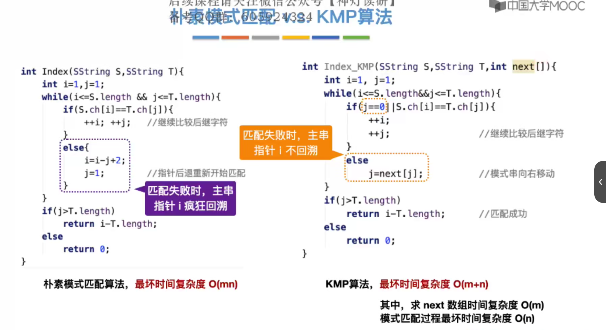

> **只需要掌握手动求next[]数组**


#### 求模式串next数组的手算练习

- next[1]始终为0；next[2]始终为1
- 当i>2，在不匹配的位置前面，划一根分界线，模式串一步一步向前走，直到分界线之前的元素都能对上或者模式串完全跨过分界线为止。此时线后面的j指向哪，next数组就是多少


#### 求模式串next数组的机算和优化(可运行)

```C++
#include <stdio.h>
#include <stdlib.h>


/*
    KMP算法
*/

#define MaxLen 255  //预定义最大串长

typedef struct{
    char ch[MaxLen];    //每个分量存储一个字符
    int length;         //串的实际长度
}SString;

//求next数组
void get_next(SString T, int next[]){
    int i=1,j=0;
    next[1]=0;
    while(i<T.length){
        if(j==0 || T.ch[i]==T.ch[j]){
            ++i; ++j;
            next[i]=j;          //若pi = pj, 则next[j+1]=next[j]+1
            printf("%d  ", next[i]);
        }
        else j = next[j];       //否则令j=next[j],循环继续
    }
    
}

//自己写的）
bool Next_KMP(SString T, int next[]){
    int n = T.length;
    next = (int *)malloc((n+1)*sizeof(int));

    if(n == 0) return false;
    else if(n == 1) next[1] = 0;

    next[1] = 0;
    next[2] = 1;
    printf("1  ");
    for(int i = 3; i <= n; i ++){
        int j = 1, t = 1;
        for(; j < i-1; j ++){
            t = 1;
            
            while(T.ch[t] == T.ch[t + j] && (t < i-j)){
                t ++;
            }
                
            
            if(t >= i - j) break;
            // printf("t = %d, j = %d\n", t, j);
        }
        
        next[i] = t;
        printf("%d  ", next[i]);
    }
    return true;
}

void Nextval_KMP(SString T, int next[], int nextval[]){
    nextval[1]= 0;
    for(int j = 2; j <= T.length; j++){
        if(T.ch[next[j]]==T.ch[j])
            nextval[j] = nextval[next[j]];
        else nextval[j]=next[j];
    }
}

int Index_KMP(SString S, SString T, int next[]){
    int i = 1, j = 1;
    while(i <= S.length && j <= T.length){
        if(j == 0 || S.ch[i] == T.ch[j]){
            ++i;
            ++j;                //继续比较后继指针
        }
        else j = next[j];       //模式串向右移动

    }

    if(j>T.length) return i - T.length;
    else return 0;

}

int main(){
    SString S, T;
    S.ch[1] = 'e';
    S.ch[2] = 'b';
    S.ch[3] = 'e';
    S.ch[4] = 'b';
    S.ch[5] = 'e';
    S.ch[6] = 'e';
    S.length = 6;
    int *next, *next1;
    get_next(S,next1);
    printf("\n");
    if(Next_KMP(S,next)) printf("Successfully!");

    return 0;
}
```


##### 练习1:

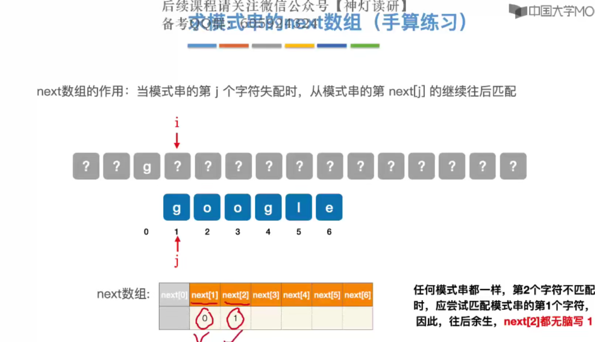


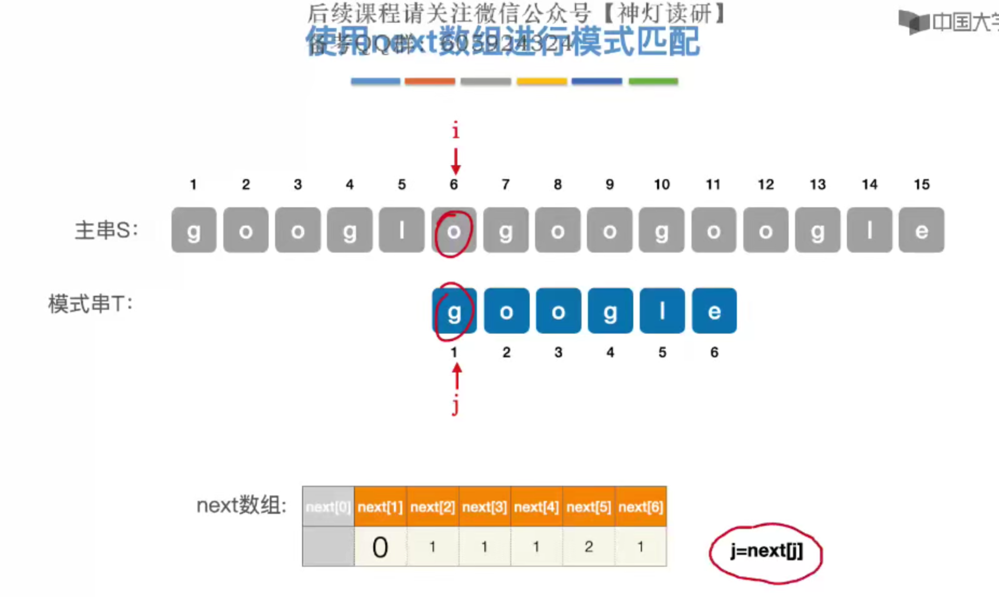

##### 练习2:

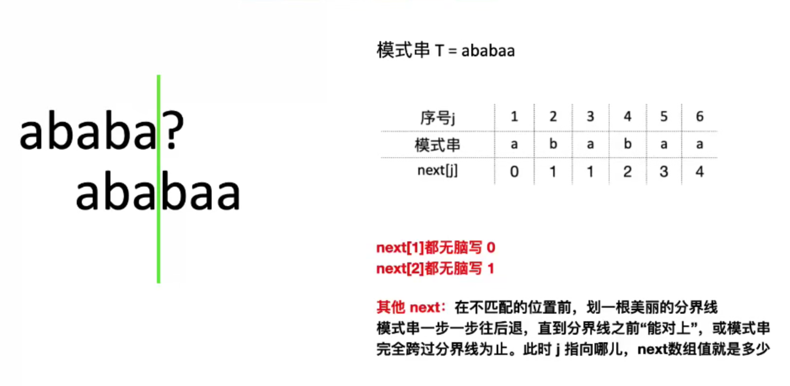


#### next数组的优化

根据指向的字符与原本失配的字符是否相等,求nextval[]数组

```C++
void Nextval_KMP(SString T, int next[], int nextval[]){
    nextval[1]= 0;
    for(int j = 2; j <= T.length; j++){
        if(T.ch[next[j]]==T.ch[j])
            nextval[j] = nextval[next[j]];
        else nextval[j]=next[j];
    }
}
```


##### 练习一：

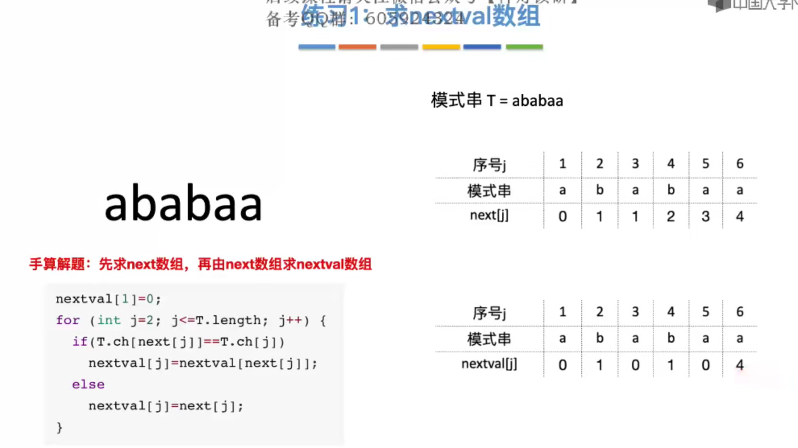

##### 练习二:


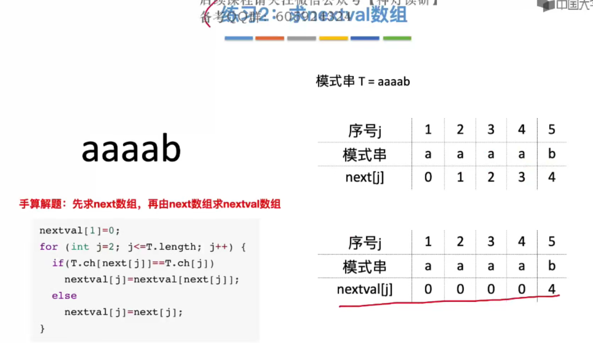


