# 图

## 考点总结

- **有向无环图才存在拓扑排序**
  - 检验有向图是否有环
    - 深度优先遍历
      - 从有向图上的某个顶点 u 出发，在 DFS(u) 结束之前出现一条从顶点 v 到 u 的边，由于 v 在生成树上是 u 的子孙，则图中必定存在包含 u 和 v 的环
    - 拓扑序列
      - 存在无法找到下一个可以加入拓扑序列的顶点
      - 一直存在有入度大于 0 的顶点
  - **在拓扑排序算法中为暂存入度为 0 的顶点，可以用栈，也可以用队列**
    - 若两个节点之间不存在祖先或子孙关系，则它们在拓扑序列中的关系是任意的（即前后关系任意），因此使用栈和队列都可以

- **有向图中如果存在顶点数大于 1 的强连通分量，那么这意味着图中存在环。**
  - 强连通分量是指在有向图中，任意两个顶点之间都存在双向路径的一组顶点。
  - 如果一个有向图中没有环，那么每个顶点都可以看作是一个独立的强连通分量，因为没有循环路径可以连接不同的顶点。

- 最短路径
  - BFS：无权图
  - Dijkstra：不含负权回路的有向图和无向图
    - 与有向无向无关
    - 与有无环路无关
  - Floyd 算法：不可以有负权的环路

### 深度优先生成树和广度优先生成树

- 结论
  - 深度优先生成树的高度大于等于广度优先生成树的高度

[原文链接](http://data.biancheng.net/view/45.html)

本章的第一节中，介绍了有关生成树和生成森林的有关知识，本节来解决对于给定的无向图，如何构建它们相对应的生成树或者生成森林。

其实在对无向图进行遍历的时候，遍历过程中所经历过的图中的顶点和边的组合，就是图的生成树或者生成森林。


例如，图 1 中的无向图是由 V1～V7 的顶点和编号分别为 a～i 的边组成。当使用深度优先搜索 DFS算法时，假设 V1 作为遍历的起始点，涉及到的顶点和边的遍历顺序为（不唯一）：
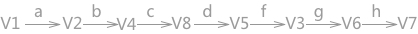


由深度优先搜索得到的树为深度优先生成树。同理，广度优先搜索 DFS生成的树为广度优先生成树，图 1 无向图以顶点 V1 为起始点进行广度优先搜索遍历得到的树，如图 3 所示：


## 知识总结

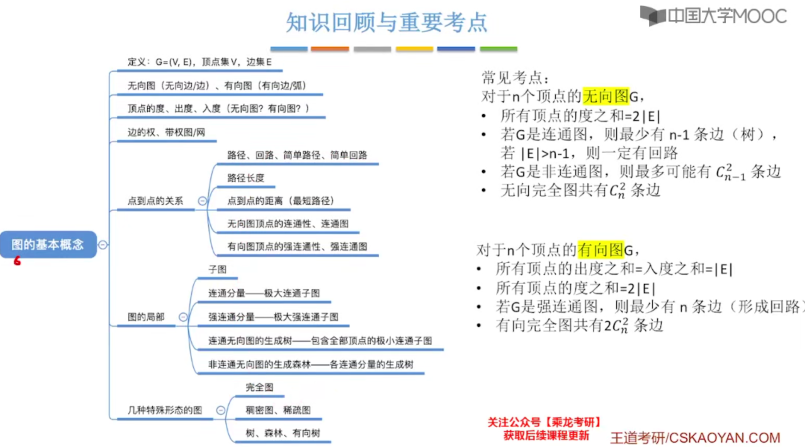


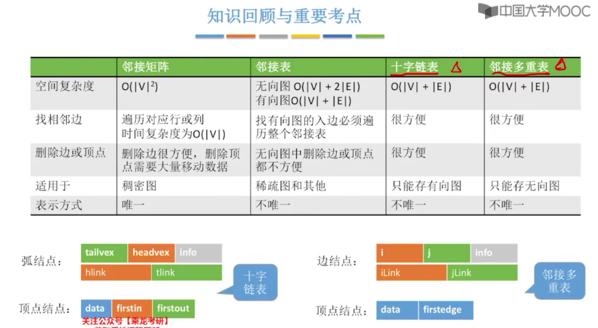

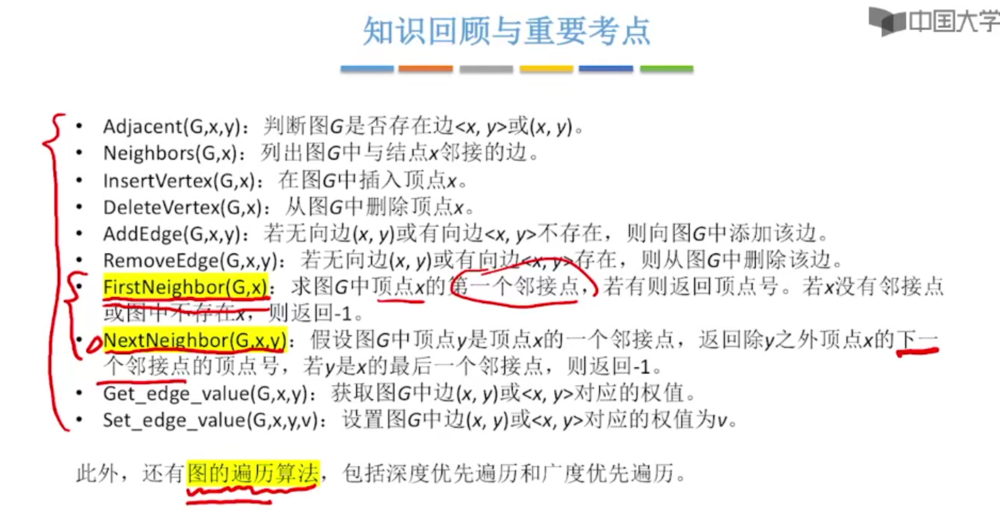


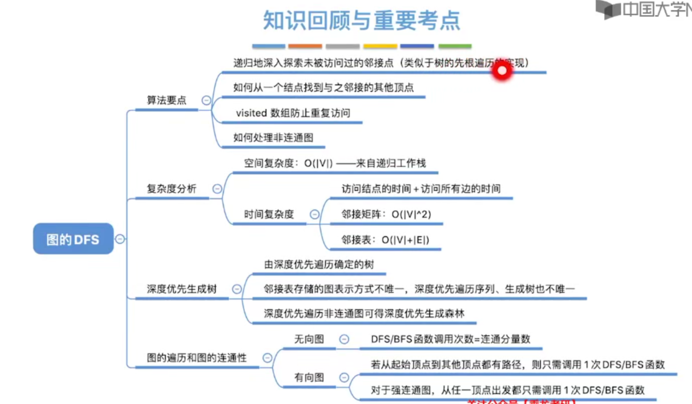


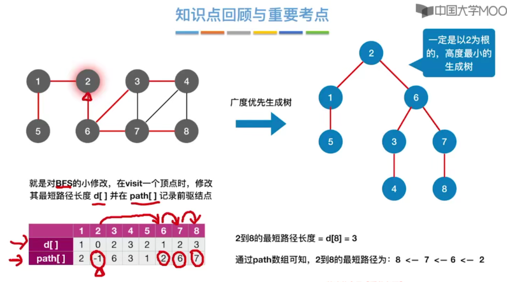


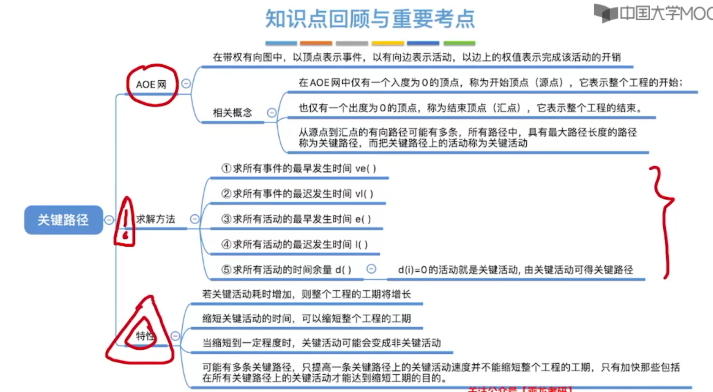

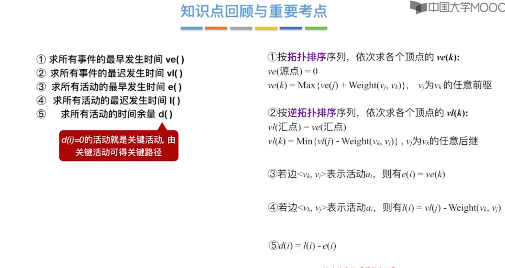


## 图的基本概念

### 图的定义

- 图G由**顶点集V**和**边集E**组成，记为G=(V,E)

- V(G)表示图G中顶点的有限非空集；
- E(G)表示图G中顶点之间的关系（边）集合
- 若V={v1,v2...vn},则用|V|表示图G中顶点的个数，也称**图G的阶**
- E={(u,v)|u属于V,v属于V}
- 用**|E|**表示图G中**边的条数**

> 线性表可以是空表，树可以是空树，但图不可以是空图，即V一定是非空集，但是图的边集E可以是空集

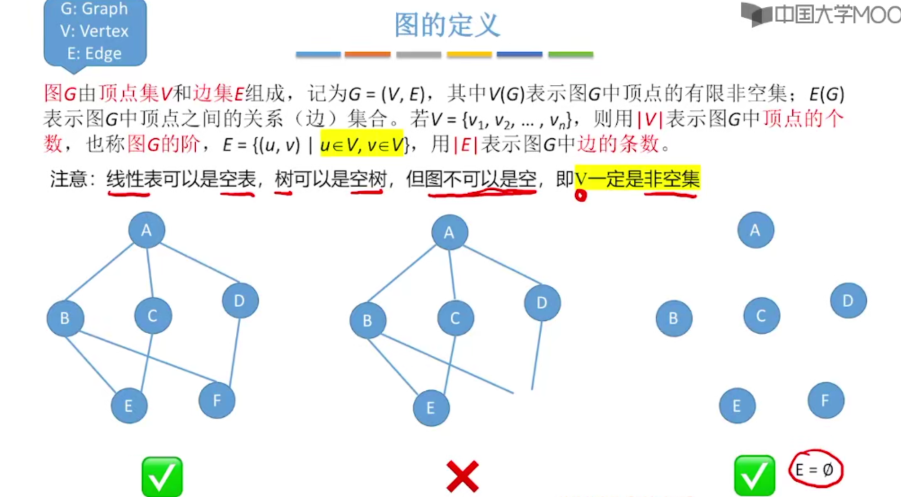

### 逻辑结构的应用

- 铁路网络：V 车站       E 铁路
- 公路交通：V 路口       E 道路
- 微信好友关系——边是没有方向的（好友关系是相互的）
- 微博粉丝关系——边是有方向的（关注是单向的）


### 无向图、有向图

- 无向边：边	 (v,w)=(w,v): v和w是顶点
- 有向边：弧     <v,w>: v是弧尾，w是弧头，方向从v->w(弧尾指向弧头)


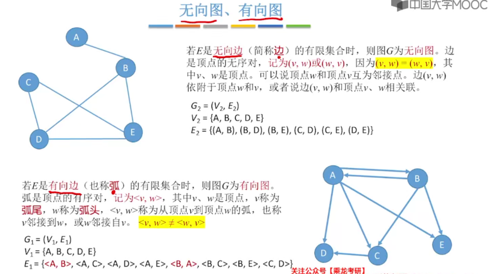

### 简单图、多重图

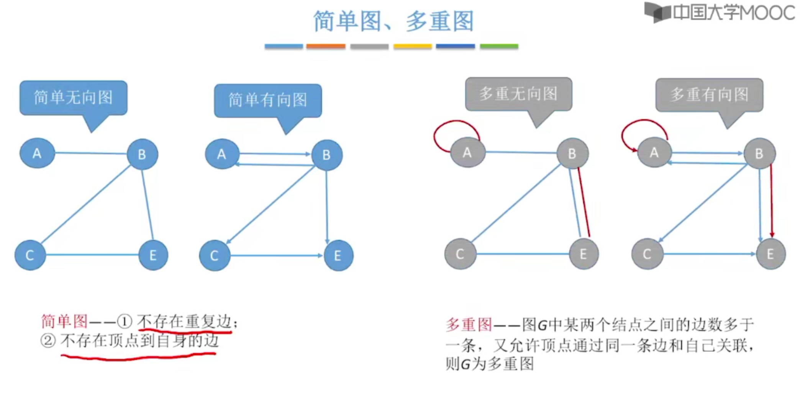

### 顶点的度、入度、出度

- 对于无向图：顶点v的度是指依附于该顶点的边的条数，记为TD(v)
  - 所有顶点的度之和 = 2 * |E|（顶点数目的二倍）
- 对于有向图
  - 入度：以顶点v为终点的有向边的数目，记为ID(v)    (进入)
  - 出度：以顶点v为起点的有向边的数目，记为OD(v)  (发射)
  - 顶点v的度等于其入度和出度之和，即TD(v)=ID(v)+OD(v)
  - 入度 == 出度

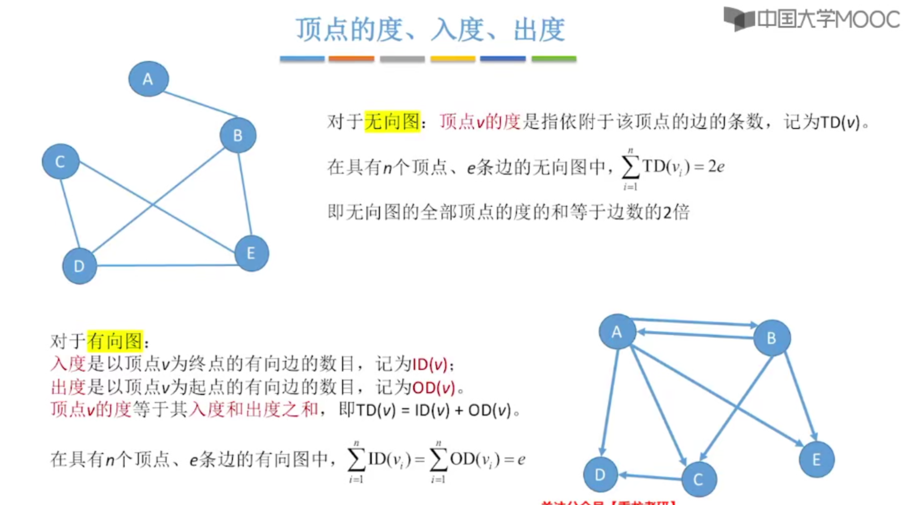

### 顶点-顶点的关系描述

- 路径
  - 顶点Vp到Vq之间的一条路径是指顶点序列，Vp,V1,V2,.....,Vq
  - 顶点之间可能不存在路径
  - 有向图的路径也是有向的
- 回路：第一个顶点和最后一个顶点相同的路径称为回路或环

- 简单路径：在路径序列中，顶点不重复出现的路径称为简单路径
- 简单回路：除第一个顶点和最后一个顶点外，其余顶点不重复出现的回路称为简单回路
- 路径长度：路径上边的数目
- 点到点的距离
  - 从顶点u出发到顶点v的最短路径若存在，则**此路径的长度为从u到v的距离**
  - 若从u到v不存在路径，在记该距离为无穷
- 无向图中，若从顶点v到顶点w有路径存在，则称v和w是**连通**的
- 有向图中
  - 若从顶点v到顶点w和从顶点w到顶点v之间都有路径，则称这两个顶点是**强连通**的

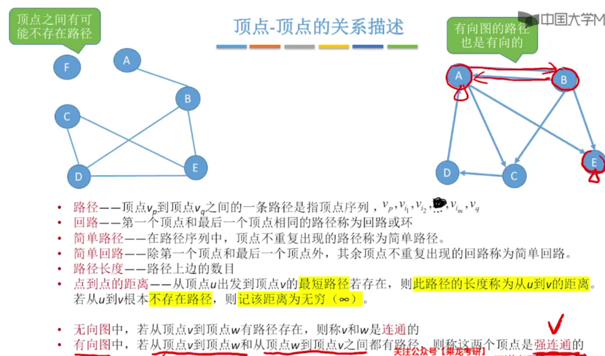

### 连通图、强连通图

- 无向图：若图G中任意两个顶点都是连通的，则称图G为连通图，否则称为非连通图
  - 对于n个顶点的无向图
    - 若G是连通图，则最少有n-1条边                          （一个顶点连接其余n-1个顶点）
    - 若G是非连通图，则最多可能有C(2,n-1)条边        （一个顶点没有边，其余n-1个顶点两两相连）
- 有向图：若图中任何一对顶点都是强连通的，则称此图为强连通图
  - 对于n个顶点的有向图G
    - 若G是强连通图，则最少有n条边（形成回路）

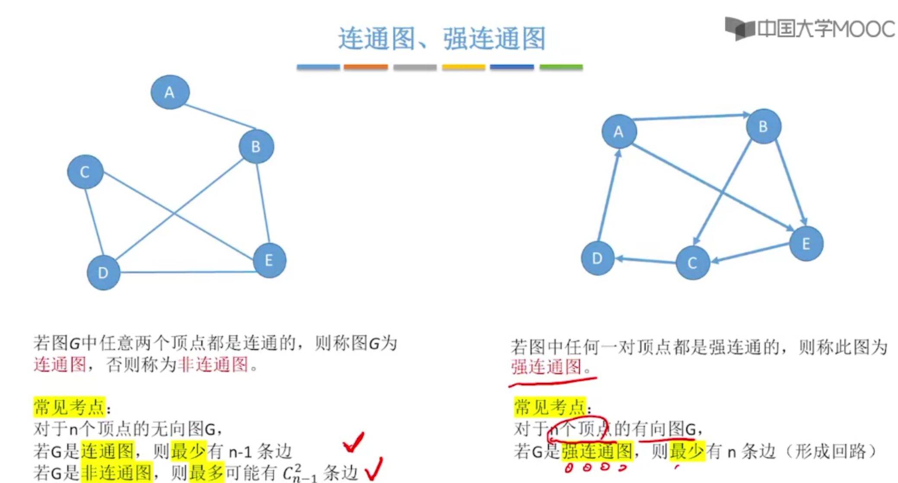

### 子图、生成子图

- 设有两个图G=(V,E)和G1=(V1,E1),若V1是V的子集，且E1是E的子集，则称G1是G的子图
  - 并非任意挑几个点、几条边都能构成子图（首先要能是个图）

- 若有满足V(G1)=V(G)的子图G1，则称其为G的**生成子图**（点都有，可以去除几条边）

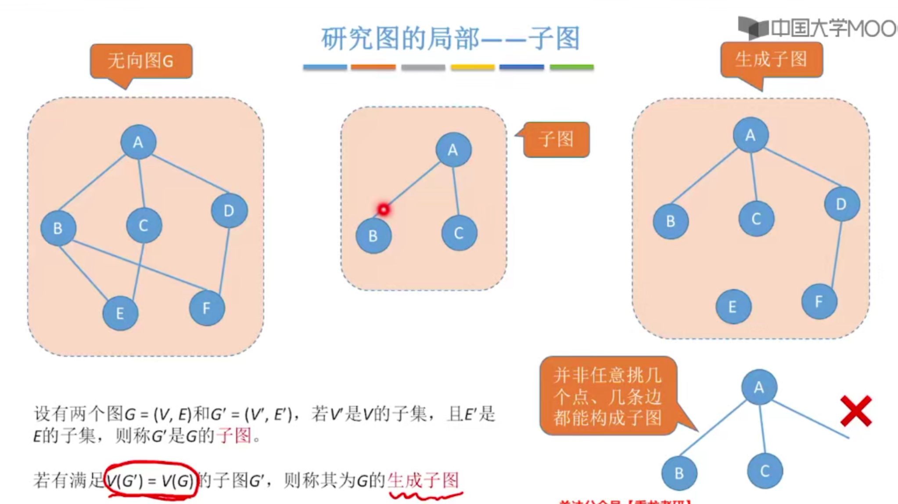

### 连通分量、强连通分量

- 无向图中的**极大连通子图**称为**连通分量**（只要有能连通的点就要包含到里面）
  - 子图必须连通，且包含尽可能多的顶点和边

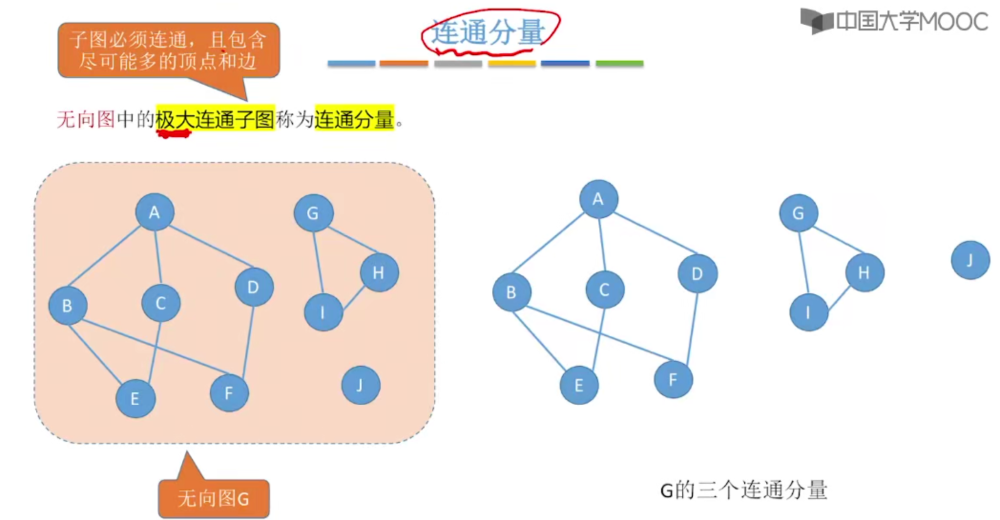

- 有向图中的极大强连通子图称为有向图的强连通分量
  - 子图必须强连通，同时保留尽可能多的边

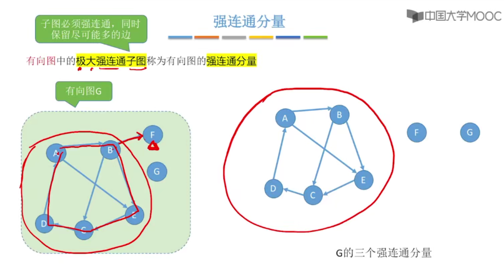

### 生成树、生成森林（一种保持连通的临界）

- 连通图的生成树是**包含图中所有顶点的一个极小连通子图**
  - 连通图都是无向的
  - 边尽可能少，但要保持连通
  - 一个连通图可能有多个生成树

- 若图中顶点数为n，则它的生成树含有n-1条边。
  - 对生成树而言，若砍去它的一条边，则会变成非连通图
  - 若加上一条边则会形成一条回路

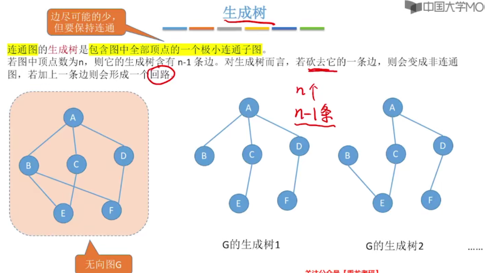


- 在非连通图中，连通分量的生成树构成了非连通图的生成森林

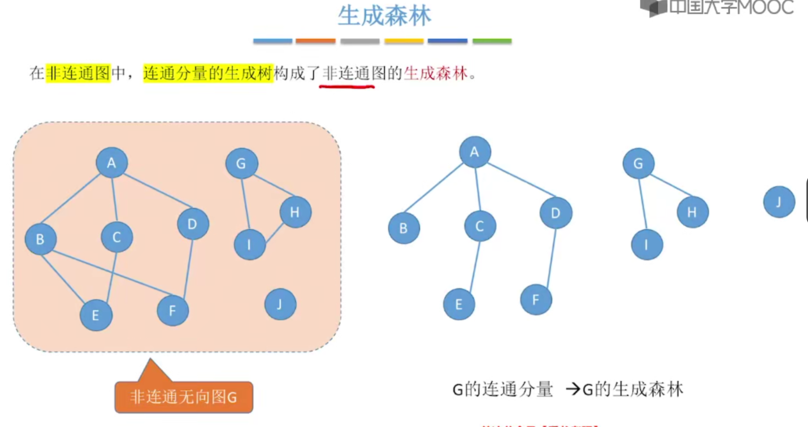

### 边的权、带权图/网

- 边的权——在一个图中，每条边都可以标上具有某种含义的数值，该数值称为该边的权值
- 带权图/网——边上带有权值的图称为带权图，也称网
- 带权路径长度——当图是带权图时，一条路径上所有边的权值之和，称为该路径的带权路径长度


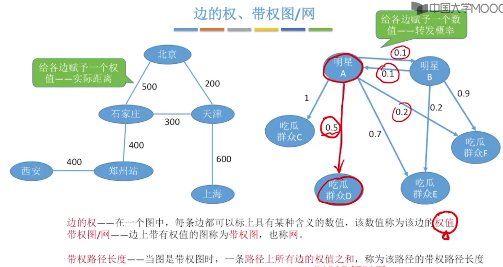

### 几种特殊状态的图

#### 无向完全图

- 无向图中任意两个顶点之间都存在边
- 若无向图的顶点数|V|=n，则|E|=n(n-1)/2

#### 有向完全图

- 有向图中任意两个顶点之间都存在方向相反的两条弧

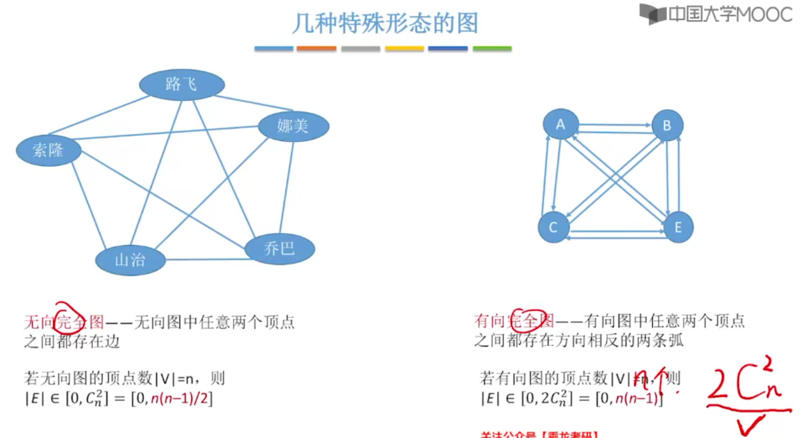

#### 稀疏图

- 边数很少的图
- 只是相对来说，没有明确的界限，一般认为|E|<|V|log|V|就是稀疏图

#### 稠密图

- 边数很多的图

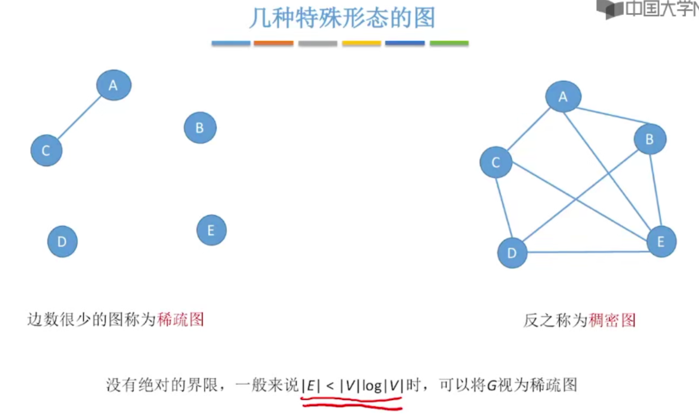

#### 树、有向树

- 连通图，各个点之间时连通的
  - n个顶点的树，必有n-1条边
  - n个顶点的图，若|E|>n-1，则一定有回路
  - 若|E|<n-1,则一定有孤零的顶点（森林）
- 有向树：一个顶点的入度为0，其余顶点的入度均为1的有向图，称为有向树
  - 有向树不是强连通图

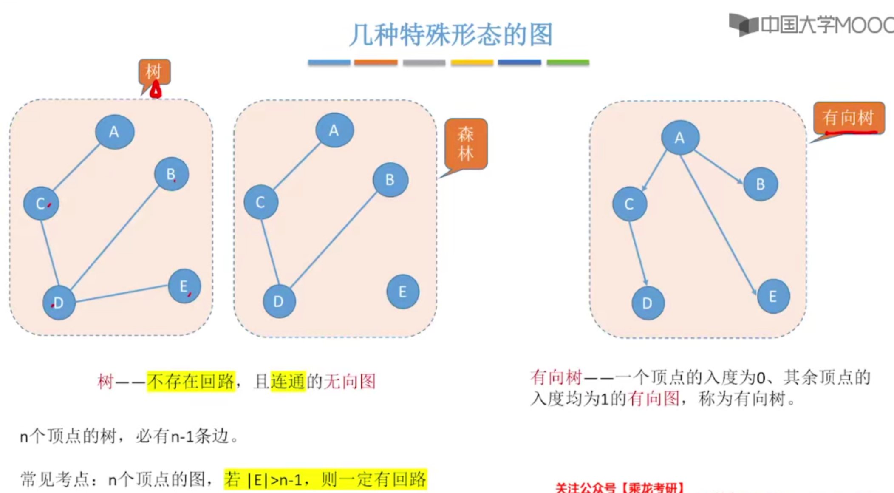


## 图的存储

### 邻接矩阵

- 数组实现的顺序存储，空间复杂度高，不适合存储稀疏图

#### 存储无权图

- 无向图：
  - 1: 有一条边，两顶点邻接                        0: 没有边，两个顶点不邻接
  - 一条边对应两个1: (A,B)是1，(B,A)也是1
- 有向图：
  - 1: 有一条行元素指向列元素的边			0: 没有行元素指向列元素的边

```C++
#define MaxVertexNum 100                    //顶点数目的最大值

//邻接矩阵
typedef struct{
    char Vex[MaxVertexNum];                 //顶点表（存放顶点名称，这里是A B C...,可以换成更复杂的比如北京、上海...)
    int Edge[MaxVertexNum][MaxVertexNum];   //邻接矩阵、边表(可以换成bool类型和枚举类型，int：4B, bool: 1B)
    int vexnum,arcnum;                      //图的当前顶点数和边数/弧数
} MGragh;

```

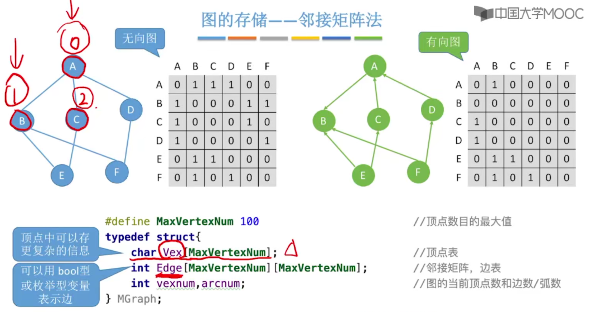

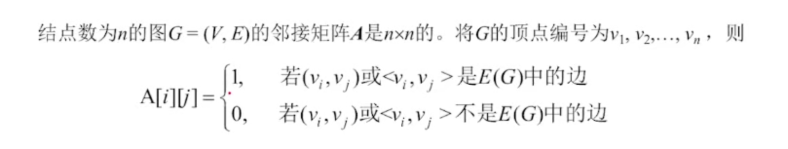

- 求顶点的度、出度、入度：
  - 无向图
    - 查找顶点所在的一行/一列一共有几个1，度就是几
    - 第i个顶点的度 = 第i行（或第i列）的非零元素个数        O(n)
  - 有向图（1表示存在行元素指向列元素的边）：
    - 出度：第i行的非零元素个数                              O(n)
    - 入度：第i列的非零元素个数                              O(n)


#### 存储带权图（网）

- 如果邻接矩阵的值为0/无穷，则说明两点之间没有边

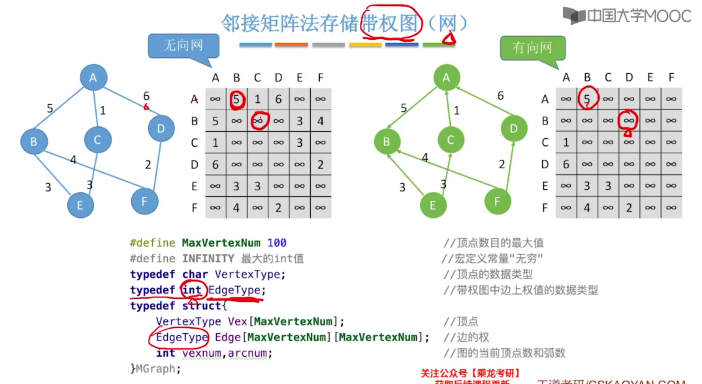

```C++
#define MaxVertexNum 100                    //顶点数目的最大值
#define INFINITY 2147483647                 //最大的int值 (2^31)-1=2147483647

typedef char VertexType;                    //顶点的数据类型
typedef int EdgeType;                       //带权图中边上权值的数据类型

//邻接矩阵（有权图）
typedef struct{
    VertexType Vex[MaxVertexNum];           //顶点
    EdgeType Edge[MaxVertexNum][MaxVertexNum];  //边的权
    int vexnum, arcnum;                     //图的当前顶点数、弧数
} MGragh;
```

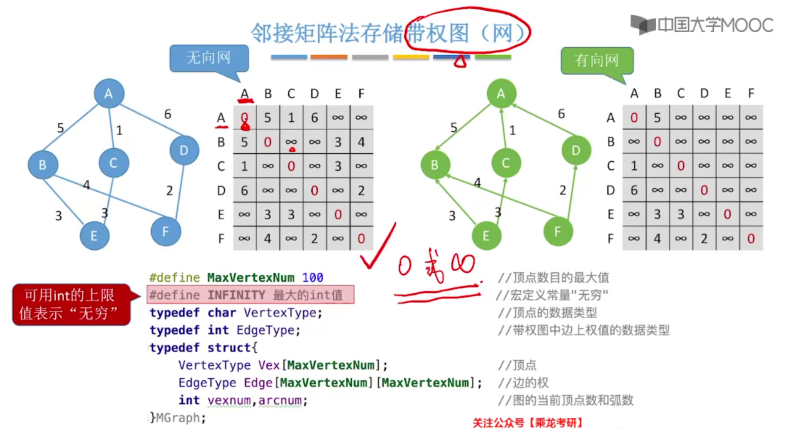

#### 性能分析

- 空间复杂度，n个顶点
  - 存储顶点：O(n)
  - 存储边：O(n^2)
  - 总：O(|V|^2)       只和顶点数有关，和实际边数无关
- 适合存储稠密图（边数较多的图）
- 无向图的邻接矩阵是对称矩阵，可以压缩存储（只存储上三角区/下三角区）


#### 回顾：对称矩阵的压缩存储

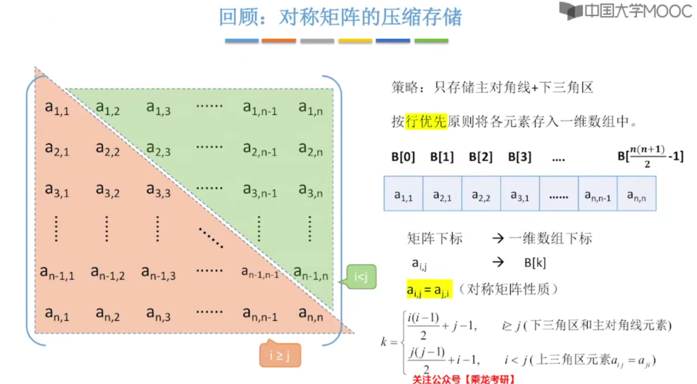


- 邻接矩阵自乘n次--->等于从顶点i到顶点j的长度为n的路径的数目

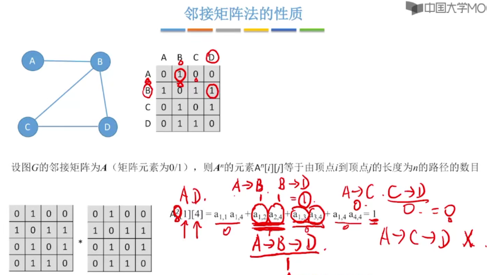

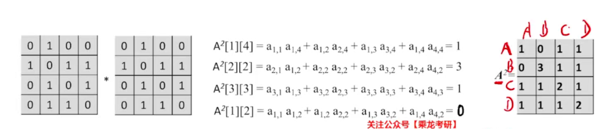

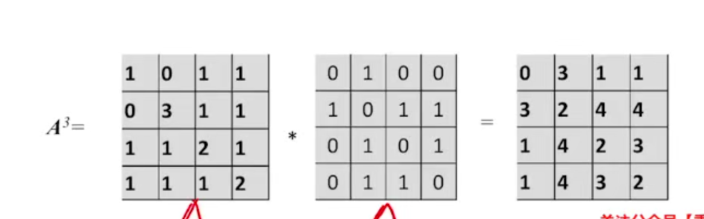


### 邻接表

- 顺序存储+链式存储

#### 定义

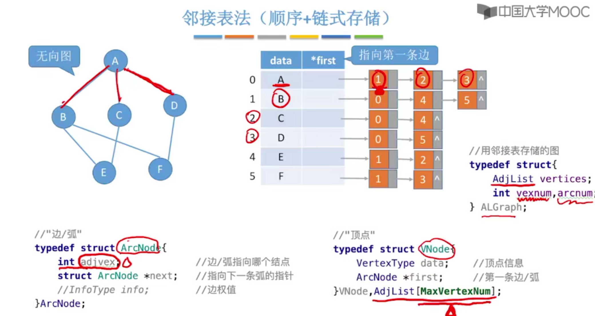

```C++
//邻接表法

//“边/弧”
typedef struct ArcNode{
    int adjvex;                             //边/弧指向哪个节点
    struct ArcNode *next;                   //指向下一条弧的指针
    //InfoType info;                        //边权值
}ArcNode;

//"顶点"
typedef struct VNode{
    VertexType data;                        //顶点信息
    ArcNode *first;                         //第一条边/弧
}VNode, AdjList[MaxVertexNum];

//用邻接表存储的图
typedef struct{
    AdjList vertices;
    int vexnum,arcnum;
} ALGragh;
```

#### 空间复杂度

- 有向图：O(V+2E)
- 无向图：O(V+E)

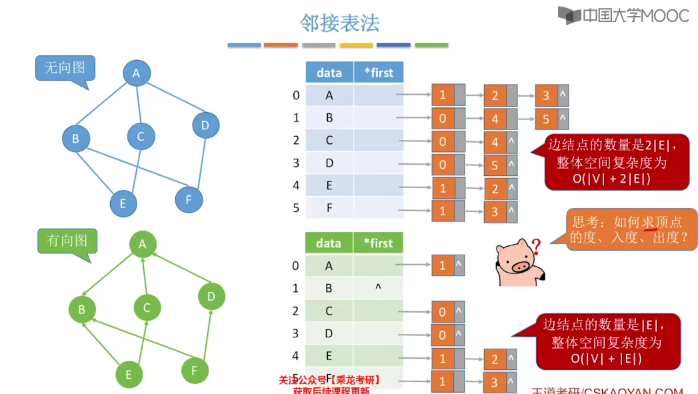

#### 入度、出度、度

- 无向图的度：节点连接的弧的数量
- 有向图
  - 入度：把所有点的边链表遍历一遍，找到其中指向该节点的边
  - 出度：节点连接的弧的数量

#### 邻接表不唯一（边链表的顺序任意）

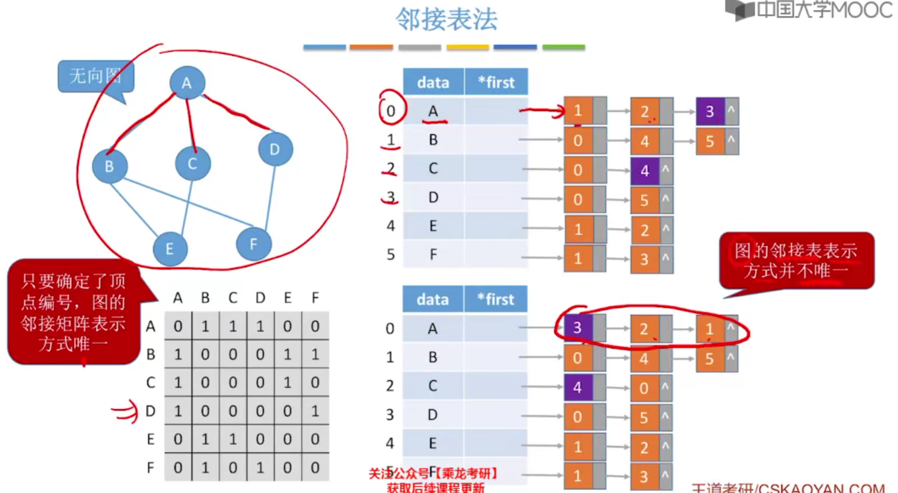


### 邻接矩阵和邻接表的劣势

- 邻接矩阵：空间复杂度高
- 邻接表：找顶点的入度不方便（找到指向该节点的边不方便）

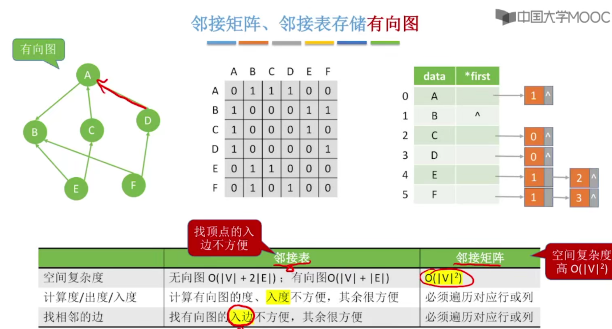


### 十字链表（只能存储有向图）

#### 弧节点（存储弧）

- 绿色tailvex：弧尾顶点编号，指示这条弧是由哪个节点出发的（弧尾）
- 橙色headvex：弧头顶点编号，指示这条弧是指向哪个节点的（弧头）
- 橙色hlink：弧头相同的下一条弧，可以找到所有指向该节点的弧
- 绿色tlink：弧尾相同的下一条弧，可以找到所有从该节点出发的弧
- 灰色info：权值，指示该条弧的weight


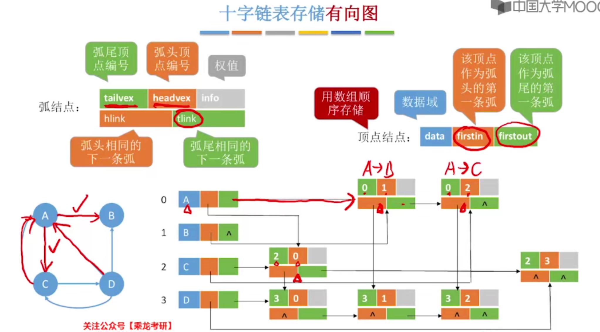


#### 性能分析

- 空间复杂度：O(V+E)

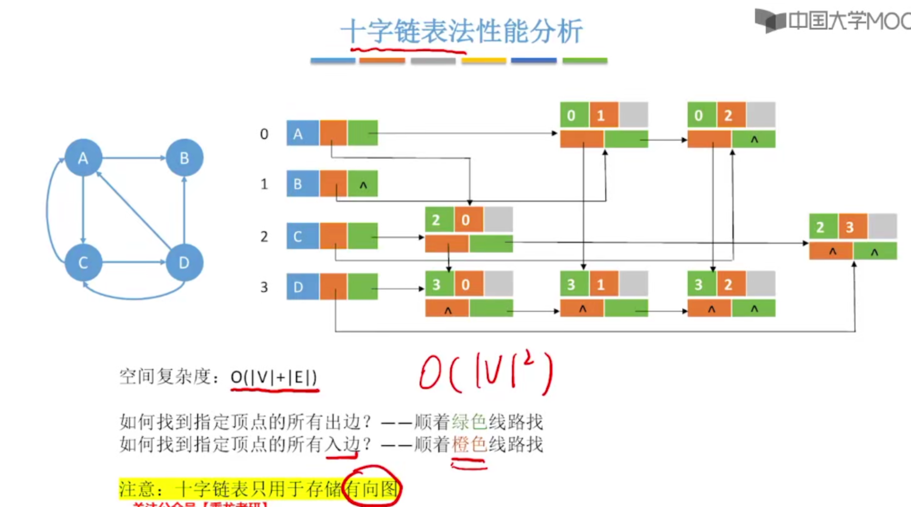


### 邻接多重表（存储无向图）


#### 改进邻接表

- 邻接表的缺点
  - 每条边对应两份冗余信息
  - 删除顶点、删除边等操作时间复杂度高

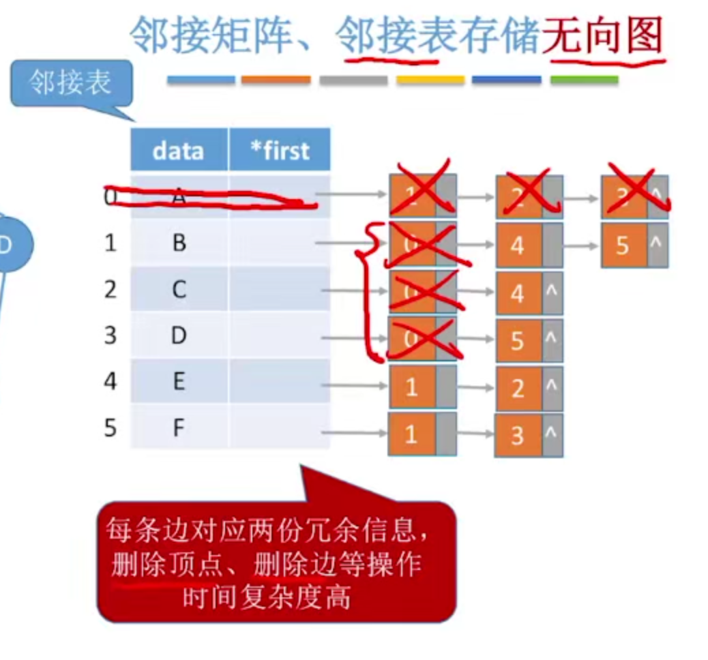

#### 定义

- 边节点
  - i：其中一个顶点的编号
  - j：另一个顶点的编号
  - iLink：依附于顶点i的下一条边（寻找与i有关的边，从iLink寻找下一个）
  - jLink：依附于顶点j的下一条边（寻找与j有关的边，从jLink寻找下一个）
  - info：权值


#### 优点

- 空间复杂度：O(V+E)  （每条边只对应一份数据）
- 删除边、删除节点等操作都很方便
- 只适用于存储无向图


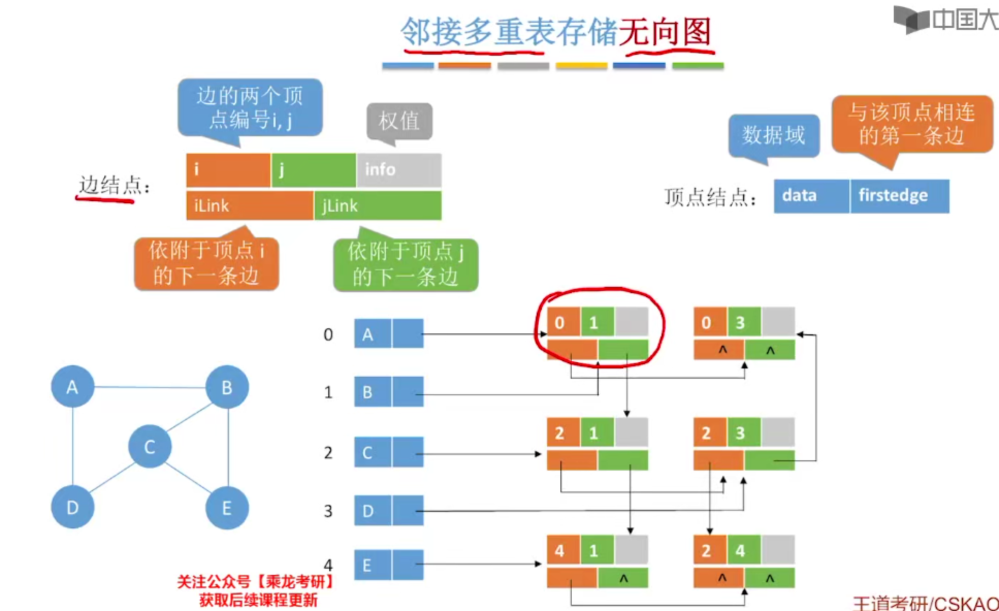

## 图的基本操作

### 基本操作

- Adjacent(G,x,y): 判断图G是否存在边<x,y>或(x,y)
- Neighbors(G,x): 列出图G中与节点x邻接的边
- InsertVertex(G,x): 在图G中插入顶点x
- DeleteVertex(G,x): 从图G中删除顶点x
- AddEdge(G,x,y): 若无向边(x,y)或有向边<x,y>不存在，则向图G中添加该边
- RemoveEdge(G,x,y): 若无向边(x,y)或有向边<x,y>存在,则从图G中删除该边
- FirstNeighbor(G,x): 求图G中顶点x的第一个邻接点，若有则返回顶点号。若x没有邻接点，或图中不存在x，则返回-1
- NextNeighbor(G,x,y): 假设图G中顶点y是顶点x的一个邻接点，返回除y之外顶点x的下一个邻接点的顶点号，若y是x的最后一个邻接点，则返回-1
- Get_edge_value(G,x,y): 获取图G中边(x,y)或<x,y>对应的权值
- Set_edge_value(G,x,y,v): 设置图G中边(x,y)或<x,y>对应的权值为v

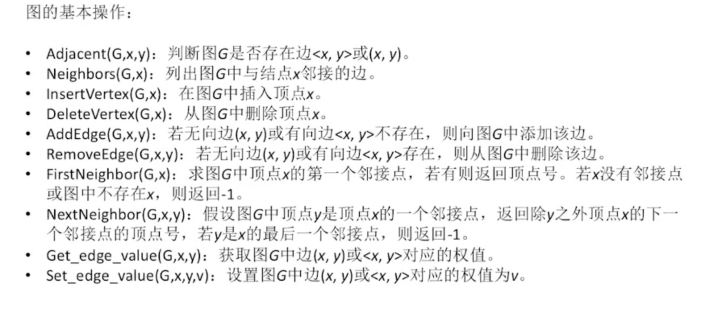

### 判断是否存在边<x,y>或(x,y)

- 有向图/无向图
  - 邻接矩阵 O(1)
  - 邻接表O(1)~O(V)

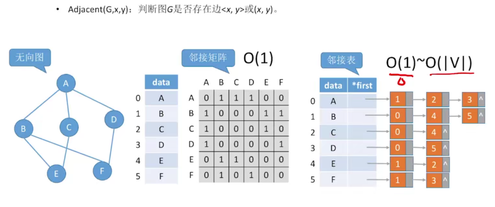

### 列出与节点x邻接的边

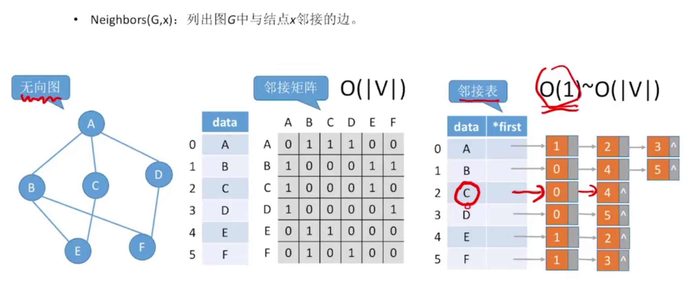

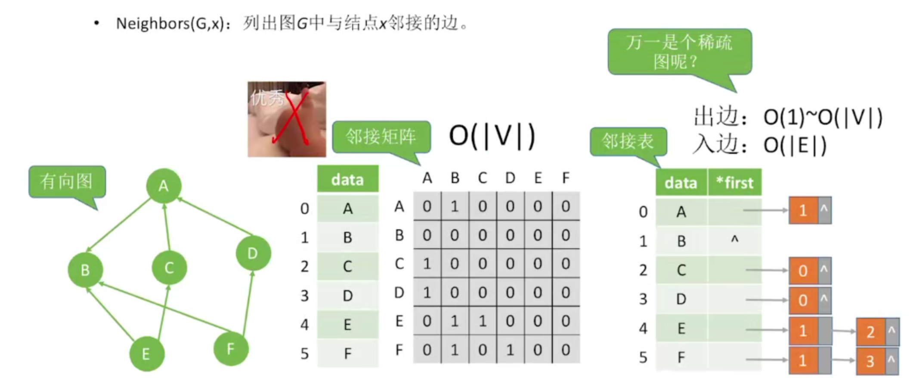

### 插入新顶点

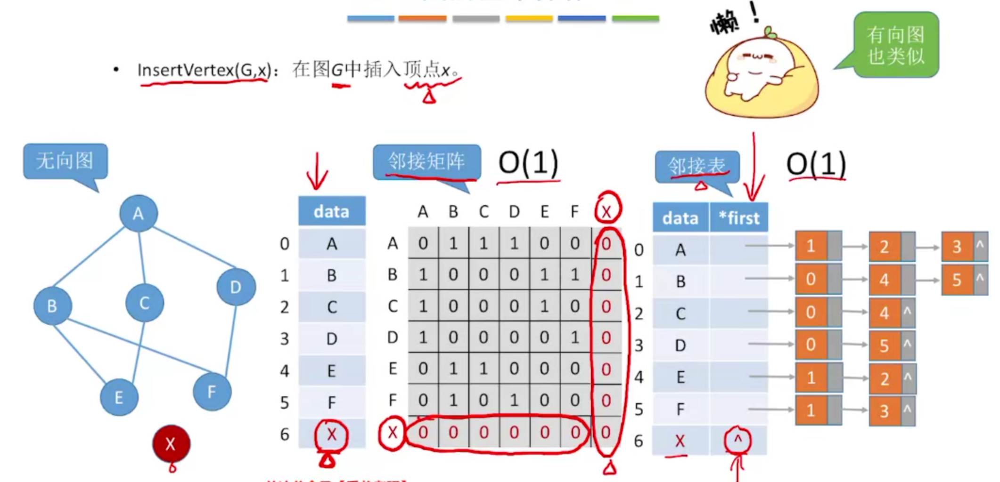

### 删除顶点

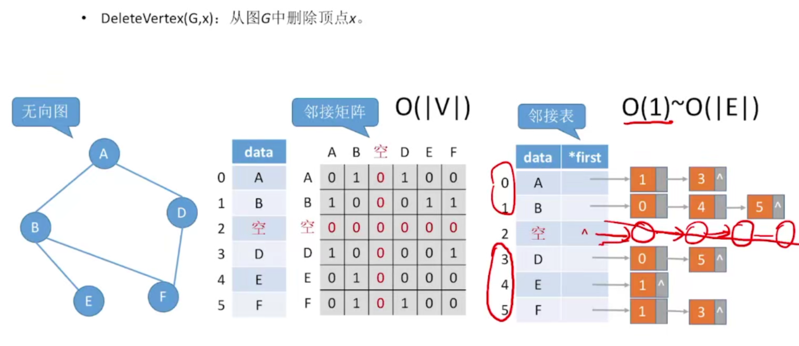

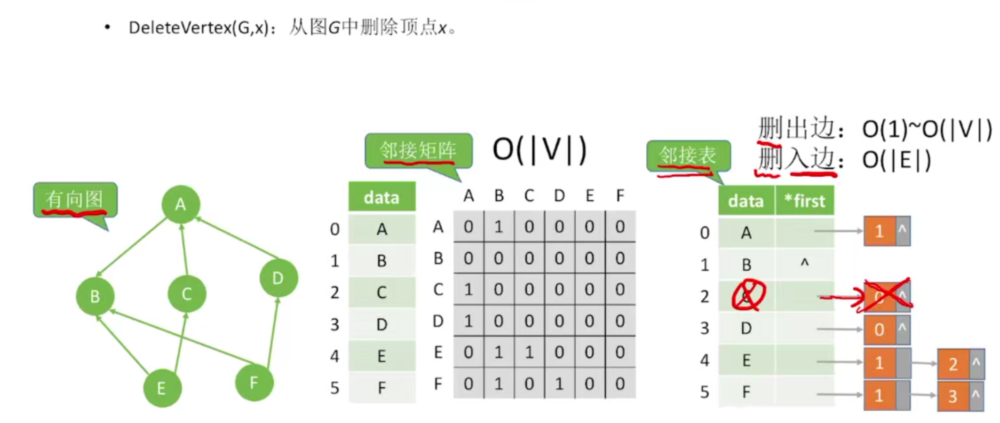

### 添加新边

- 邻接表可以采用头插法，减少时间复杂度

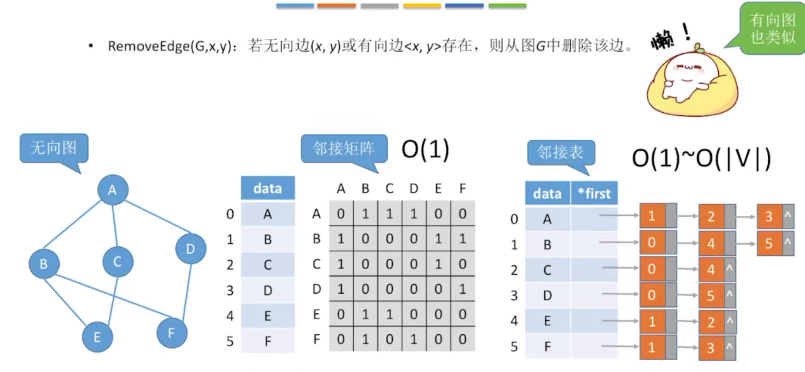

### 找到第一个邻接点（重点）

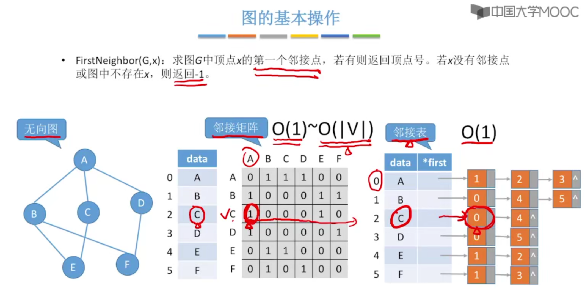

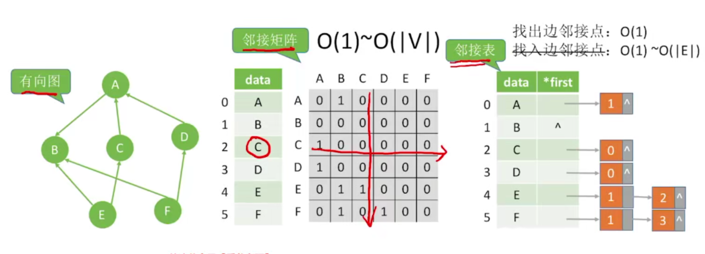

### 找到除了邻接点y以外的下一个邻接点(重点)

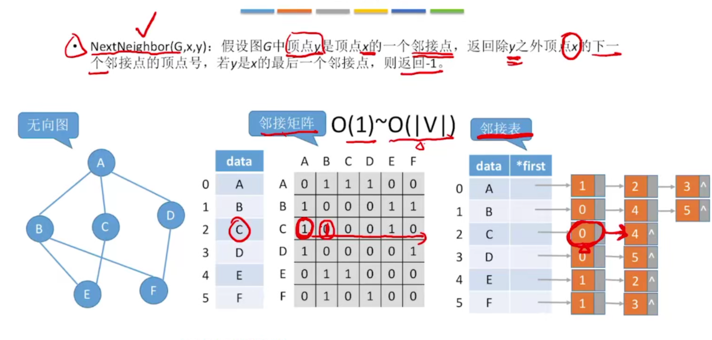

### 找边的权值/设置边的权值

- 核心在于找到边
  - Adjacent(G,x,y)：判断图G中是否存在边<x,y>或(x,y)


### 图的深度优先遍历（重点）（用栈实现）

#### 树的深度优先遍历

```C++
//树的先根遍历
void PreOrder(TreeNode *R){
  if (R!= NULL){
    visit(R);					//访问根节点
    while(R还有下一个子树T)
      PreOrder(T);		//先根遍历下一棵子树
  }
}
```

#### 深度优先遍历

```C++
bool visited[MAX_VERTEX_NUM];								//访问标记数组
//图的深度优先遍历
void DFS(MGragh G, int v){                  //从顶点v出发，深度优先遍历图G
    visit(v);                               //访问顶点v
    visited[v]=true;                        //设已访问标志
    int w;
    for(w=FirstNeighbor(G,v);w>=0;w=NextNeighbor(G,v,w)){
        if(!visited[w]){                    //w为u的尚未访问的邻接顶点
            DFS(G,w);
        }
    }
}
```


#### 算法存在的问题

- 如果是非连通图，无法遍历完所有节点

```C++
bool visited[MAX_VERTEX_NUM];								//访问标记数组
//对图G进行深度优先遍历
void DFSTraverse(MGragh G){
    for(int v = 0; v < G.vexnum; ++v)
        visited[v]=false;                   //初始化已访问标记数据
    for(int v = 0; v < G.vexnum; ++v)
        if(!visited[v]) DFS(G,v);           //从v=0开始遍历
    
}

//图的深度优先遍历
void DFS(MGragh G, int v){                  //从顶点v出发，深度优先遍历图G
    visit(v);                               //访问顶点v
    visited[v]=true;                        //设已访问标志
    int w;
    for(w=FirstNeighbor(G,v);w>=0;w=NextNeighbor(G,v,w)){
        if(!visited[w]){                    //w为u的尚未访问的邻接顶点
            DFS(G,w);
        }
    }
}
```

#### 复杂度分析

- 空间复杂度
  - 最坏情况：O(V)
  - 最好情况：O(1)


- 时间复杂度 = 访问各个顶点+探索各条边

  - 邻接矩阵
    - 访问V个顶点需要O(V)的时间
    - 查找每个顶点的邻接点都需要O(V)的时间，总共有V个顶点
    - 时间复杂度=O(V^2)
  - 邻接表
    - 访问V个顶点需要O(V)的时间
    - 查找各个顶点的邻接点总共需要O(E)的时间
    - 时间复杂度=O(V+E)

  

  #### 深度优先遍历序列（邻接矩阵唯一，邻接表不唯一遍历序列也不唯一，但是一一对应）

  #### 邻接矩阵的遍历序列可以直接从图中看出来，小的顶点先遍历

  

#### 邻接表的遍历序列要看邻接表，不能直接从图中得出


#### 深度优先生成树

- 同一个图的邻接矩阵表达方式唯一，因此深度优先遍历序列唯一，深度优先生成树也唯一
- 同一个图邻接表表达方式不唯一，因此深度优先遍历序列不唯一，深度优先生成树也不唯一


#### 深度优先生成森林


#### 图的遍历与图的连通性

- 无向图
  - 进行BFS/DFS遍历
  - 调用BFS/DFS函数的次数=连通分量数
  - 对于连通图，只需调用一次BFS/DFS


- 有向图

  - 进行BFS/DFS遍历
  - 调用BFS/DFS函数的次数要具体问题具体分析
  - 若起始顶点到其他各顶点都有路径，则只需调用一次BFS/DFS函数

  - 对于强连通图之需要调用一次BFS/DFS函数


### 图的广度优先遍历（重点）（用队列实现）

#### 树的广度优先遍历 VS 图的广度优先遍历

- 树🌲：不存在“回路”，搜索相邻的节点时，不可能搜到已经访问过的节点
  - 若树非空，则根节点入队
  - 若队列非空，队头元素出队并访问，同时将该元素的孩子依次入队
  - 重复2直到队列为空
- 图✍️：搜索相邻的节点时，有可能搜到已经访问过的节点
  - 找到与一个顶点相邻的所有顶点
  - 标记哪些顶点被访问过
  - 需要一个辅助队列
    - FirstNeighbor(G,x): 求图G中顶点x的第一个邻接点，若有则返回顶点号，若x没有邻接点或图中不存在x，则返回-1
    - NextNeighbor(G,x,y): 假设图G中顶点y是顶点x的一个邻接点，返回除y之外顶点x的下一个邻接点的顶点号，若y是x的最后一个邻接点，则返回-1


#### 代码实现

```C++
//广度优先遍历
void BFS(MGragh G,int v){                   //从顶点v出发，广度优先遍历图G
    visit(v);                               //访问初始顶点v
    visited[v]=true;                        //对x做已访问标记
    SqQueue Q;
    EnQueue(Q,v);                           //顶点v入队列Q
    while(!QueueEmpty(Q)){
        DeQueue(Q,v);                       //顶点v出队列
        int w;
        for(w=FirstNeighbor(G,v); w>=0; w=NextNeighbor(G,v,w)){
            //检测v的所有邻接点
            if(!visited[w]){                //w为v的尚未访问的邻接顶点
                visit(w);                   //访问顶点
                visited[w]=true;            //对w做已访问标记
                EnQueue(Q,w);               //顶点w入队列
            }   //if
        }//while
    }

}
```


#### 手算


#### 遍历序列可变（邻接链表存储先后）


#### 算法存在的问题

- 如果是非连通图，则无法遍历完所有代码


- 但是可以通过visited数组找到未遍历的顶点


```C++
#define MaxVertexNum 100                    //顶点数目的最大值
#define INFINITY 2147483647                 //最大的int值 (2^31)-1=2147483647

bool visited[MaxVertexNum];                 //访问标记数组
//对图G进行广度优先遍历
void BFSTraverse(MGragh G){
    for(int i = 0; i <G.vexnum; ++i) visited[i]=false;  //访问标记数组初始化
    SqQueue Q;
    InitQueue(Q);                           //初始化辅助队列Q
    for(int i = 0; i < G.vexnum;++i)        //从0号顶点开始遍历
        if(!visited[i]) BFS(G,i);           //对每个连通分量调用一次BFS，vi未访问过，从vi开始BFS
}

//广度优先遍历
void BFS(MGragh G,int v){                   //从顶点v出发，广度优先遍历图G
    visit(v);                               //访问初始顶点v
    visited[v]=true;                        //对x做已访问标记
    SqQueue Q;
    EnQueue(Q,v);                           //顶点v入队列Q
    while(!QueueEmpty(Q)){
        DeQueue(Q,v);                       //顶点v出队列
        int w;
        for(w=FirstNeighbor(G,v); w>=0; w=NextNeighbor(G,v,w)){
            //检测v的所有邻接点
            if(!visited[w]){                //w为v的尚未访问的邻接顶点
                visit(w);                   //访问顶点
                visited[w]=true;            //对w做已访问标记
                EnQueue(Q,w);               //顶点w入队列
            }   //if
        }//while
    }

}
```


#### 复杂度分析

#### 空间复杂度

- 最坏情况：辅助队列O(V)
- 所有其他节点都与1相邻


#### 时间复杂度

- 邻接矩阵

  - 访问V个顶点需要O(V)的时间
  - 查找每个顶点的邻接点都需要O(V)的时间，而总共有V个顶点

  - 时间复杂度=O(V^2)

- 邻接表

  - 访问V个节点需要O(V)的时间
  - 查找各个顶点的邻接点共需要O(E)的时间
  - 时间复杂度=O(V+E)


#### 广度优先生成树

- n个顶点，n-1条边
- 广度优先生成树由广度优先遍历过程确定。由于邻接表的表达方式不唯一，因此基于邻接表的广度优先生成树也不唯一


#### 广度优先生成森林

- 对非连通图的广度优先遍历，可得到广度优先生成森林


### 最小生成树

#### 生成树

- 连通图的生成树是包含图中所有顶点的一个极小连通子图（边要尽可能小，但要保持连通）
- 若图中顶点数为n，则它的生成树含有n-1条边。
- 对于生成树而言，若砍去它的一条边，则会变成非连通图，若加上一条边则会形成一个回路


#### 广度优先生成树


#### 深度优先生成树


#### 最小生成树（最小代价树）

- 对于一个**带权连通无向图**G=(V,E)，生成树不同，每棵树的权（即树中所有边上的权值之和）也可能不同
- 设R为G的所有生成树的集合，若T为R中边的权值之和最小的生成树，则T称为G的最小生成树(Minimum-Spanning-Tree,MST)


- 不唯一
  - 可能有多个，但边的权值之和总是唯一且最小的
- 最小生成树的边数 = 顶点数 - 1
  - 砍掉一条则不连通，增加一条边则会出现回路
- 如果连通图本身是一棵树，则其最小生成树就是它本身
- 只有连通图才有生成树，非连通图只有生成森林


#### Prim算法（普里姆）（点）

- 算法实现

  - 从某一个**顶点**开始构建生成树

  - 每次将代价最小的新顶点纳入生成树，直到所有顶点都纳入为止

- 时间复杂度
  - O(V^2)，适合用于边稠密图
    - 从V0开始，总共需要n-1轮处理
    - 每一轮循环：循环遍历所有节点，找到lowCast最低的，且还没有加入树的节点
    - 再次循环遍历，更新还没有加入各个节点的lowCast值
- 机器实现
  - 初始：从V0开始
    - 声明两个数组
      - isJoin[]: 标记各节点是否已加入树
      - lowCost[]: 各节点加入树的最低代价
  - 第一轮
    - 循环遍历所有的节点，找到lowCast最低的，且还没有加入树的节点
    - 将该节点加入正在构建的树里，isJoin数组对应元素变为true
    - 再次循环遍历。更新还没有加入各个顶点的lowCast值
      - 遍历刚加入节点的所有边，将这些边的权值与lowCast数组中的值进行比较，取其中较小的一个
  - 循环以上操作，直到isJoin数组中不存在false（n-1轮）


#### Kruskal算法（克鲁斯卡尔）（边）

- 算法实现

  - 每次选择一条权值最小的**边**，使这条边的两头连通（原本已经连通的就不选）

  - 直到所有节点都连通

- 时间复杂度

  - O(Elog2E)，适合用于边稀疏图
    - 共执行e轮
    - 每轮判断两个顶点是否属于同一个集合，需要O(log2e)

- 机器实现
  - 初始：
    - 将各条边按权值排序
    - 三个属性
      - Weight: 权值
      - Vertex1: 起始节点
      - Vertex2: 末尾节点
  - 第一轮
    - 检查第一条边的两个顶点是否连通（是否属于同一个集合）（并查集）
    - 如果不属于同一个集合，就将这条边选上，并将其两边的顶点放到同一个集合中
    - 如果属于同一个集合，就直接跳过
  - 重复以上操作，直到所有顶点都属于一个集合（都连通）


### 图的最短路径

#### 单源最短路径

- 一个点到其他点的最短路径


#### 多源最短路径

- 每对顶点间的最短路径


### BFS求无权图的单源最短路径（只适用于无权图，或所有边权值都相同的图）

- 无权图可以视为一种特殊的带权图，只是每条边的权值都为1
- 就是对BFS的一个小修改，在visit一个顶点时，修改其最短路径长度d[]并在path[]记录前驱节点

#### 代码实现

```C++
//广度优先遍历
void BFS(MGragh G,int v){                   //从顶点v出发，广度优先遍历图G
    visit(v);                               //访问初始顶点v
    visited[v]=true;                        //对x做已访问标记
    SqQueue Q;
    EnQueue(Q,v);                           //顶点v入队列Q
    while(!QueueEmpty(Q)){
        DeQueue(Q,v);                       //顶点v出队列
        int w;
        for(w=FirstNeighbor(G,v); w>=0; w=NextNeighbor(G,v,w)){
            //检测v的所有邻接点
            if(!visited[w]){                //w为v的尚未访问的邻接顶点
                visit(w);                   //访问顶点
                visited[w]=true;            //对w做已访问标记
                EnQueue(Q,w);               //顶点w入队列
            }   //if
        }//while
    }

}
```

```C++
//求顶点u到其他顶点到最短路径
void BFS_MIN_Distance(MGragh G, int u){
    int d[MaxVertexNum];                     //d[i]表示u到i的节点的最短路径
    int path[MaxVertexNum];                  //最短路径从哪个顶点过来
    for(int i = 0; i < G.vexnum; ++i){
        d[i]=INFINITY;                       //初始化路径长度
        path[i]=-1;                          //最短路径从哪个顶点过来
    }
    d[u]=0;
    visited[u]=true;
    SqQueue Q;
    EnQueue(Q,u);
    while(!QueueEmpty(Q)){                  //BFS算法主过程
        DeQueue(Q,u);                       //队头元素u出队
        for(int w=FirstNeighbor(G,u); w>=0; w=NextNeighbor(G,u,w)){
            if(!visited[w]){                //w为u的尚未访问的邻接顶点
                d[w]=d[u]+1;                //路径长度+1
                path[w]=u;                  //最短路径应从u到w
                visited[w]=true;            //设已访问标志
                EnQueue(Q,w);               //顶点w入队
            }
        }
    }
}
```


### 狄杰斯特拉求单源最短路径（可以用于无权图、带权图，不能用于负权值的图）

- Dijkstra
- 带权路径长度——当图是带权图时，一条路径上所有边的权值之和，称为该路径的带权路径长度

- 算法实现
  - 初始
    - 从V0开始，初始化三个数组信息如下
    - Final[]: 标记各顶点是否已找到最短路径
    - Dist[]: 最短路径长度
    - Path[]: 路径上的前驱
  - 第一轮：
    - 循环遍历所有节点，找到还没确定最短路径，且dist最小的顶点Vi，令final[i]=true
    - 检查所有邻接自Vi的顶点，若其final值为false，则更新dist和path信息
    - 如果dist[]里面存储的值   小于   该点的最小距离+该点到另一点的距离，则更新dist和path
  - 重复以上步骤


- 使用dist[]和path[]数组可以找到最短带权路径


- 时间复杂度
  - O(V^2)
  - 初始
    - Arcs[i]\[j]表示Vi到Vj的弧的权值
    - 若从V0开始，令final[0]=true; dist[0]=0; path[0]=-1;
    - 其余顶点final[k]=false; dist[k]=arcs[o]\[k]; path[k]=(arcs[0]\[k]==无穷大)? -1:0;
  - 第n-1轮处理
    - 循环遍历所有顶点，找到还确定最短路径，且dist最小的顶点Vi，令final[i]=true
    - 检查所有邻接自Vi的顶点，对于邻接自Vi的顶点Vj，若final[j]==false且dist[i]+arcs[i]\[j]<dist[j],则令dist[j]=dist[i]+arcs[i]\[j]; path[j]=i
  

#### 算法缺点

- 不适用于有负权值的带权图


### Floyd算法（求各顶点间最短路径）（可以用于负权图）

#### 算法思想

- 求出每一对顶点之间的最短路径

- 使用**动态规划**思想，将问题的求解分为多个节点

- 对于n个顶点的图G，求任意一对顶点Vi->Vj之间的最短路径可分为如下几个阶段：

  - #初始：不允许在其他顶点中转，最短路径是？
  - #0：若允许V0中转，最短路径是？
  - #1：若允许V0、V1中转，最短路径是？
  - #2：若允许V0、V1、V2中转，最短路径是？

  - ...
  - #n-1：若允许V0、V1、V2......Vn-1中转，最短路径是？


#### 代码实现

```C++
//Floyd算法，求每个顶点间距离的最小值
void Floyd(MGragh G){
    //准备工作，根据图的信息初始化矩阵A和path
    int A[MaxVertexNum][MaxVertexNum];
    int path[MaxVertexNum][MaxVertexNum];
    int n = G.vexnum;

    for(int k = 0; k < n; k ++){                    //考虑以vk作为中转点
        for(int i=0; i < n; i ++){                  //遍历整个矩阵，i为行号，j为列号
            for(int j=0; j < n; j ++){              
                if(A[i][j] > A[i][k] + A[j][k]){    //以vk为中转点的路径更短
                    A[i][j]=A[i][k]+A[j][k];        //更新最短路径长度
                    path[i][j]=k;                   //中转点
                }
            }
        }
    }
}
```


#### 算法复杂度

- 时间复杂度：O(V^3)
- 空间复杂度：O(V^2)


#### 举例


#### 寻找完整路径

- 通过path矩阵递归地找到完整路径


#### 算法存在问题

- 可以解决负权图的问题
- 但是不能解决带有“负权回路”的图（有负权值的边组成回路），这种图可能没有最短路径


## 有向无环图(DAG)

### 定义

- 若一个有向图中不存在环，则称为有向无环图，建成DAG图(Directed Acyclic Gragh)


### 有向无环图描述表达式（简化存储结构）（不唯一）

#### 算法实现


#### 例题


#### 总结方法

- 思想：顶点中不可能出现重复的操作数
- 第一步
  - 把各个操作数不重复地排成一排
- 第二步
  - 标出各个运算符的生效顺序（先后顺序无所谓）
- 第三步
  - 按顺序加入运算符，注意分层
- 第四步
  - **自底向上**逐层检查**同层**的运算符是否可以合体


### 拓扑排序

- 可以用 DFS 实现拓扑排序


#### AOV网（用顶点表示活动）

- AOV网(Activity on Vertex NetWork，用顶点表示活动的网)
- 用DAG图（有向无环图）表示一个工程。顶点表示活动，有向边<Vi,Vj>表示活动Vi必须先于活动Vj进行
- 有环路就不是AOV网


#### 拓扑排序定义

- 在图论中，由一个有向无环图的顶点组成的序列，当且仅当满足下列条件时，称为该图的一个拓扑排序
  - 每个顶点出现且只出现一次
  - 若顶点A在序列中排在顶点B的前面，则在图中不存在从顶点B到顶点A的路径
- 或定义为
  - 拓扑排序是对有向无环图的顶点的一种排序，它使得若存在一条从顶点A到顶点B的路径，则在排序中顶点B出现在A的后面
  - 每个AOV网都有一个或多个拓扑排序序列


#### 实现方式

- 先找到做事的先后顺序


- 机器实现
  - 从AOV网中选择一个没有前驱（入度为0）的顶点并输出
  - 从网中删除该顶点和所有以它为起点的有向边
  - 重复以上步骤知道当前的AOV网为空或当前网中不存在无前驱的顶点为止

- 数据结构
  - 两个数组
    - Indegree[]: 当前顶点的入度
    - Print[]: 记录拓扑序列
  - 栈/队列
    - S：保存度为0的顶点

```C++
//拓扑排序
bool TopologicalSort(Graph G){
    InitStack(S);                           //初始化栈，存储入度为0的顶点
    for(int i = 0; i < G.vexnum; i++)
        if(indegree[i]==0)
            Push(S,i);                      //将所有入度为0的顶点入栈
    int count=0;                            //计数，记录当前已经输出的顶点数
    while(!IsEmpty(S)){                     //栈不空，则存在入度为0的顶点
        Pop(S,i);                           //栈顶元素出栈
        print[count++]= i;                  //输出顶点i
        for(p=G.vertices[i].firstarc;p;p=p->nextarc){
            //将所有i指向的顶点的入度-1，并且将入度减为0的顶点压入栈S
            v=p->adjvex;
            if(!(--indegree[v])) Push[S,v]; //入度为0，则入栈
        }

    }
    if(count < G.vexnum) return false;      //排序失败，有向图中有回路
    else return true;                       //拓扑排序成功
    
}
```

```C++
#define VertexType int

typedef struct ArcNode{                     //边表节点
    int adjvex;                             //该弧所指向的顶点的位置
    struct ArcNode *nextarc;                //指向下一条弧的指针
    //InfoType info;                        //网的边权值
}ArcNode;

typedef struct VNode                        //顶点表节点
{
    VertexType data;                        //顶点信息
    ArcNode *firstarc;                      //指向第一条依附该顶点的弧的指针
} VNode, AdjList[MaxVertexNum];

typedef struct {
    AdjList vertices;                       //邻接表
    int vexnum, arcnum;                     //图的顶点数和弧数
} Graph;																		//Graph是以邻接表存储的图类型
```


#### 过程


#### 时间复杂度

- 邻接表：O(V+E)
- 邻接矩阵：O(V^2)


#### 无法进行拓扑排序：有回路的图


- 当前AOV图中每个节点的入度都>0


### 逆拓扑排序

- 拓扑排序是删除入度=0的点
- 逆拓扑排序是删除出度=0的点


#### 举例


#### 逆拓扑排序的实现

- 邻接表
  - 保存的是从这个节点出去的边
- 逆邻接表
  - 保存的是指向这个顶点的边
- 邻接矩阵
  - 横行：从该节点出去的边
  - 竖列：指向这个顶点的边


#### DFS实现逆拓扑排序

```C++
//逆拓扑排序（DFS算法）
void DFSTraverse(Graph G){                  //对图G进行深度优先遍历
    for(int v=0; v<G.vexnum; ++v)
        visited[v]=false;                   //初始化已访问标记数据
    for(int v=0; v<G.vexnum; ++v)
        if(!visited[v])
            DFS(G,v);
}

//DFS，从顶点v出发，深度优先遍历图G
void DFS(Graph G,int v){
    visit(v);                               //访问顶点
    visited[v]=true;                        //设已访问标记
    for(w=FirstNeighbor(G,v);w>=0;w=NextNeighbor(G,v,w))
        if(!visited[w]){                    //w为u的尚未访问的邻接顶点
            DFS(G,w);
        }
  	print(v);                               //输出顶点
}
```


#### 实现过程


### 关键路径

#### AOE网（用边表示活动）

- 在带权有向图中，以**顶点**表示事件，以**有向边**表示活动，以**边上的权值**表示完成该活动的开销（如完成活动所需时间），称之为用边表示活动的网络，简称AOE网（Activity On Edge Network）


- AOV网的性质

  - 只有在某个顶点所代表的事件发生后，从该顶点出发的各有向边所代表的活动才能开始
  - 只有在进入某个顶点的各有向边所代表的活动都已经结束时，该顶点所代表的事件才能发生

  - 另外，有些活动是可以并行进行的


- AOE网的组成
  - 在AOE网中仅有一个入度为0的顶点，称为**开始顶点（源点）**，表示整个工程的开始
  - 仅有一个出度为0的点，称为**结束顶点（汇点）**，表示整个工程的结束
  - 从源点到汇点的有向路径可能有多条，所有路径中，具有最大路径长度的路径称为**关键路径**，而把关键路径上的活动称为**关键活动**
  - 完成整个工程的最短时间就是**关键路径的长度**，若关键路径不能按时完成，则整个工程完成时间就会延长


#### 关键路径（类似软件项目管理的里程碑）

- 事件Vk的最早发生时间Ve(k)——决定了所有从Vk开始的活动能够开工的最早时间
- 活动ai的最早开始时间e(i)——指该活动弧的起点所表示的事件的最早发生时间


- 事件Vk的最早发生时间Vl(k)——指在不推迟整个工程完成的前提下，该事件最迟必须发生的时间
- 活动ai的最早开始时间l(i)——指该活动弧的终点所表示的事件的最迟发生时间与该活动所需时间之差


- 活动最早时间e(i) VS 活动最迟开始时间l(i)
- 活动ai的时间余量d(i)=l(i)-e(i)
  - 表示在不增加完成整个工程所需总时间的情况下，活动ai可以拖延的时间
  - 若一个活动的时间余量=0，则说明该活动必须要如期完成，d(i)=0即l(i)=e(i)的活动ai是关键活动，由关键活动组成的路径就是关键路径


#### 求关键路径的步骤

1. 求所有事件的最早发生时间Ve()
   - 按**拓扑排序**序列，依次求各个顶点的Ve(k)
   - Ve(源点)=0
   - Ve(k)=Max{Ve(j) + Weight(Vj,Vk)}.  Vj为Vk的任意前驱（即找到前驱节点+事件时间最大的路径）
2. 求所有事件的最迟发生时间Vl()
   - 按逆拓扑排序序列，依次求各个顶点的Vl(k)
   - Vl(汇点)=Ve(汇点)
   - Vl(k)=Min{Vl(j)+Weight(Vk,Vj)}.     Vj为Vk的任意后继
3. 求所有活动的最早发生时间e()
   - 若边<Vk,Vj>表示活动ai，则有e(i)=Ve(k)
4. 求所有活动的最迟发生时间l()
   - 若边<Vk,Vj>表示活动ai，则有l(i)=Vl(j)-Weight(Vk,Vj)
5. 求所有活动的时间余量d()
   - d(i)=l(i)-e(i)
6. 求得关键活动、关键路径
   - 将d[i]=0的路径连接成一条线

**d(i)=0的活动就是关键活动，由关键活动可得关键路径**


- 求所有事件的最早发生时间


- 求所有事件的最迟发生时间


- 求所有活动的最早发生时间


- 求所有活动的最迟发生时间


- 求所有活动的最迟发生时间


- 求所有活动的时间余量


- 求得关键活动、关键路径


#### 关键活动、关键路径的特性

- 若关键活动耗时增加，则整个工程的工期将曾长
- 缩短关键活动的时间，可以缩短整个工程的工期
- 当缩短到一定程度时，关键活动可能会变成非关键活动（并不是只要压缩关键路径的时间，工期就可以提前）
- 可能有多条关键路径，只提高一条关键路径上的关键活动速度并不能缩短整个工程的工期，只有加快那些包括在所有关键路径上的关键活动才能达到缩短工期的目的（或者缩短每一条关键路径上的关键活动）


## 题目

### 1.练习：有向图的BFS过程


### 2.练习：如果存在回路，则不存在逆拓扑排序序列，如何判断回路？


