# 栈和队列

## 做题总结

### 考点

- 栈的应用（先进后出）：括号匹配、表达式求值、中缀转后缀、中缀转前缀、递归、迷宫求解（深度优先算法）、进制转换
- 队列的应用（先进先出）：层次遍历（广度优先算法）、缓冲区、资源分配、矩阵压缩、页面替换算法
- 中缀转后缀表达式算法：栈中存储运算符
- 后缀表达式的计算：栈中存储操作数
- 递归求解


### 易错点

#### 中缀转后缀的手算方法

1. 确定中缀表达式中各个运算符的运算顺序
2. 选择下一个运算符，按照[左操作数 右操作数 运算符]的方式组合成一个新的操作数
3. 如果还有运算符没被处理，就继续2


#### 中缀表达式转后缀表达式（机算）

- 初始化一个栈，用于保存暂时还不能确定运算顺序的运算符

- 从左向右处理各个元素，直到末尾。

- 可能遇到三种情况：

  1. 遇到操作数。直接加入后缀表达式

  2. 遇到界限符。遇到"("直接入栈；遇到")"则依次弹出栈内运算符并加入后缀表达式，直到弹出"("为止。注意："("不加入后缀表达式

  3. 遇到运算符。依次弹出栈中**优先级**高于或等于当前运算符的所有运算符，并加入后缀表达式，若碰到"("或栈空则停止。之后再将当前运算符入栈。

- 按上述方法处理完所有字符后，将栈中剩余运算符依次弹出，并加入后缀表达式。


#### 后缀表达式的机算

用栈实现后缀表达式：

1. 从左往右扫描下一个元素，直到处理完所有元素
2. 若扫描到操作数则压入栈，并回到1；否则执行3
3. 若扫描到运算符，则弹出两个栈顶元素（**先出栈的是右操作数**），执行相应运算，运算结果压回栈顶，回到1


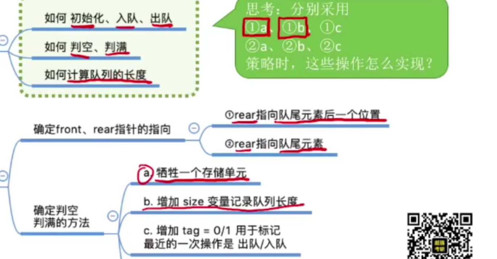


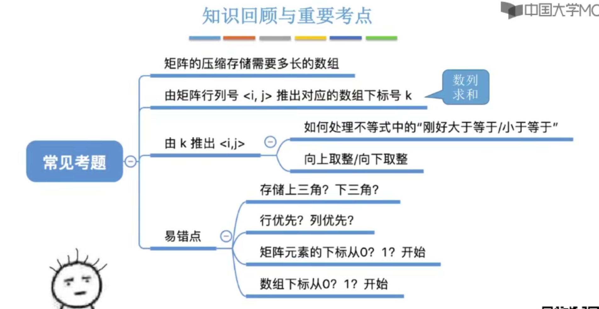


## 知识总结

数据结构三要素：逻辑结构、数据的运算、存储结构（物理结构）


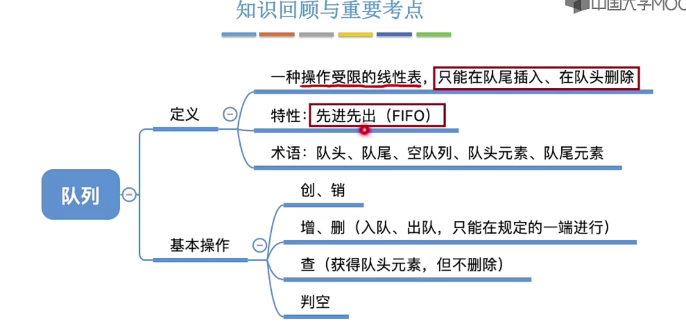

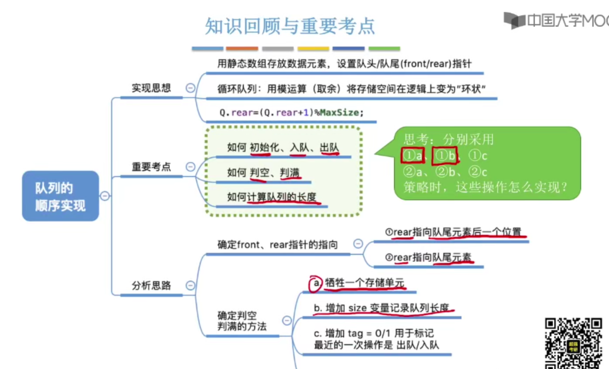

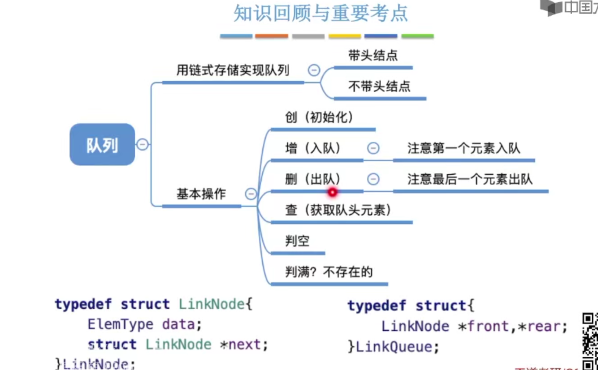

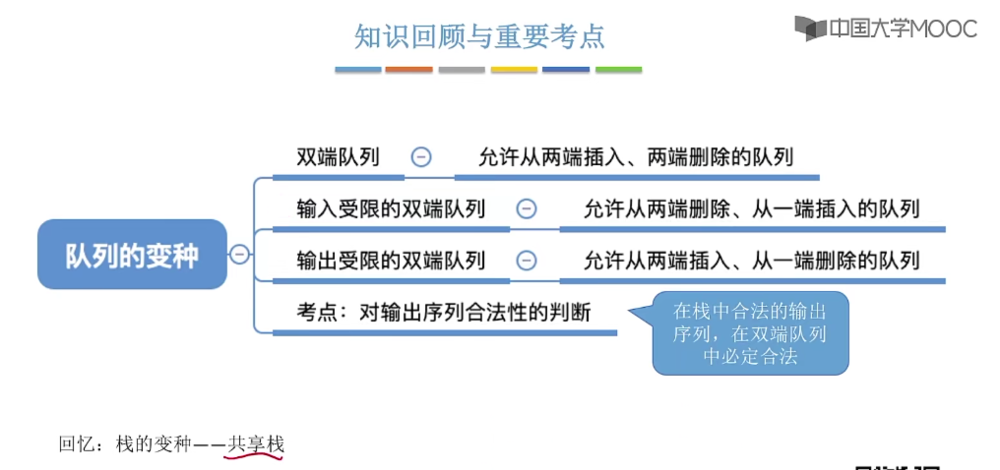

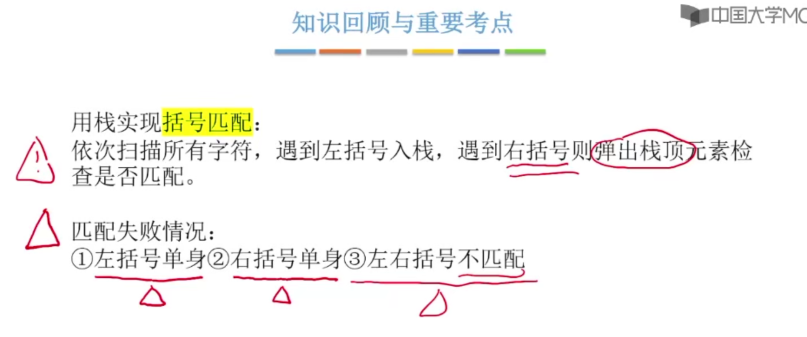

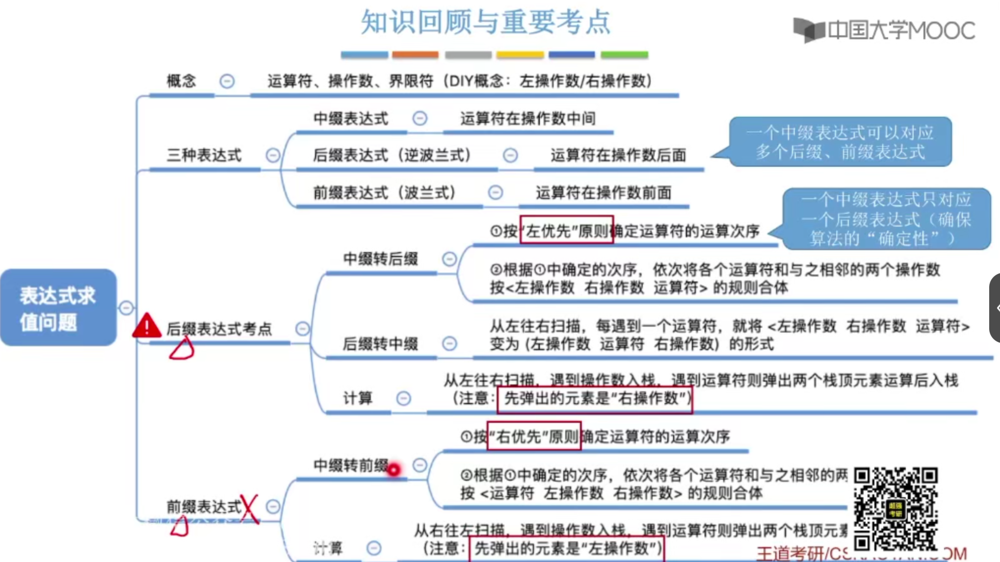


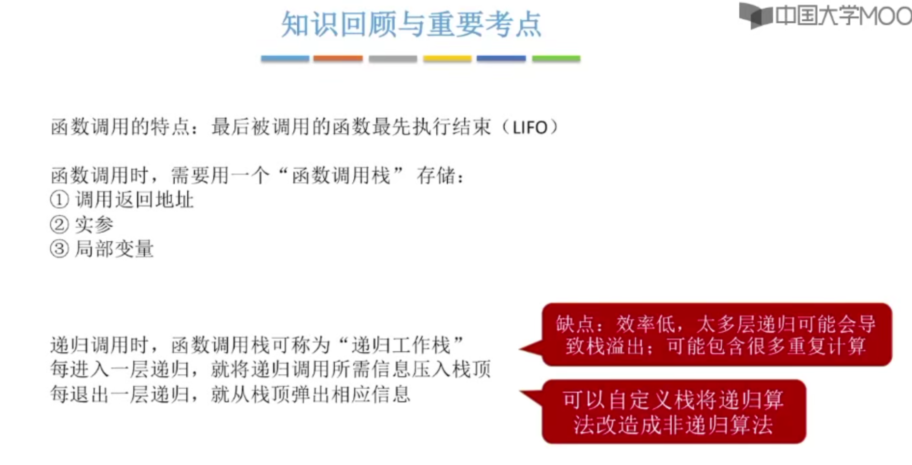

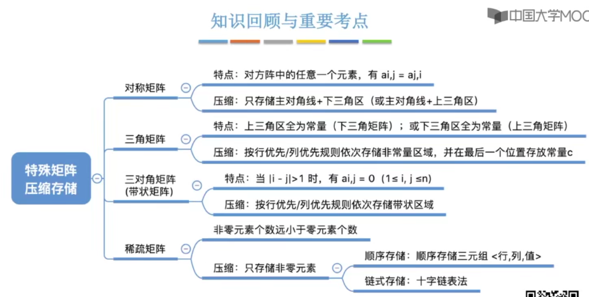


## 栈

### 定义

- 线性表是具有相同数据类型的n（n>=0）个数据元素的有限序列，其中n为表长，当n=0时线性表是一个空表，若用L命名线性表，则其一般表示为L=(a1,a2,a2......,an)
- 栈(Stack)是只允许一段进行插入或删除操作的**线性表**

#### 重要术语

#### 栈顶

允许进行插入和删除的一端

#### 栈底

不允许进行插入和删除的一端

#### 空栈

空表（没有元素）

#### 特点

后进先出（FILO）


### 基本操作

#### 线性表的基本操作

1. 初始化
2. 销毁
3. 插入
4. 删除
5. 按值查找
6. 按位查找
7. 求表长
8. 输出
9. 判空


#### 栈的基本操作

1. InitStack(&S): 初始化栈。创造一个空栈S，分配内存空间
2. DestroyStack(&L): 销毁栈。销毁并释放栈S所占用的内存空间
3. Push(&S, x): 进栈， 若栈S非满，则将x加入使之成为新栈顶
4. Pop(&S, &x): 出栈， 若栈S非空，则弹出栈顶元素，并用x返回              删除栈顶元素
5. GetTop(S, &x): 读栈顶元素。若栈S非空，则用x返回栈顶元素               不删除栈顶元素
6. StackEmpty(S): 判断一个栈S是否为空，若S为空，则返回true，否则返回false


### 栈的常考题型

进栈顺序：a->b->c->d->e

出栈顺序：a->b->c->d->e   e->d->c->b->a........

#### n个不同元素进栈，出栈元素的不同排列的个数有1/n+1 * Cn 2n


  

### 顺序栈（顺序存储方式的实现）

#### 顺序存储的定义

缺点：栈的大小不可变

顺序存储：给各个数据元素分配连续的存储空间。 MaxSize*sizeof(ElemType)

```C++
typedef struck{
    ElemType data[MaxSize];    //静态数组存放栈中元素
    int top;                   //栈顶指针
} SqStack;                     //sequence 顺序
```


#### 初始化栈

```C++
//初始化栈
//注意审题，top是指向最后一个元素的位置还是指向下一个可以插入的位置
void InitStack(SqStack &S){
    S.top = -1;                //初始化栈顶指针
}
```


#### 判断栈空

```C++
//判断栈空
bool StackEmpty(SqStack S){
    return (S.top == -1);
}
```


#### 新元素入栈（Push）

```C++
//新元素入栈
bool Push(SqStack &S, ElemType x){
    if(s.top == MaxSize -1) return false; //栈满报错
    S.top = S.top + 1;                    //指针+1
    S.data[S.top] = x;                    //新元素入栈
    //S.data[++S.top] = x; 
    return true; 
}
```


#### 出栈(Pop)

```C++
//出栈操作
bool Pop(SqStack &S, ElemType &x){
    if(S.top == -1) return false;           //栈空报错
    x = S.data[S.top];                      //栈顶元素出栈
    S.top=S.top - 1;                        //指针-1
    //x = S.data[S.top--];
    return true;
}

```


#### 读栈顶元素

```C++
//读栈顶元素
bool GetTop(SqStack S, ElemType &x){
    if(S.top == -1) return false;
    x = S.data[S.top];
    return true;
}
```


#### 总代码

```C++
#include <stdio.h>
#include <stdlib.h>

#define ElemType int
#define MaxSize 10

typedef struck{
    ElemType data[MaxSize];    //静态数组存放栈中元素
    int top;                   //栈顶指针
} SqStack;                     //sequence 顺序

//初始化栈
//注意审题，top是指向最后一个元素的位置还是指向下一个可以插入的位置
void InitStack(SqStack &S){
    S.top = -1;                //初始化栈顶指针
}

//判断栈空
bool StackEmpty(SqStack S){
    return (S.top == -1);
}

//新元素入栈
bool Push(SqStack &S, ElemType x){
    if(s.top == MaxSize -1) return false; //栈满报错
    S.top = S.top + 1;                    //指针+1
    S.data[S.top] = x;                    //新元素入栈
    //S.data[++S.top] = x; 
    return true; 
}

//出栈操作
bool Pop(SqStack &S, ElemType &x){
    if(S.top == -1) return false;           //栈空报错
    x = S.data[S.top];                      //栈顶元素出栈
    S.top=S.top - 1;                        //指针-1
    //x = S.data[S.top--];
    return true;
}

//读栈顶元素
bool GetTop(SqStack S, ElemType &x){
    if(S.top == -1) return false;
    x = S.data[S.top];
    return true;
}

int main()
{
    SqStack s;
    InitStack(s);
}

```


### 共享栈(顺序栈的一种)

#### 共享栈定义

```C++
typedef struct{
    ElemType data[MaxSize];
    int top0;
    int top1;
}ShStack;
```


#### 初始化共享栈

```C++
void InitStack(ShStack &S){
    S.top0 = -1;
    S.top1 = MaxSize;
}
```


#### 判断栈满

```C++
//栈满条件：top0 + 1 == top1;
bool StackFull(ShStack S){
    return(top0 +1 == top1);
} 
```


#### 总代码

```C++
#include <stdio.h>
#include <stdlib.h>

/*
    共享栈
*/

#define ElemType int
#define MaxSize 10

typedef struct{
    ElemType data[MaxSize];
    int top0;
    int top1;
}ShStack;

//初始化栈
void InitStack(ShStack &S){
    S.top0 = -1;
    S.top1 = MaxSize;
}

//栈满条件：top0 + 1 == top1;
bool StackFull(ShStack S){
    return(top0 +1 == top1);
}

int main()
{
    ShStack s;
}
```


### 链栈

### 优点

便于多个栈共享存储空间和提高效率，且不存在栈满上溢的情况


#### 链栈结构定义

```C++
typedef struct LinkNode{
    ElemType data;              //指针域
    struct LinkNode *next;      //数据域
} *LiStack;                     //栈类型定义
```


#### 初始化

```C++
//初始化（不带头节点）
void InitStack(LiStack &S){
    S = NULL;
}

//初始化（带头节点）
void InitStack2(LiStack &S){
    S = (LinkNode *)malloc(sizeof(LinkNode));
    S ->next = NULL;
}
```


#### 判断栈空

```C++
//判断栈空(不带头节点)
bool StackEmpty(LiStack S){
    return (S == NULL);
}

//判断栈空(带头节点)
bool StackEmpty2(LiStack S){
    return (S ->next == NULL);
}
```


#### 进栈

```C++
//进栈（Push）不带头节点
bool Push(LiStack &S, ElemType x){

    LinkNode *p = (LinkNode *)malloc(sizeof(LinkNode));
    if(p == NULL) return false;

    p -> next = S;
    p -> data = x;
    S = p;
    return true;
}

//进栈（Push）带头节点
bool Push2(LiStack &S, ElemType x){

    LinkNode *p = (LinkNode *)malloc(sizeof(LinkNode));
    if(p == NULL) return false;

    p -> next = S -> next;
    p -> data = x;
    S -> next= p;
    return true;
}
```


#### 出栈

```C++
//出栈 (Pop) 不带头节点
bool Pop(LiStack &S, ElemType &x){
    if(S == NULL) return false;

    x = S -> data;
    S = S -> next;
    return true;
}

//出栈 (Pop) 带头节点
bool Pop2(LiStack &S, ElemType &x){
    if(S -> next == NULL) return false;

    x = S -> next -> data;
    S -> next = S -> next -> next;
    return true;
}
```


#### 读取栈顶元素

```C++
//读取栈顶元素（带头节点）
bool GetElem(LiStack S, ElemType &x){
    if(S == NULL) return false;

    x = S -> data;
    return true;
}

//读取栈顶元素（不带头节点）
bool GetElem2(LiStack S, ElemType &x){
    if(S -> next== NULL) return false;

    x = S -> next -> data;
    return true;
}

```


#### 总代码

```C++
#include <stdio.h>
#include <stdlib.h>

/*
    链栈
*/

#define ElemType int
#define MaxSize 10

typedef struct LinkNode{
    ElemType data;              //指针域
    struct LinkNode *next;      //数据域
} *LiStack;                     //栈类型定义

//初始化（不带头节点）
void InitStack(LiStack &S){
    S = NULL;
}

//初始化（带头节点）
void InitStack2(LiStack &S){
    S = (LinkNode *)malloc(sizeof(LinkNode));
    S ->next = NULL;
}

//判断栈空(不带头节点)
bool StackEmpty(LiStack S){
    return (S == NULL);
}

//判断栈空(带头节点)
bool StackEmpty2(LiStack S){
    return (S ->next == NULL);
}

//进栈（Push）不带头节点
bool Push(LiStack &S, ElemType x){

    LinkNode *p = (LinkNode *)malloc(sizeof(LinkNode));
    if(p == NULL) return false;

    p -> next = S;
    p -> data = x;
    S = p;
    return true;
}

//进栈（Push）带头节点
bool Push2(LiStack &S, ElemType x){

    LinkNode *p = (LinkNode *)malloc(sizeof(LinkNode));
    if(p == NULL) return false;

    p -> next = S -> next;
    p -> data = x;
    S -> next= p;
    return true;
}

//出栈 (Pop) 不带头节点
bool Pop(LiStack &S, ElemType &x){
    if(S == NULL) return false;

    x = S -> data;
    S = S -> next;
    return true;
}

//出栈 (Pop) 带头节点
bool Pop2(LiStack &S, ElemType &x){
    if(S -> next == NULL) return false;

    x = S -> next -> data;
    S -> next = S -> next -> next;
    return true;
}

//读取栈顶元素（带头节点）
bool GetElem(LiStack S, ElemType &x){
    if(S == NULL) return false;

    x = S -> data;
    return true;
}

//读取栈顶元素（不带头节点）
bool GetElem2(LiStack S, ElemType &x){
    if(S -> next== NULL) return false;

    x = S -> next -> data;
    return true;
}

int main(){
    LiStack s;
    InitStack(s);
    printf("The Stack is empty: %d\n",StackEmpty(s));
    int choise;
    printf("Enter choise: ");
    scanf("%d", &choise);
    while(choise != 0){
        ElemType x;
        printf("Enter value: ");
        scanf("%d", &x);
        if(Push(s,x)) printf("Successfully!!\n");
        else printf("Erorr!");
        if(GetElem(s,x)) printf("The value is:%d ", x);
        else printf("Erorr!");
        printf("Enter choise: ");
        scanf("%d", &choise);
    }

    int choise2;
    printf("Enter choise: ");
    scanf("%d", &choise2);
    while(choise2 != 0){
        ElemType x;
        if(Pop(s,x)) printf("%d\n", x);
        else{
            printf("Error!!");
            break;
        }
        scanf("%d", &choise2);
    }
}
```


## 队列

### 定义

队列是只允许在一端进行插入，在另一端进行删除的线性表

#### 重要术语

#### 队头

允许删除的一端

#### 队尾

允许插入的一端

#### 空队列

没有元素的队列

#### 特点

先进先出（FIFO）

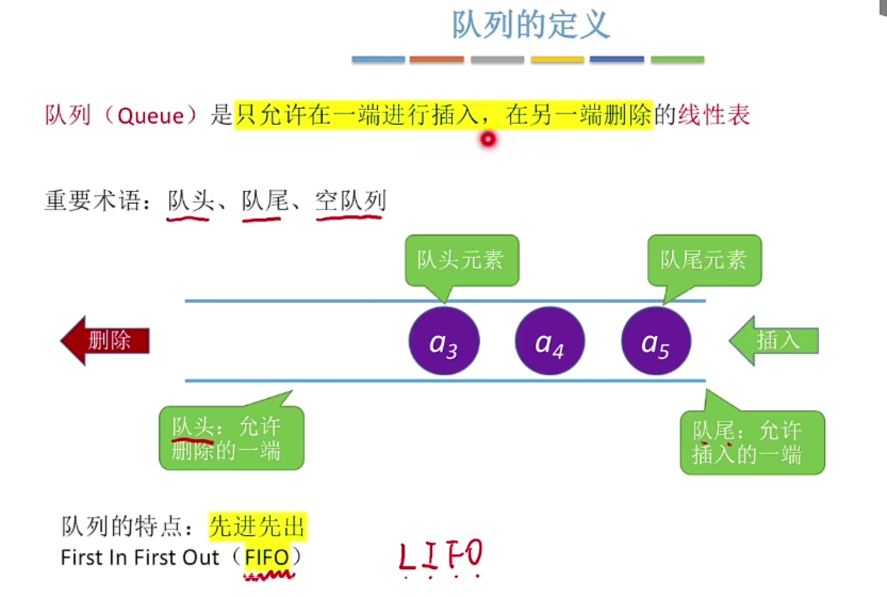

### 队列的基本操作

> 创建 销毁 增删改查

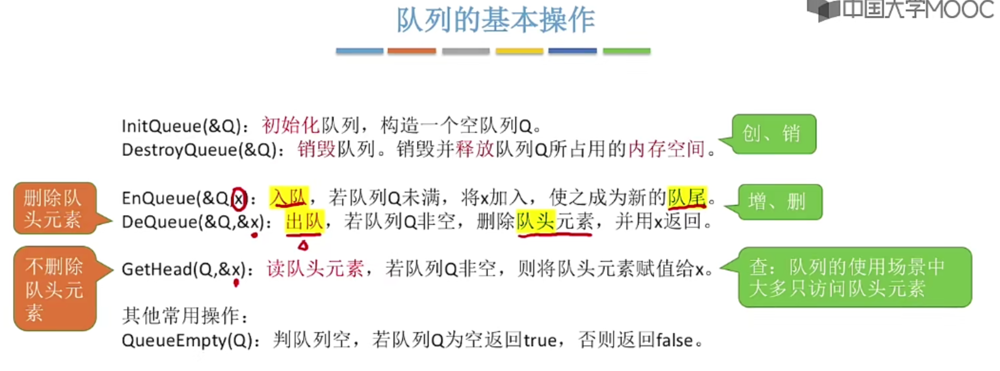

1. InitQueue(&Q)：初始化队列，构造一个空队列Q
2. DestroyQueue(&Q)：销毁队列。销毁并释放队列Q所占用的内存空间
3. EnQueue(&Q, x)：入队，若队列Q未满，将x加入，使之成为新的队尾
4. DeQueue(&Q, &x)：出队，若队列Q非空，删除队头元素，并用x返回
5. GetHead(Q, &x)：读队头元素，若队列非空，则将队头元素赋值给x
6. QueueEmpty(Q): 判断队列是否为空


### 顺序队列（队列的顺序实现）

#### 定义(浪费一个存储空间)

```C++
typedef struct{
    ElemType data[MaxSize]; //静态数组存放队列元素
    int front, rear;        //队头指针和队尾指针
} SqQueue;
```

连续的存储空间，大小：MaxSize*sizeof(ElemType);

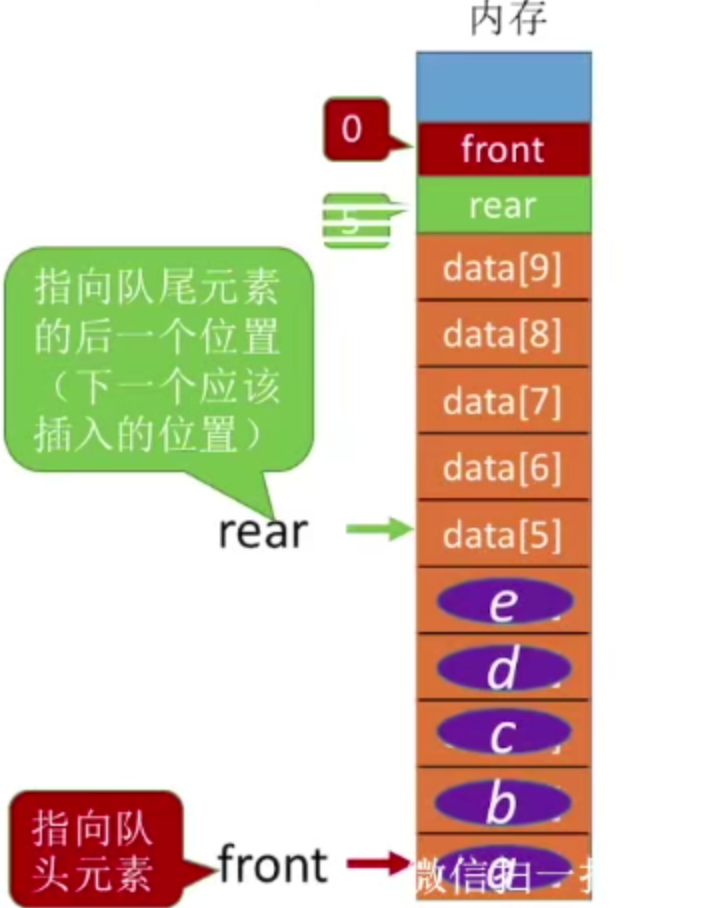

#### 初始化

```C++
//初始化队列
void InitQueue(SqQueue &Q){
    //初始时 队头、队尾指针指向0
    Q.rear = Q.front = 0;
}

```


#### 判断队空

```C++
//判断队列是否为空
bool QueueEmpty(SqQueue Q){
    return (Q.rear == Q.front);//队空条件
}
```


#### 入队

```C++
//入队
bool EnQueue(SqQueue &Q, ElemType x){
    if((Q.rear + 1)%MaxSize == Q.front) return false;

    Q.data[Q.rear] = x;
    Q.rear = (Q.rear + 1) % MaxSize;
    
    return true;
}
```


#### 出队

```C++
//出队
bool DeQueue(SqQueue &Q, ElemType &x){
    if(Q.rear == Q.front) return false;
    x = Q.data[Q.front];
    Q.front=[Q.front+1]%MaxSize;
    return true;
}
```


#### 获取队头元素

```C++
//获得队头元素
bool GetHead(SqQueue Q, ElemType &x){
    if(Q.rear == Q.front) return true;
    x = Q.data[Q.front];
    return true;
}
```


#### 获取元素个数

```C++
//获取队列元素的个数
int GetNum(SqQueue Q){
    return ((Q.rear + MaxSize - Q.front) % MaxSize); 
}
```


#### 总代码

```C++
#include <stdio.h>
#include <stdlib.h>

/*
    队列的顺序实现(浪费空间)
*/

#define ElemType int
#define MaxSize 10

typedef struct{
    ElemType data[MaxSize]; //静态数组存放队列元素
    int front, rear;        //队头指针和队尾指针
} SqQueue;


//初始化队列
void InitQueue(SqQueue &Q){
    //初始时 队头、队尾指针指向0
    Q.rear = Q.front = 0;
}

//判断队列是否为空
bool QueueEmpty(SqQueue Q){
    return (Q.rear == Q.front);//队空条件
}

//入队
bool EnQueue(SqQueue &Q, ElemType x){
    if((Q.rear + 1)%MaxSize == Q.front) return false;

    Q.data[Q.rear] = x;
    Q.rear = (Q.rear + 1) % MaxSize;
    
    return true;
}

//出队
bool DeQueue(SqQueue &Q, ElemType &x){
    if(Q.rear == Q.front) return false;
    x = Q.data[Q.front];
    Q.front=[Q.front+1]%MaxSize;
    return true;
}

//获得队头元素
bool GetHead(SqQueue Q, ElemType &x){
    if(Q.rear == Q.front) return true;
    x = Q.data[Q.front];
    return true;
}

//获取队列元素的个数
int GetNum(SqQueue Q){
    return ((Q.rear + MaxSize - Q.front) % MaxSize); 
}
```


#### （不浪费存储空间的方法）

```C++
//使用一个size进行判空和判满
typedef struct{
    ElemType data[MaxSize];
    int front, rear;
    int size;
} SqQueue;

//使用tag来判空和判满
typedef struct{
    ElemType data[MaxSize];
    int front, rear;
    int tag;
} SqQueue;
```


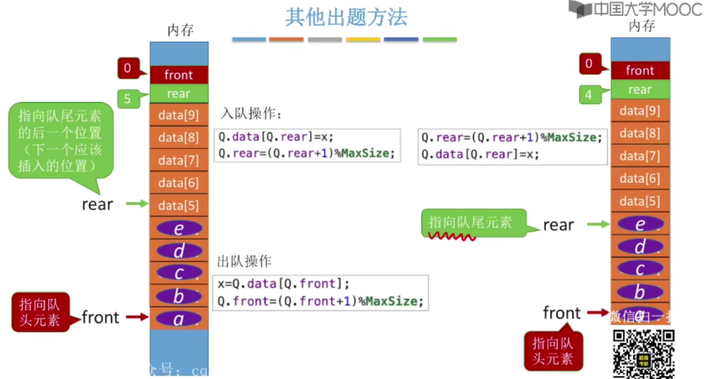

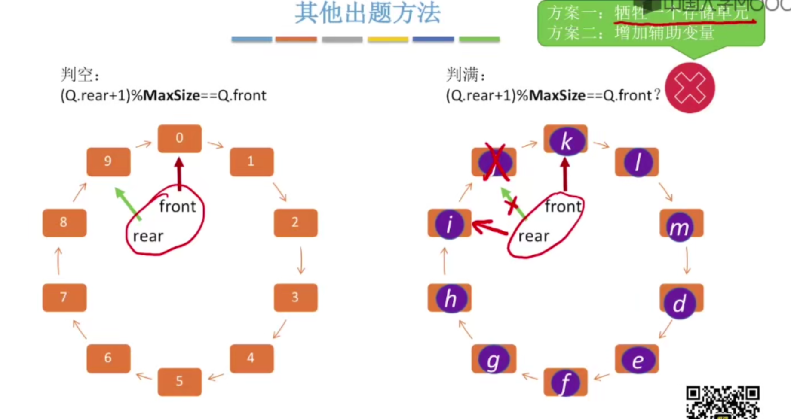


### 链队（队列的链式实现）

#### 结构体定义

```C++
//链式队列结点
typedef struct LinkNode{
    ElemType data;
    struct LinkNode *next;
} LinkNode;

//链式队列
typedef struct{
    LinkNode *front, *rear;     //队列的队头和队尾指针
} LinkQueue;

```


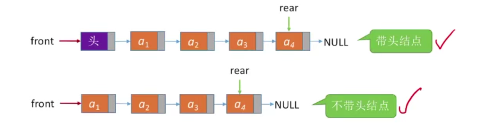


#### 初始化

```C++
//初始化队列（带头节点）
void InitQueue(LinkQueue &Q){
    //初始时 front rear 都指向头节点
    Q.front = Q.rear = (LinkNode *)malloc(sizeof(LinkNode));
    Q.front -> next = NULL;
}
```

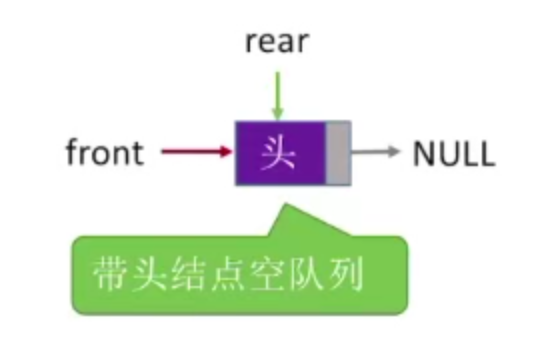

```C++
//初始化队列（不带头节点）
void InitQueue(LinkQueue &Q){
    //初始时 front rear都指向NULL
    Q.front = NULL;
    Q.rear = NULL;
}
```

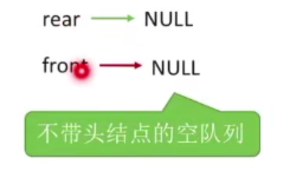


#### 判空

```C++
//判空（带头节点）
bool IsEmpty2(LinkQueue Q){
    return (Q.front == Q.rear);
}

//判空（不带头节点）
bool IsEmpty(LinkQueue Q){
    return (Q.front == NULL);
}
```


#### 入队

```C++
//入队（不带头节点）
void EnQueue(LinkNode &Q, ElemType x){
    //新节点赋值
    LinkNode *s = (LinkNode *)malloc(sizeof(LinkNode));
    s->data = x;
    s->next = NULL;
    
    //插入第一个元素
    if(Q.front == NULL){
        Q.front = s;
        Q.rear = s;
    }
    //插入其他元素
    else{
        Q.rear -> next = s;
        Q.rear = s;
    }
}

//入队（带头节点）
void EnQueue2(LinkQueue &Q, ElemType x){
    LinkNode *s = (LinkNode *)malloc(sizeof(LinkNode));
    s -> data = x;
    s -> next = NULL;
    Q.rear -> next = s;
    Q.rear = s;
}
```


#### 出队

```C++
//出队（不带头节点）
bool DeQueue(LinkQueue &Q, ElemType &x){
    if(Q.front == NULL) return false;

    LinkNode *p = Q.front;
    x = p->data;
    Q.front = p->next;
    if(Q.rear == p){
        Q.rear = NULL;
        Q.front == NULL;
    }
    free(p);
    return true;
}

//出队（带头节点）
bool DeQueue2(LinkQueue &Q, ElemType &x){
    //空队列
    if(Q.front == Q.rear) return false;

    LinkNode *p = Q.front->next;
    //返回值和修改
    x = p -> data;
    Q.front ->next = p ->next;
    //检验是否为最后一个节点
    if(Q.rear == p) Q.rear = Q.front;
    //释放存储空间
    free(p);
    return true;
}
```


#### 总代码

```C++
#include <stdio.h>
#include <stdlib.h>

/*
    队列的链式实现
*/

#define ElemType int
#define MaxSize 10

//链式队列结点
typedef struct LinkNode{
    ElemType data;
    struct LinkNode *next;
} LinkNode;

//链式队列
typedef struct{
    LinkNode *front, *rear;     //队列的队头和队尾指针
} LinkQueue;

//初始化队列（不带头节点）
void InitQueue(LinkQueue &Q){
    //初始时 front rear都指向NULL
    Q.front = NULL;
    Q.rear = NULL;
}

//初始化队列（带头节点）
void InitQueue2(LinkQueue &Q){
    //初始时 front rear 都指向头节点
    Q.front = Q.rear = (LinkNode *)malloc(sizeof(LinkNode));
    Q.front -> next = NULL;
}

//判空（不带头节点）
bool IsEmpty(LinkQueue Q){
    return (Q.front == NULL);
}

//判空（带头节点）
bool IsEmpty2(LinkQueue Q){
    return (Q.front == Q.rear);
}

//入队（不带头节点）
void EnQueue(LinkNode &Q, ElemType x){
    //新节点赋值
    LinkNode *s = (LinkNode *)malloc(sizeof(LinkNode));
    s->data = x;
    s->next = NULL;
    
    //插入第一个元素
    if(Q.front == NULL){
        Q.front = s;
        Q.rear = s;
    }
    //插入其他元素
    else{
        Q.rear -> next = s;
        Q.rear = s;
    }
}

//入队（带头节点）
void EnQueue2(LinkQueue &Q, ElemType x){
    LinkNode *s = (LinkNode *)malloc(sizeof(LinkNode));
    s -> data = x;
    s -> next = NULL;
    Q.rear -> next = s;
    Q.rear = s;
}

//出队（不带头节点）
bool DeQueue(LinkQueue &Q, ElemType &x){
    if(Q.front == NULL) return false;

    LinkNode *p = Q.front;
    x = p->data;
    Q.front = p->next;
    if(Q.rear == p){
        Q.rear = NULL;
        Q.front == NULL;
    }
    free(p);
    return true;
}

//出队（带头节点）
bool DeQueue2(LinkQueue &Q, ElemType &x){
    //空队列
    if(Q.front == Q.rear) return false;

    LinkNode *p = Q.front->next;
    //返回值和修改
    x = p -> data;
    Q.front ->next = p ->next;
    //检验是否为最后一个节点
    if(Q.rear == p) Q.rear = Q.front;
    //释放存储空间
    free(p);
    return true;
}

int main(){
    LinkQueue q;        //声明一个队列
    InitQueue(q);       //初始化队列
}
```


### 双端队列

#### 定义

可以在两端进行输入和输出的队列

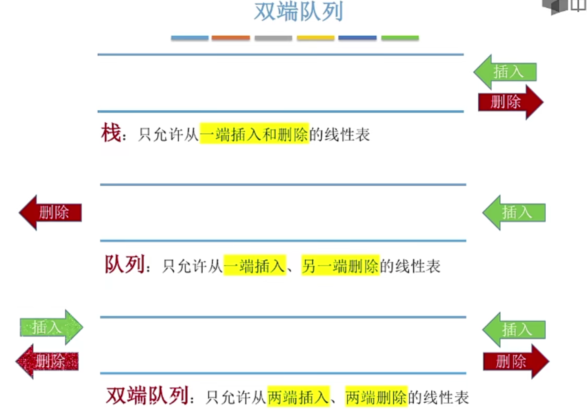

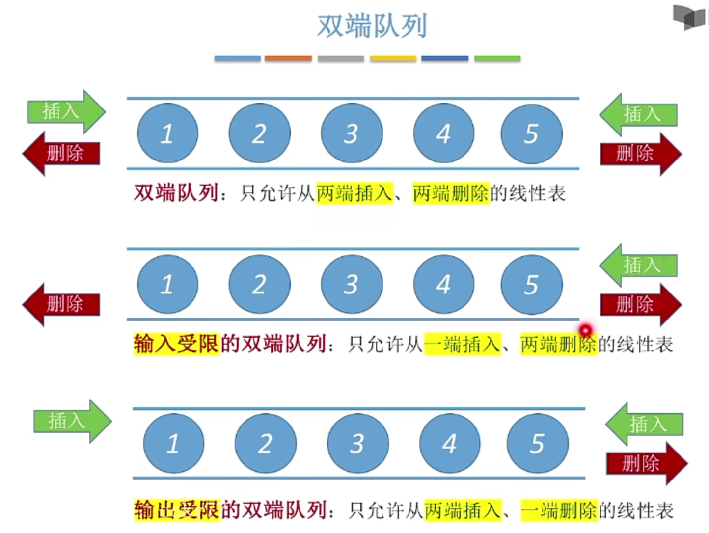 

#### 考点：判断输出序列合法性

若数据元素输入序列为1，2，3，4，则哪些输出序列是合法的，哪些是非法的？

#### 栈

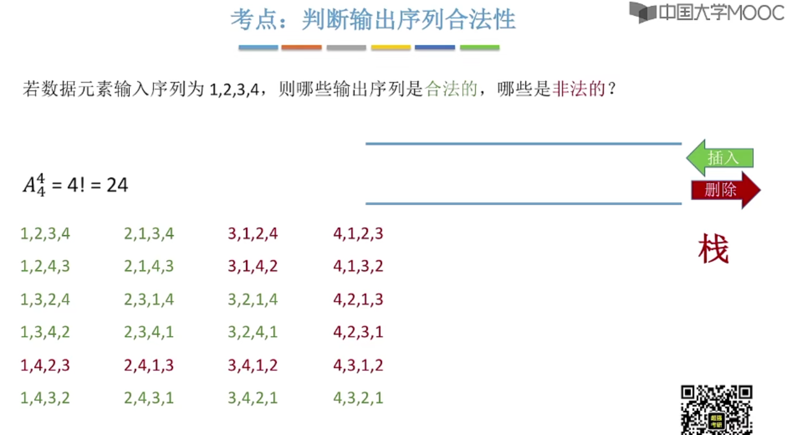

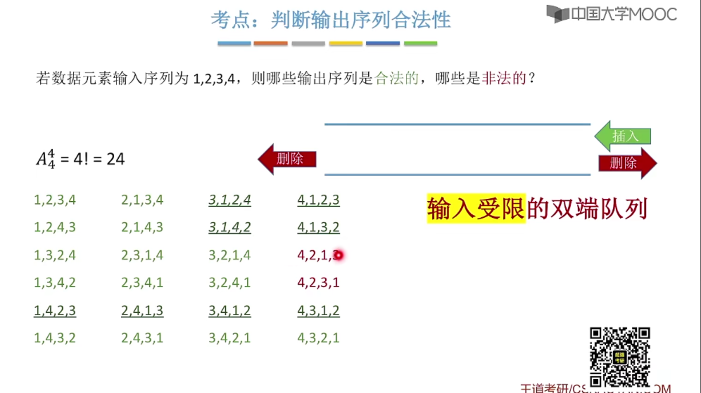

 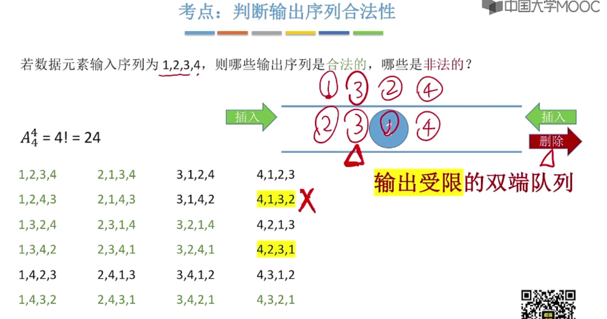

## 栈和队列的应用

### 1.栈的第一个应用：括号匹配中的应用

#### 函数代码

```C++
bool bracketCheck(char str[], int length){
    SqStack S;
    InitStack(S);   //初始化一个栈 
    for(int i = 0; i < length;i ++){

        if(str[i] == '(' || str[i] == '[' || str[i] == '{') Push(S, str[i]);   //扫描到左括号，入栈
        else{
            if(StackEmpty(S)) return false; //扫描到右括号，且当前栈空

            char topElem;
            Pop(S, topElem);    //栈顶元素出栈

            if(str[i] == ')' && topElem != '(') return false;
            else if(str[i] == ']' && topElem != '[') return false;
            else if(str[i] == '}' && topElem != '{') return false;

        }

    }
    return StackEmpty(S);
}
```


#### 总代码（可运行）

```C++
#include <stdio.h>
#include <stdlib.h>
#include <string.h>

/*
    栈在括号匹配中的应用
*/

#define ElemType char
#define MaxSize 10

typedef struct{
    ElemType data[MaxSize];    //静态数组存放栈中元素
    int top;                   //栈顶指针
} SqStack;                     //sequence 顺序

//初始化栈
//注意审题，top是指向最后一个元素的位置还是指向下一个可以插入的位置
void InitStack(SqStack &S){
    S.top = -1;                //初始化栈顶指针
}

//判断栈空
bool StackEmpty(SqStack S){
    return (S.top == -1);
}

//新元素入栈
bool Push(SqStack &S, ElemType x){
    if(S.top == MaxSize -1) return false; //栈满报错
    S.top = S.top + 1;                    //指针+1
    S.data[S.top] = x;                    //新元素入栈
    //S.data[++S.top] = x; 
    return true; 
}

//出栈操作
bool Pop(SqStack &S, ElemType &x){
    if(S.top == -1) return false;           //栈空报错
    x = S.data[S.top];                      //栈顶元素出栈
    S.top=S.top - 1;                        //指针-1
    //x = S.data[S.top--];
    return true;
}

//读栈顶元素
bool GetTop(SqStack S, ElemType &x){
    if(S.top == -1) return false;
    x = S.data[S.top];
    return true;
}


bool bracketCheck(char str[], int length){
    SqStack S;
    InitStack(S);   //初始化一个栈 
    for(int i = 0; i < length;i ++){

        if(str[i] == '(' || str[i] == '[' || str[i] == '{') Push(S, str[i]);   //扫描到左括号，入栈
        else{
            if(StackEmpty(S)) return false; //扫描到右括号，且当前栈空

            char topElem;
            Pop(S, topElem);    //栈顶元素出栈

            if(str[i] == ')' && topElem != '(') return false;
            else if(str[i] == ']' && topElem != '[') return false;
            else if(str[i] == '}' && topElem != '{') return false;

        }

    }
    return StackEmpty(S);
}

int main(){
    char s[]="{}[{((()))}]";
    if(bracketCheck(s,strlen(s))) printf("Right!");
    else printf("Error!");

    return 0;
    
}
```


### 2.栈的第二个应用：表达式的求值

#### 中缀、后缀、前缀表达式

- 中缀表达式：运算符在两个操作数中间
- 后缀表达式：运算符在两个操作数后面
- 前缀表达式：运算符在两个操作数前面

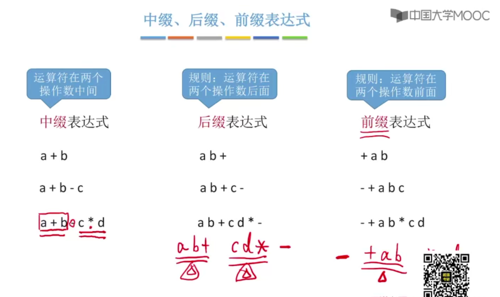

#### 中缀转后缀的手算方法

1. 确定中缀表达式中各个运算符的运算顺序
2. 选择下一个运算符，按照[左操作数 右操作数 运算符]的方式组合成一个新的操作数
3. 如果还有运算符没被处理，就继续2

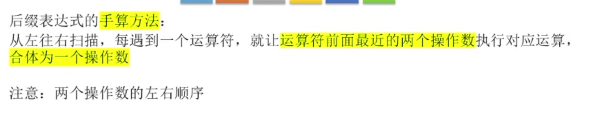


运算顺序不唯一，因此对应的后缀表达式也不唯一

“左优先原则”，不要Freestyle，保证手算和机算结果相同：只要左边的运算符能先计算，就优先算左边（可保证表达式唯一）


#### 中缀表达式转后缀表达式（机算）

- 初始化一个栈，用于保存暂时还不能确定运算顺序的运算符

- 从左向右处理各个元素，直到末尾。

- 可能遇到三种情况：

  1. 遇到操作数。直接加入后缀表达式

  2. 遇到界限符。遇到"("直接入栈；遇到")"则依次弹出栈内运算符并加入后缀表达式，直到弹出"("为止。注意："("不加入后缀表达式

  3. 遇到运算符。依次弹出栈中**优先级**高于或等于当前运算符的所有运算符，并加入后缀表达式，若碰到"("或栈空则停止。之后再将当前运算符入栈。

- 按上述方法处理完所有字符后，将栈中剩余运算符依次弹出，并加入后缀表达式。

```C++
```


#### 后缀表达式的机算

用栈实现后缀表达式：

1. 从左往右扫描下一个元素，直到处理完所有元素
2. 若扫描到操作数则压入栈，并回到1；否则执行3
3. 若扫描到运算符，则弹出两个栈顶元素（先出栈的是右操作数），执行相应运算，运算结果压回栈顶，回到1

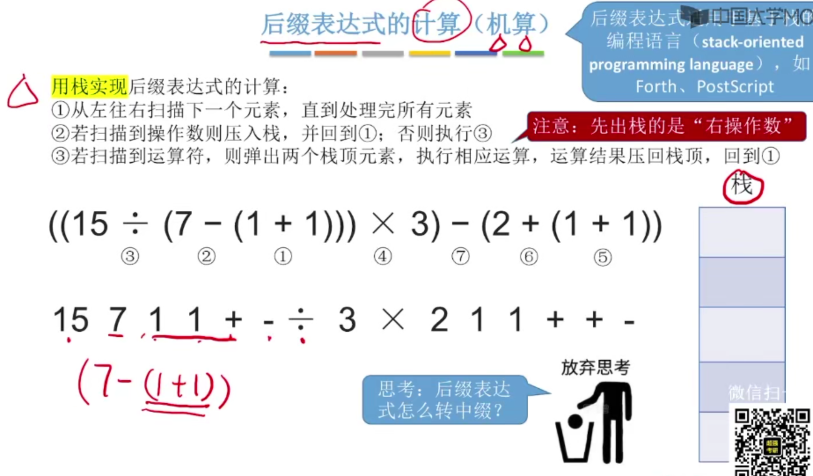

```C++
```


#### 中缀转前缀的手算方法

1. 确定中缀表达式中各个运算符的运算顺序
2. 选择下个运算符，按照[运算符 左操作数 右操作数] 的方式组合成一个新的操作数
3. 如果还有操作符没被处理，就继续2


”右优先原则“：只要右边的运算符能先计算，就优先计算右边的

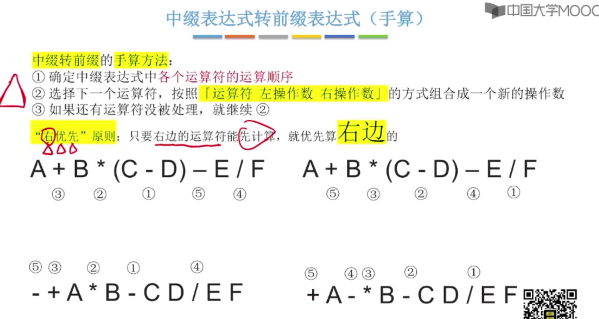

#### 前缀表达式的机算

用栈实现前缀表达式的机算：

1. 从右往左扫描下一个元素，直到处理完所有元素
2. 若扫描到操作数则压入栈，并回到1；否则执行3
3. 若扫描到运算符，则弹出两个栈顶元素（先出栈的元素是左操作数），执行相应运算，运算结果压回栈顶，回到1

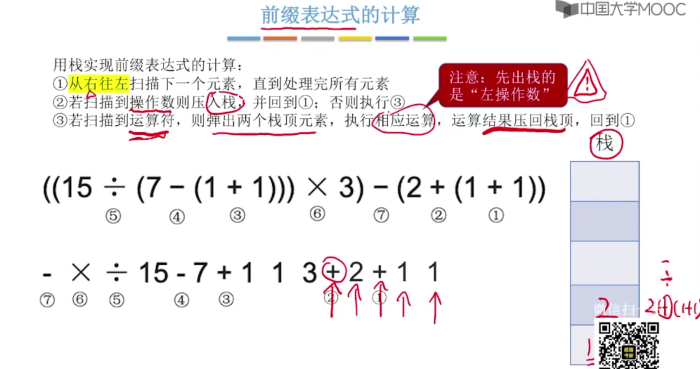


#### 中缀表达式的机算（用栈实现）

中缀转后缀 + 后缀表达式求值       两个算法结合

用栈实现中缀表达式的计算：

1. 初始化两个字栈：操作数栈和运算符栈
2. 若扫描到操作数，压入操作数栈
3. 若扫描到运算符或界限符，则按照“中缀转后缀”相同的逻辑压入运算符栈**（期间也会弹出运算符，每当弹出一个运算符时，就需要再弹出两个操作数栈的栈顶元素并执行相应运算，运算结果再压回操作数栈）**


```C++
```


### 3.栈的第三个应用：递归

函数调用背后的过程：

#### 函数调用的特点：最后被调用的函数最先被执行结束（FILO）

#### 函数调用的过程

函数调用时，需要用一个栈存储：

1. 调用返回地址
2. 实参
3. 局部变量

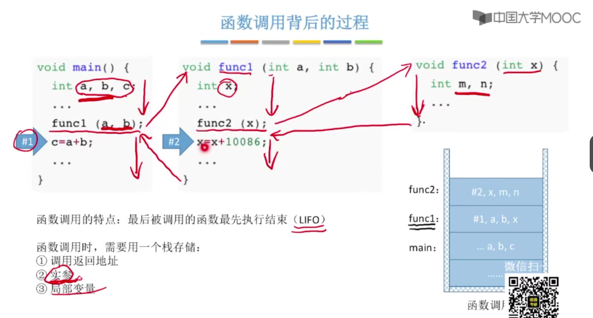

栈在递归中的应用：

**适合用递归算法解决：可以把原始问题转换为属性相同，但规模更小的问题**

#### 求阶乘和斐波那契数列的和

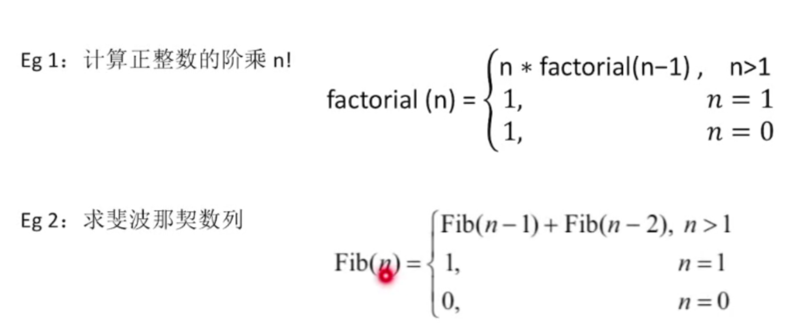

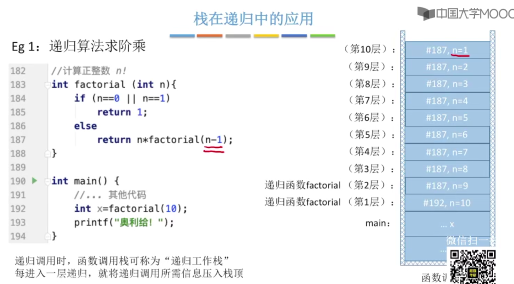

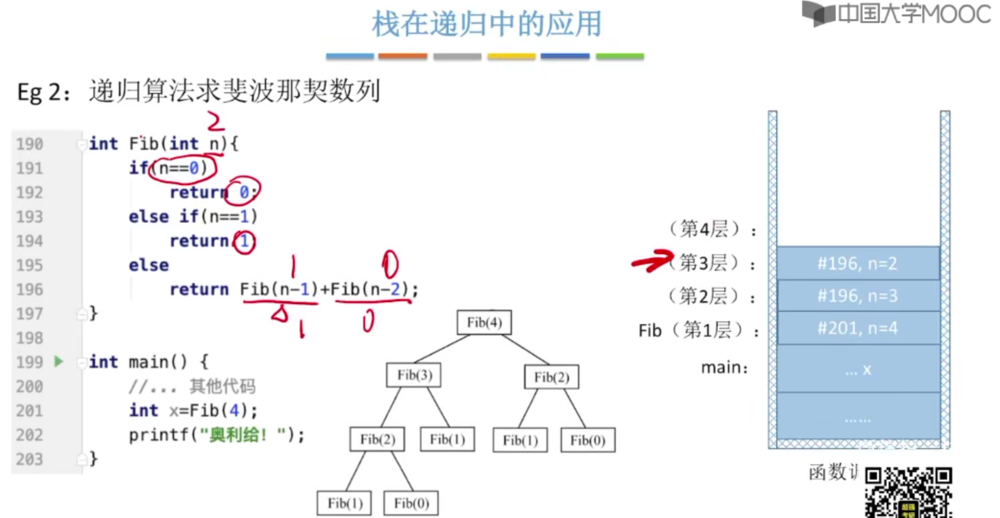

```C++
/计算阶乘
int factorial (int n){
    if(n == 1 || n == 0) return 1;
    else return n * factorial(n-1);
}

//计算斐波那契数列
int Fib(int n){
    if(n == 0) return 0;
    else if (n == 1) return 1;
    else return Fib(n-1)+Fib(n-2);
}

int main(){
    int num;
    scanf("%d", &num);
    printf("阶乘是：%d  ,斐波那契数列是：%d", factorial(num),Fib(num));
    return 0;
}
```

#### 栈应用的缺点

效率低，太多层递归可能会导致栈溢出；可能包含很多重复计算

#### 栈的改善方法

可以自定义栈将递归算法改造成非递归算法


### 4.栈的第四个应用：进制转换

#### 思路

- 使用stack<int>来存储每一位的数字。
- 在函数decimalToBase中，通过不断将十进制数除以目标进制数并取余数，将余数压入栈中。
- 将栈中的元素依次弹出，并将其转换为字符串类型，连接起来形成最终的转换结果。

#### 总代码

```C++
#include <iostream>
#include <stack>
#include <string.h>

/*
    栈在进制转换中的应用
    使用stack<int>来存储每一位的数字。
    在函数decimalToBase中，通过不断将十进制数除以目标进制数并取余数，将余数压入栈中。
    将栈中的元素依次弹出，并将其转换为字符串类型，连接起来形成最终的转换结果。
*/
using namespace std;

// 将十进制数转换为指定进制数
string decimalToBase(int number, int base) {
    stack<int> digits;

    while (number > 0) {
        int remainder = number % base;
        digits.push(remainder);
        number /= base;
    }

    string result;
    while (!digits.empty()) {
        int digit = digits.top();
        digits.pop();
        result += to_string(digit);
    }

    return result;
}

int main() {
    int number;
    int base;

    cout << "Enter a decimal number: ";
    cin >> number;

    cout << "Enter the base to convert to: ";
    cin >> base;

    string result = decimalToBase(number, base);

    cout << "Result: " << result << endl;

    return 0;
}

```


### 5. 栈的第五个应用：迷宫求解（深度优先算法）

#### 思路

栈在迷宫求解中有广泛的应用，主要用于实现**深度优先搜索算法**。下面是栈在迷宫求解中的具体应用：

1. 迷宫表示：首先，我们可以使用二维数组或者矩阵来表示迷宫。迷宫的每个位置可以用0表示可通行的路径，用1表示墙壁或障碍物。这样的表示方式可以方便我们在后续的求解过程中进行遍历和判断。

2. 深度优先搜索：在迷宫求解过程中，我们通常采用深度优先搜索算法来寻找从入口到出口的路径。**深度优先搜索算法的核心思想是沿着一个方向尽可能深入地探索迷宫，直到无法继续为止，然后回溯到上一个位置，选择其他的方向进行探索。**

3. 栈的应用：为了实现深度优先搜索算法，我们可以借助栈来保存当前位置和搜索路径的信息。具体操作如下：
   - 将起始位置入栈。
   - 不断出栈并探索当前位置的相邻可通行位置。
   - 将可通行位置入栈，并标记为已访问。
   - 重复上述步骤，直到找到出口或者栈为空。
   - 如果找到出口，则可以通过栈中保存的路径信息来追踪整个路径。

通过使用栈，我们可以有效地管理搜索过程中的状态信息，避免了递归调用带来的函数调用开销，同时也方便了路径的回溯和记录。

总结起来，栈在迷宫求解中的应用主要体现在深度优先搜索算法的实现中，通过栈来管理搜索状态和路径信息，以便找到从入口到出口的路径。


### 1.队列应用——树的层次遍历

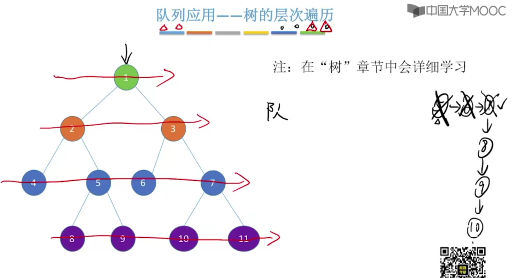


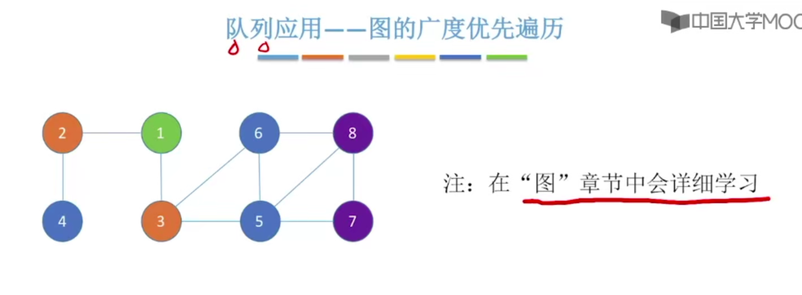


### 2.队列的应用：页面替换算法

#### 定义

**页面替换算法是操作系统中用于管理虚拟内存的一种策略。在计算机系统中，虚拟内存是一种将主存（RAM）扩展到硬盘上的技术。由于硬盘的访问速度较慢，所以在内存空间不足时，操作系统需要根据一定的策略将部分主存中的页面（页框）置换到硬盘上，从而腾出空间供其他页面使用。**

页面替换算法的目标是使得整体的页面访问效率最大化，减少页面置换带来的性能损失。常见的页面替换算法有以下几种：

1. **最佳(OPT)算法**：选择将来最长时间内不再被访问的页面进行置换。该算法是一种理想化的算法，但实际上很难预测将来页面的访问模式。

2. **先进先出(FIFO)算法**：选择最早进入内存的页面进行置换。该算法简单直观，但可能会导致"先进入"的页面在后续访问中仍然频繁使用，造成性能下降，即所谓的"Belady现象"。

3. **最近最少使用(LRU)算法**：选择最近一段时间内最少被访问的页面进行置换。该算法基于局部性原理，认为最近被访问的页面可能在将来继续被访问，适应了大多数程序的访问模式。

4. **最不经常使用(LFU)算法**：选择最近一段时间内访问次数最少的页面进行置换。该算法认为访问次数少的页面可能是不常用的页面，适用于具有较强访问模式的程序。

5. **时钟(Clock)算法**：基于FIFO算法的基础上，使用一个"访问位"（也称为"引用位"）来判断页面是否被访问过，将未被访问的页面进行置换。

不同的页面替换算法在不同的工作负载下表现不同，没有一种算法能够适用于所有情况。因此，在实际应用中，根据系统特点和工作负载的特点选择合适的页面替换算法。


#### **先进先出(FIFO)算法**使用队列

#### LRU（最近最少使用）算法也可以使用双端队列


### 3.队列的应用：缓冲区

#### 问题描述

- 解决主机 与外部设备之间速度不匹配的问题
- 例如：主机输出数据给打印机打印，输出数据的速度比打印数据的速度快很多，由于速度不匹配，若直接把输出的数据给打印机打印显然是不行的。解决方法是设置一个**打印数据缓冲区**，主机把要打印输出的数据依次写入这个缓冲区，写满后就暂停输出，转去做其他事情。打印机就从缓冲区中按照**先进先出**的原则依次取出数据并打印，打印完后再向主机发出请求。主机接到请求之后再向缓冲区写入打印数据。
- 这样做既保证了打印数据的正确，又使主机提高了效率。
- 打印数据缓冲区中所存储的数据就是一个队列


### 4. 队列的应用：CPU资源分配

#### 问题描述：

- 解决由多用户引起的资源竞争问题
- 在一个多终端的计算机系统上，有多个用户需要CPU各自运行自己的程序，分别通过各自的终端向操作系统提出占用CPU的请求，操作系统通常按照每个请求在时间上的先后顺序，把它们排成一个队列，每次把CPU分配给队首请求的用户使用。当相应的程序运行结束或者用完规定的时间间隔后，令其出队，再把CPU分配给新的队首请求的用户使用。
- 既能满足每个用户的请求，又使CPU能够正常运行


### 5.队列的应用：图的广度优先搜索

队列在图的广度优先搜索(BFS)中扮演了关键的角色，用于管理待访问的顶点和控制搜索的顺序。下面是队列在图的广度优先搜索中的具体应用：

1. 图的表示：首先，我们需要使用适当的数据结构来表示图。常见的表示方式有邻接矩阵和邻接表。邻接矩阵适用于稠密图，而邻接表适用于稀疏图。无论使用哪种表示方式，我们需要确保能够存储图中顶点之间的连接关系。

2. 广度优先搜索：广度优先搜索是一种用于图的遍历的算法，它从图中的一个顶点开始，逐层地访问与该顶点相邻的顶点，直到达到目标顶点或者遍历完所有可达的顶点。这种搜索方式确保了先访问离起始顶点最近的顶点，然后再逐渐扩展到离起始顶点更远的顶点。

3. 队列的应用：为了实现广度优先搜索算法，我们需要使用队列来管理待访问的顶点。具体操作如下：
   - 将起始顶点入队列。
   - 从队列中取出一个顶点并标记为已访问。
   - 遍历该顶点的所有相邻顶点，将未访问的顶点入队列。
   - 重复上述步骤，直到队列为空或者找到目标顶点。
   - 如果找到目标顶点，则可以通过记录顶点间的连接关系来追踪整个路径。

通过使用队列，我们能够按照广度优先的顺序逐层遍历图中的顶点，保证了离起始顶点近的顶点优先被访问。队列的先进先出(FIFO)特性确保了每个顶点在队列中只被访问一次。

综上所述，队列在图的广度优先搜索中的应用主要体现在管理待访问的顶点和控制搜索顺序方面，通过队列来按照广度优先的方式遍历图中的顶点，并追踪整个路径。


### 6.队列的应用：特殊矩阵的压缩

#### 主要术语

- **压缩存储**：为多个值相同的元素只分配一个存储空间，对零元素不分配存储空间。目的是节省存储空间
- **特殊矩阵**：具有许多相同矩阵元素或零元素，这些相同的矩阵元素或零元素的分布有一定规律的矩阵。 常见有：对称矩阵、上（下）三角矩阵、对角矩阵
- **特殊矩阵的压缩存储方法**：找出特殊矩阵中值相同的矩阵元素的分布规律，把那些呈现规律性分布的、值相同的多个矩阵元素压缩存储到一个存储空间


#### 二维数组的存储结构

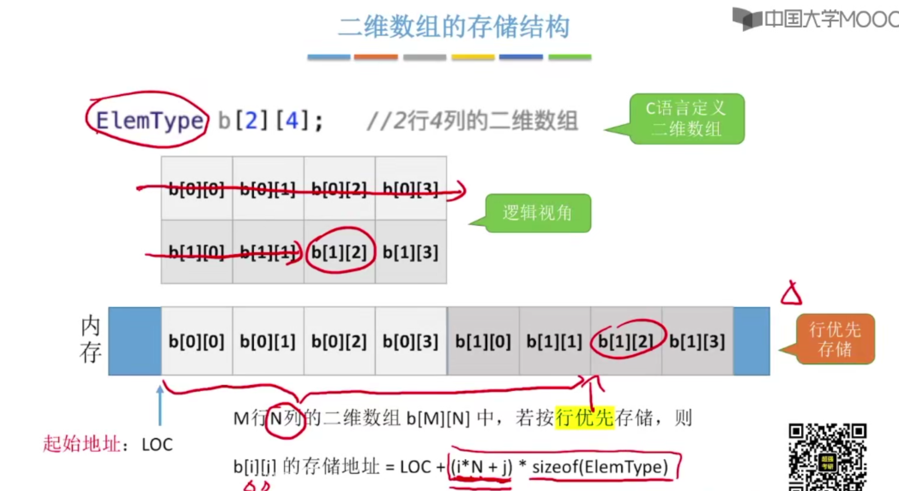

#### 对称矩阵的压缩存储

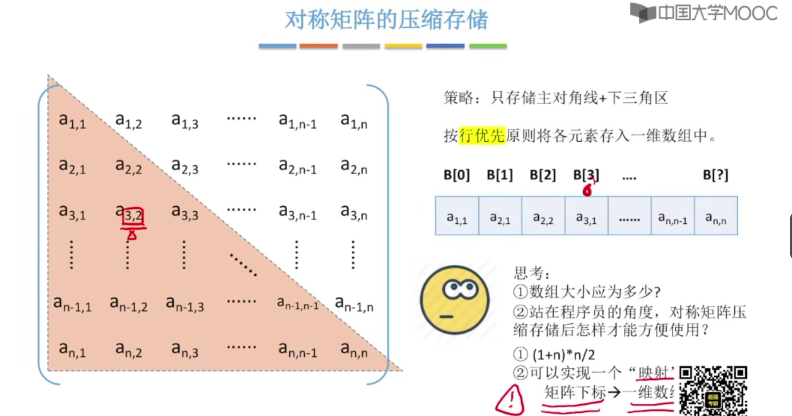

矩阵下标  a(i,j)           一维数组下标B[k]

a(i,j)  (i >= j):  k = i*(i-1)/2+j-1;

a(i,j)  (i < j):  k = j*(j-1)/2+i-1;


#### 三角矩阵的压缩存储

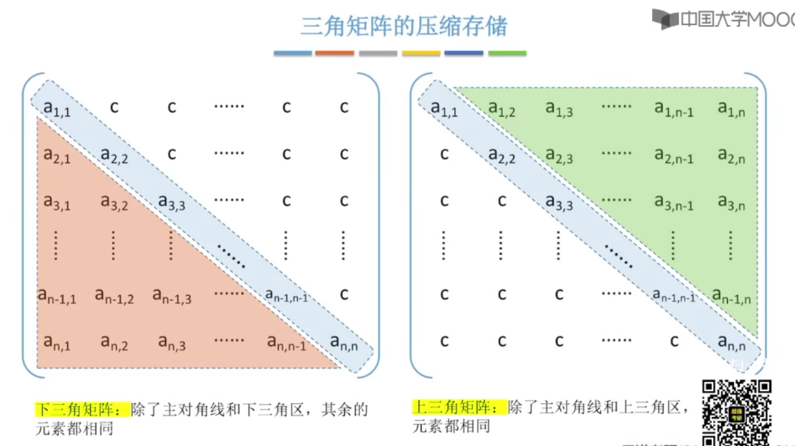

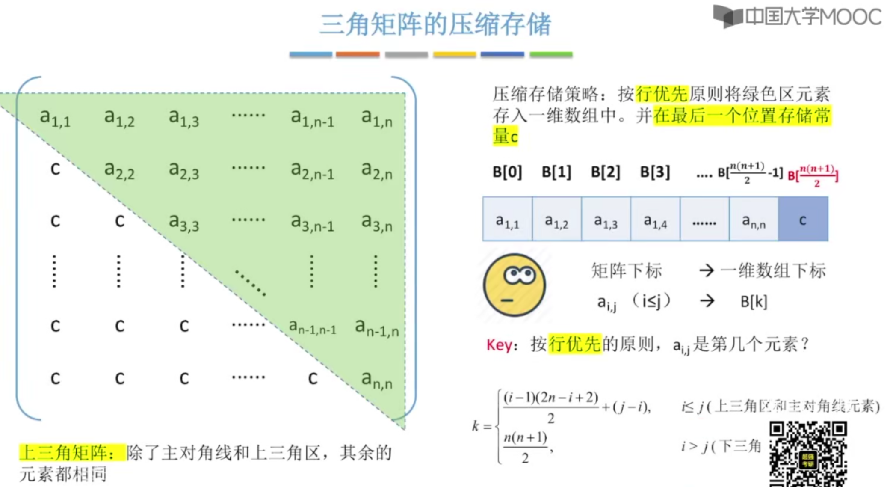

#### 三对角矩阵的压缩存储


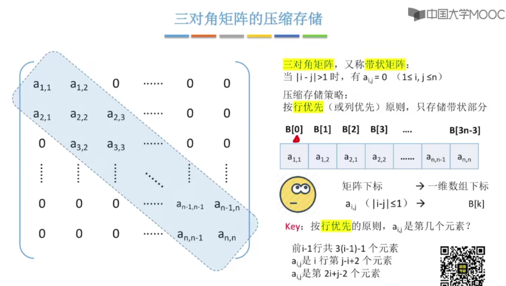

#### 稀疏矩阵的压缩存储

非零元素远远少于矩阵元素的个数


#### 顺序存储——三元组<行，列，值>

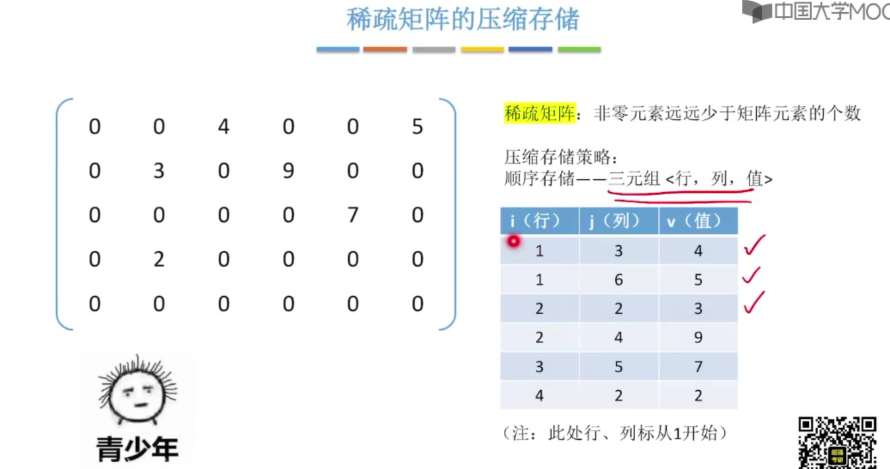

#### 十字链表法

- [十字链表法的实现](https://blog.csdn.net/qq_42185999/article/details/105083274)


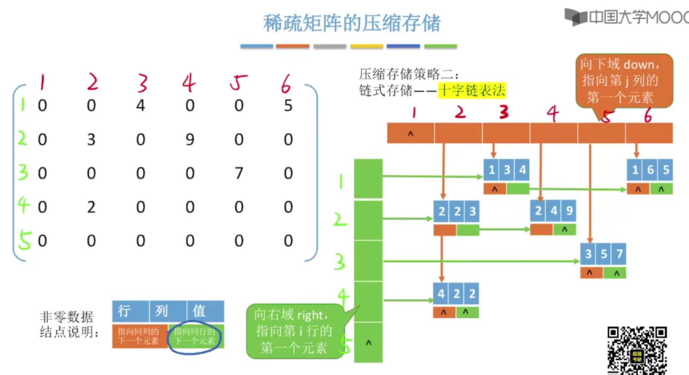

**使用条件**：当矩阵的非零元个数和位置在操作过程中变化较大时，就不宜采用顺序存储结构来表示三元组的[线性表](https://so.csdn.net/so/search?q=线性表&spm=1001.2101.3001.7020)。对这种类型的矩阵，采用链式存储结构表示三元组的线性表更为恰当。


**使用方法**：在链表中，每个非零元可用一个含 5 个域的结点表示，其中 i , j , e 这 3 个域分别表示该非零元所在的行、列和非零元的值，向右域 right 用以链接同一行中下一个非零元，向下域 down 用以链接同一列中下一个非零元。

同一行的非零元通过 right 域链接成一个线性链表，同一列的非零元通过 down 域链接成一个线性链表，每个非零元既是某个行链表中的一个结点，又是某个列链表中的一个结点，整个矩阵构成了一个十字交叉的链表，故称这样的存储结构为十字链表。
可用两个分别存储行链表的头指针和列链表的头指针的一维数组表示之

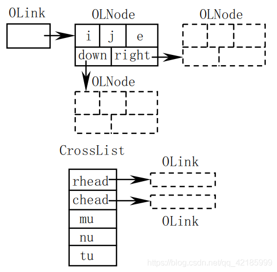

***采用十字链表存储稀疏矩阵的示例：***

 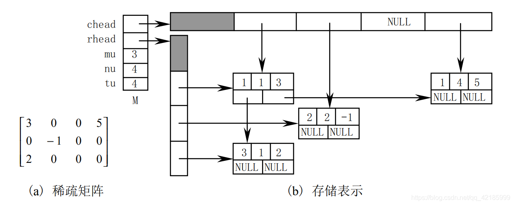

>由于十字链表存储结构中的非零元素是按其所在行、列插入相应的链表的，所以，在创建稀疏矩阵输入非零元时，可以按**任意顺序**输入非零元素。每个非零元结点按升序被插入到两个没有头结点的单链表中：一个是所在行链表；另一个是所在列链表。当插入或删除结点时，只要修改相关的行、列链表即可，比较灵活。
>


总代码（不知道能不能运行）：

```C++
typedef int Status; /* Status是函数的类型,其值是函数结果状态代码，如OK等 */
typedef int Boolean; /* Boolean是布尔类型,其值是TRUE或FALSE */
typedef int ElemType;
 
#include<malloc.h> /* malloc()等 */
#include<stdio.h> /* EOF(=^Z或F6),NULL */
#include<process.h> /* exit() */
 
#include<stdarg.h> /* 标准头文件，提供宏va_start，va_arg和va_end， */
/* 用于存取变长参数表 */
 
/* 函数结果状态代码 */
#define TRUE 1
#define FALSE 0
#define OK 1
#define ERROR 0
#define INFEASIBLE -1
#define OVERFLOW -2 
 
 
 
/* ---------------------------    稀疏矩阵的十字链表存储表示    ------------------------------*/
 
typedef struct OLNode
{
	int i, j; /* 该非零元的行和列下标 */
	ElemType e; /* 非零元素值 */
	struct OLNode *right, *down; /* 该非零元所在行表和列表的后继链域 */
}OLNode, *OLink;
typedef struct
{
	OLink *rhead, *chead; /* 行和列链表头指针向量基址,由CreatSMatrix_OL()分配 */
	int mu, nu, tu; /* 稀疏矩阵的行数、列数和非零元个数 */
}CrossList;
 
/* ------------------------------------------------------------------------------------------*/
 
 
 
/* ---------------------------  稀疏矩阵的十字链表存储的基本操作(9个)  --------------------------*/
 
Status InitSMatrix(CrossList *M) /* 加 */
{ /* 初始化M(CrossList类型的变量必须初始化,否则创建、复制矩阵将出错) */
	(*M).rhead = (*M).chead = NULL;
	(*M).mu = (*M).nu = (*M).tu = 0;
	return OK;
}
 
Status DestroySMatrix(CrossList *M)
{ /* 初始条件: 稀疏矩阵M存在。操作结果: 销毁稀疏矩阵M */
	int i;
	OLNode *p, *q;
	for (i = 1; i <= (*M).mu; i++) /* 按行释放结点 */
	{
		p = *((*M).rhead + i);
		while (p)
		{
			q = p;
			p = p->right;
			free(q);
		}
	}
	free((*M).rhead);
	free((*M).chead);
	(*M).rhead = (*M).chead = NULL;
	(*M).mu = (*M).nu = (*M).tu = 0;
	return OK;
}
 
Status CreateSMatrix(CrossList *M)
{ /* 创建稀疏矩阵M,采用十字链表存储表示。算法5.4 */
	int i, j, k, m, n, t;
	ElemType e;
	OLNode *p, *q;
	if ((*M).rhead)
		DestroySMatrix(M);
	printf("请输入稀疏矩阵的行数 列数 非零元个数: ");
	scanf_s("%d%d%d", &m, &n, &t);
	(*M).mu = m;
	(*M).nu = n;
	(*M).tu = t;
	(*M).rhead = (OLink*)malloc((m + 1) * sizeof(OLink));
	if (!(*M).rhead)
		exit(OVERFLOW);
	(*M).chead = (OLink*)malloc((n + 1) * sizeof(OLink));
	if (!(*M).chead)
		exit(OVERFLOW);
	for (k = 1; k <= m; k++) /* 初始化行头指针向量;各行链表为空链表 */
		(*M).rhead[k] = NULL;
	for (k = 1; k <= n; k++) /* 初始化列头指针向量;各列链表为空链表 */
		(*M).chead[k] = NULL;
	printf("请按任意次序输入%d个非零元的行 列 元素值:\n", (*M).tu);
	for (k = 0; k < t; k++)
	{
		scanf_s("%d%d%d", &i, &j, &e);
		p = (OLNode*)malloc(sizeof(OLNode));
		if (!p)
			exit(OVERFLOW);
		p->i = i; /* 生成结点 */
		p->j = j;
		p->e = e;
		if ((*M).rhead[i] == NULL || (*M).rhead[i]->j > j) /* p插在该行的第一个结点处 */
		{
			p->right = (*M).rhead[i];
			(*M).rhead[i] = p;
		}
		else /* 寻查在行表中的插入位置 */
		{
			for (q = (*M).rhead[i]; q->right&&q->right->j < j; q = q->right);
			p->right = q->right; /* 完成行插入 */
			q->right = p;
		}
		if ((*M).chead[j] == NULL || (*M).chead[j]->i > i) /* p插在该列的第一个结点处 */
		{
			p->down = (*M).chead[j];
			(*M).chead[j] = p;
		}
		else /* 寻查在列表中的插入位置 */
		{
			for (q = (*M).chead[j]; q->down&&q->down->i < i; q = q->down);
			p->down = q->down; /* 完成列插入 */
			q->down = p;
		}
	}
	return OK;
}
 
Status PrintSMatrix(CrossList M)
{ /* 初始条件: 稀疏矩阵M存在。操作结果: 按行或按列输出稀疏矩阵M */
	int i, j;
	OLink p;
	printf("%d行%d列%d个非零元素\n", M.mu, M.nu, M.tu);
	printf("请输入选择(1.按行输出 2.按列输出): ");
	scanf_s("%d", &i);
	switch (i)
	{
	case 1: for (j = 1; j <= M.mu; j++)
	{
		p = M.rhead[j];
		while (p)
		{
			printf("%d行%d列值为%d\n", p->i, p->j, p->e);
			p = p->right;
		}
	}
			break;
	case 2: for (j = 1; j <= M.nu; j++)
	{
		p = M.chead[j];
		while (p)
		{
			printf("%d行%d列值为%d\n", p->i, p->j, p->e);
			p = p->down;
		}
	}
	}
	return OK;
}
 
void PrintSMatrix1(CrossList M)
{ // 按矩阵形式输出M
	int i, j;
	OLink p;
	for (i = 1; i <= M.mu; i++)
	{ // 从第1行到最后1行
		p = M.rhead[i]; // p指向该行的第1个非零元素
		for (j = 1; j <= M.nu; j++) // 从第1列到最后1列
			if (!p || p->j != j) // 已到该行表尾或当前结点的列值不等于当前列值
				printf("%-3d", 0); // 输出0
			else
			{
				printf("%-3d", p->e);
				p = p->right;
			}
		printf("\n");
	}
}
 
Status CopySMatrix(CrossList M, CrossList *T)
{ /* 初始条件: 稀疏矩阵M存在。操作结果: 由稀疏矩阵M复制得到T */
	int i;
	OLink p, q = NULL, q1 = NULL, q2;
	if ((*T).rhead)
		DestroySMatrix(T);
	(*T).mu = M.mu;
	(*T).nu = M.nu;
	(*T).tu = M.tu;
	(*T).rhead = (OLink*)malloc((M.mu + 1) * sizeof(OLink));
	if (!(*T).rhead)
		exit(OVERFLOW);
	(*T).chead = (OLink*)malloc((M.nu + 1) * sizeof(OLink));
	if (!(*T).chead)
		exit(OVERFLOW);
	for (i = 1; i <= M.mu; i++) /* 初始化矩阵T的行头指针向量;各行链表为空链表 */
		(*T).rhead[i] = NULL;
	for (i = 1; i <= M.nu; i++) /* 初始化矩阵T的列头指针向量;各列链表为空链表 */
		(*T).chead[i] = NULL;
	for (i = 1; i <= M.mu; i++) /* 按行复制 */
	{
		p = M.rhead[i];
		while (p) /* 没到行尾 */
		{
			q = (OLNode*)malloc(sizeof(OLNode)); /* 生成结点 */
			if (!q)
				exit(OVERFLOW);
			q->i = p->i; /* 给结点赋值 */
			q->j = p->j;
			q->e = p->e;
			if (!(*T).rhead[i]) /* 插在行表头 */
				(*T).rhead[i] = q1 = q;
			else /* 插在行表尾 */
				q1 = q1->right = q;
			if (!(*T).chead[q->j]) /* 插在列表头 */
			{
				(*T).chead[q->j] = q;
				q->down = NULL;
			}
			else /* 插在列表尾 */
			{
				q2 = (*T).chead[q->j];
				while (q2->down)
					q2 = q2->down;
				q2->down = q;
				q->down = NULL;
			}
			p = p->right;
		}
		q->right = NULL;
	}
	return OK;
}
 
Status AddSMatrix(CrossList M, CrossList N, CrossList *Q)
{ /* 初始条件: 稀疏矩阵M与N的行数和列数对应相等。 */
  /* 操作结果: 求稀疏矩阵的和Q=M+N */
	int i, k;
	OLink p, pq = NULL, pm, pn;
	OLink *col;
	if (M.mu != N.mu || M.nu != N.nu)
	{
		printf("两个矩阵不是同类型的,不能相加\n");
		exit(OVERFLOW);
	}
	(*Q).mu = M.mu; /* 初始化Q矩阵 */
	(*Q).nu = M.nu;
	(*Q).tu = 0; /* 元素个数的初值 */
	(*Q).rhead = (OLink*)malloc(((*Q).mu + 1) * sizeof(OLink));
	if (!(*Q).rhead)
		exit(OVERFLOW);
	(*Q).chead = (OLink*)malloc(((*Q).nu + 1) * sizeof(OLink));
	if (!(*Q).chead)
		exit(OVERFLOW);
	for (k = 1; k <= (*Q).mu; k++) /* 初始化Q的行头指针向量;各行链表为空链表 */
		(*Q).rhead[k] = NULL;
	for (k = 1; k <= (*Q).nu; k++) /* 初始化Q的列头指针向量;各列链表为空链表 */
		(*Q).chead[k] = NULL;
	col = (OLink*)malloc(((*Q).nu + 1) * sizeof(OLink)); /* 生成指向列的最后结点的数组 */
	if (!col)
		exit(OVERFLOW);
	for (k = 1; k <= (*Q).nu; k++) /* 赋初值 */
		col[k] = NULL;
	for (i = 1; i <= M.mu; i++) /* 按行的顺序相加 */
	{
		pm = M.rhead[i]; /* pm指向矩阵M的第i行的第1个结点 */
		pn = N.rhead[i]; /* pn指向矩阵N的第i行的第1个结点 */
		while (pm&&pn) /* pm和pn均不空 */
		{
			if (pm->j < pn->j) /* 矩阵M当前结点的列小于矩阵N当前结点的列 */
			{
				p = (OLink)malloc(sizeof(OLNode)); /* 生成矩阵Q的结点 */
				if (!p)
					exit(OVERFLOW);
				(*Q).tu++; /* 非零元素数加1 */
				p->i = i; /* 给结点赋值 */
				p->j = pm->j;
				p->e = pm->e;
				p->right = NULL;
				pm = pm->right; /* pm指针向右移 */
			}
			else if (pm->j > pn->j) /* 矩阵M当前结点的列大于矩阵N当前结点的列 */
			{
				p = (OLink)malloc(sizeof(OLNode)); /* 生成矩阵Q的结点 */
				if (!p)
					exit(OVERFLOW);
				(*Q).tu++; /* 非零元素数加1 */
				p->i = i; /* 给结点赋值 */
				p->j = pn->j;
				p->e = pn->e;
				p->right = NULL;
				pn = pn->right; /* pn指针向右移 */
			}
			else if (pm->e + pn->e) /* 矩阵M、N当前结点的列相等且两元素之和不为0 */
			{
				p = (OLink)malloc(sizeof(OLNode)); /* 生成矩阵Q的结点 */
				if (!p)
					exit(OVERFLOW);
				(*Q).tu++; /* 非零元素数加1 */
				p->i = i; /* 给结点赋值 */
				p->j = pn->j;
				p->e = pm->e + pn->e;
				p->right = NULL;
				pm = pm->right; /* pm指针向右移 */
				pn = pn->right; /* pn指针向右移 */
			}
			else /* 矩阵M、N当前结点的列相等且两元素之和为0 */
			{
				pm = pm->right; /* pm指针向右移 */
				pn = pn->right; /* pn指针向右移 */
				continue;
			}
			if ((*Q).rhead[i] == NULL) /* p为该行的第1个结点 */
				(*Q).rhead[i] = pq = p; /* p插在该行的表头且pq指向p(该行的最后一个结点) */
			else /* 插在pq所指结点之后 */
			{
				pq->right = p; /* 完成行插入 */
				pq = pq->right; /* pq指向该行的最后一个结点 */
			}
			if ((*Q).chead[p->j] == NULL) /* p为该列的第1个结点 */
				(*Q).chead[p->j] = col[p->j] = p; /* p插在该列的表头且col[p->j]指向p */
			else /* 插在col[p->]所指结点之后 */
			{
				col[p->j]->down = p; /* 完成列插入 */
				col[p->j] = col[p->j]->down; /* col[p->j]指向该列的最后一个结点 */
			}
		}
		while (pm) /* 将矩阵M该行的剩余元素插入矩阵Q */
		{
			p = (OLink)malloc(sizeof(OLNode)); /* 生成矩阵Q的结点 */
			if (!p)
				exit(OVERFLOW);
			(*Q).tu++; /* 非零元素数加1 */
			p->i = i; /* 给结点赋值 */
			p->j = pm->j;
			p->e = pm->e;
			p->right = NULL;
			pm = pm->right; /* pm指针向右移 */
			if ((*Q).rhead[i] == NULL) /* p为该行的第1个结点 */
				(*Q).rhead[i] = pq = p; /* p插在该行的表头且pq指向p(该行的最后一个结点) */
			else /* 插在pq所指结点之后 */
			{
				pq->right = p; /* 完成行插入 */
				pq = pq->right; /* pq指向该行的最后一个结点 */
			}
			if ((*Q).chead[p->j] == NULL) /* p为该列的第1个结点 */
				(*Q).chead[p->j] = col[p->j] = p; /* p插在该列的表头且col[p->j]指向p */
			else /* 插在col[p->j]所指结点之后 */
			{
				col[p->j]->down = p; /* 完成列插入 */
				col[p->j] = col[p->j]->down; /* col[p->j]指向该列的最后一个结点 */
			}
		}
		while (pn) /* 将矩阵N该行的剩余元素插入矩阵Q */
		{
			p = (OLink)malloc(sizeof(OLNode)); /* 生成矩阵Q的结点 */
			if (!p)
				exit(OVERFLOW);
			(*Q).tu++; /* 非零元素数加1 */
			p->i = i; /* 给结点赋值 */
			p->j = pn->j;
			p->e = pn->e;
			p->right = NULL;
			pn = pn->right; /* pm指针向右移 */
			if ((*Q).rhead[i] == NULL) /* p为该行的第1个结点 */
				(*Q).rhead[i] = pq = p; /* p插在该行的表头且pq指向p(该行的最后一个结点) */
			else /* 插在pq所指结点之后 */
			{
				pq->right = p; /* 完成行插入 */
				pq = pq->right; /* pq指向该行的最后一个结点 */
			}
			if ((*Q).chead[p->j] == NULL) /* p为该列的第1个结点 */
				(*Q).chead[p->j] = col[p->j] = p; /* p插在该列的表头且col[p->j]指向p */
			else /* 插在col[p->j]所指结点之后 */
			{
				col[p->j]->down = p; /* 完成列插入 */
				col[p->j] = col[p->j]->down; /* col[p->j]指向该列的最后一个结点 */
			}
		}
	}
	for (k = 1; k <= (*Q).nu; k++)
		if (col[k]) /* k列有结点 */
			col[k]->down = NULL; /*  令该列最后一个结点的down指针为空 */
	free(col);
	return OK;
}
 
Status SubtSMatrix(CrossList M, CrossList N, CrossList *Q)
{ /* 初始条件: 稀疏矩阵M与N的行数和列数对应相等。 */
  /* 操作结果: 求稀疏矩阵的差Q=M-N */
	int i, k;
	OLink p, pq = NULL, pm, pn;
	OLink *col;
	if (M.mu != N.mu || M.nu != N.nu)
	{
		printf("两个矩阵不是同类型的,不能相加\n");
		exit(OVERFLOW);
	}
	(*Q).mu = M.mu; /* 初始化Q矩阵 */
	(*Q).nu = M.nu;
	(*Q).tu = 0; /* 元素个数的初值 */
	(*Q).rhead = (OLink*)malloc(((*Q).mu + 1) * sizeof(OLink));
	if (!(*Q).rhead)
		exit(OVERFLOW);
	(*Q).chead = (OLink*)malloc(((*Q).nu + 1) * sizeof(OLink));
	if (!(*Q).chead)
		exit(OVERFLOW);
	for (k = 1; k <= (*Q).mu; k++) /* 初始化Q的行头指针向量;各行链表为空链表 */
		(*Q).rhead[k] = NULL;
	for (k = 1; k <= (*Q).nu; k++) /* 初始化Q的列头指针向量;各列链表为空链表 */
		(*Q).chead[k] = NULL;
	col = (OLink*)malloc(((*Q).nu + 1) * sizeof(OLink)); /* 生成指向列的最后结点的数组 */
	if (!col)
		exit(OVERFLOW);
	for (k = 1; k <= (*Q).nu; k++) /* 赋初值 */
		col[k] = NULL;
	for (i = 1; i <= M.mu; i++) /* 按行的顺序相减 */
	{
		pm = M.rhead[i]; /* pm指向矩阵M的第i行的第1个结点 */
		pn = N.rhead[i]; /* pn指向矩阵N的第i行的第1个结点 */
		while (pm&&pn) /* pm和pn均不空 */
		{
			if (pm->j < pn->j) /* 矩阵M当前结点的列小于矩阵N当前结点的列 */
			{
				p = (OLink)malloc(sizeof(OLNode)); /* 生成矩阵Q的结点 */
				if (!p)
					exit(OVERFLOW);
				(*Q).tu++; /* 非零元素数加1 */
				p->i = i; /* 给结点赋值 */
				p->j = pm->j;
				p->e = pm->e;
				p->right = NULL;
				pm = pm->right; /* pm指针向右移 */
			}
			else if (pm->j > pn->j) /* 矩阵M当前结点的列大于矩阵N当前结点的列 */
			{
				p = (OLink)malloc(sizeof(OLNode)); /* 生成矩阵Q的结点 */
				if (!p)
					exit(OVERFLOW);
				(*Q).tu++; /* 非零元素数加1 */
				p->i = i; /* 给结点赋值 */
				p->j = pn->j;
				p->e = -pn->e;
				p->right = NULL;
				pn = pn->right; /* pn指针向右移 */
			}
			else if (pm->e - pn->e) /* 矩阵M、N当前结点的列相等且两元素之差不为0 */
			{
				p = (OLink)malloc(sizeof(OLNode)); /* 生成矩阵Q的结点 */
				if (!p)
					exit(OVERFLOW);
				(*Q).tu++; /* 非零元素数加1 */
				p->i = i; /* 给结点赋值 */
				p->j = pn->j;
				p->e = pm->e - pn->e;
				p->right = NULL;
				pm = pm->right; /* pm指针向右移 */
				pn = pn->right; /* pn指针向右移 */
			}
			else /* 矩阵M、N当前结点的列相等且两元素之差为0 */
			{
				pm = pm->right; /* pm指针向右移 */
				pn = pn->right; /* pn指针向右移 */
				continue;
			}
			if ((*Q).rhead[i] == NULL) /* p为该行的第1个结点 */
				(*Q).rhead[i] = pq = p; /* p插在该行的表头且pq指向p(该行的最后一个结点) */
			else /* 插在pq所指结点之后 */
			{
				pq->right = p; /* 完成行插入 */
				pq = pq->right; /* pq指向该行的最后一个结点 */
			}
			if ((*Q).chead[p->j] == NULL) /* p为该列的第1个结点 */
				(*Q).chead[p->j] = col[p->j] = p; /* p插在该列的表头且col[p->j]指向p */
			else /* 插在col[p->]所指结点之后 */
			{
				col[p->j]->down = p; /* 完成列插入 */
				col[p->j] = col[p->j]->down; /* col[p->j]指向该列的最后一个结点 */
			}
		}
		while (pm) /* 将矩阵M该行的剩余元素插入矩阵Q */
		{
			p = (OLink)malloc(sizeof(OLNode)); /* 生成矩阵Q的结点 */
			if (!p)
				exit(OVERFLOW);
			(*Q).tu++; /* 非零元素数加1 */
			p->i = i; /* 给结点赋值 */
			p->j = pm->j;
			p->e = pm->e;
			p->right = NULL;
			pm = pm->right; /* pm指针向右移 */
			if ((*Q).rhead[i] == NULL) /* p为该行的第1个结点 */
				(*Q).rhead[i] = pq = p; /* p插在该行的表头且pq指向p(该行的最后一个结点) */
			else /* 插在pq所指结点之后 */
			{
				pq->right = p; /* 完成行插入 */
				pq = pq->right; /* pq指向该行的最后一个结点 */
			}
			if ((*Q).chead[p->j] == NULL) /* p为该列的第1个结点 */
				(*Q).chead[p->j] = col[p->j] = p; /* p插在该列的表头且col[p->j]指向p */
			else /* 插在col[p->j]所指结点之后 */
			{
				col[p->j]->down = p; /* 完成列插入 */
				col[p->j] = col[p->j]->down; /* col[p->j]指向该列的最后一个结点 */
			}
		}
		while (pn) /* 将矩阵N该行的剩余元素插入矩阵Q */
		{
			p = (OLink)malloc(sizeof(OLNode)); /* 生成矩阵Q的结点 */
			if (!p)
				exit(OVERFLOW);
			(*Q).tu++; /* 非零元素数加1 */
			p->i = i; /* 给结点赋值 */
			p->j = pn->j;
			p->e = -pn->e;
			p->right = NULL;
			pn = pn->right; /* pm指针向右移 */
			if ((*Q).rhead[i] == NULL) /* p为该行的第1个结点 */
				(*Q).rhead[i] = pq = p; /* p插在该行的表头且pq指向p(该行的最后一个结点) */
			else /* 插在pq所指结点之后 */
			{
				pq->right = p; /* 完成行插入 */
				pq = pq->right; /* pq指向该行的最后一个结点 */
			}
			if ((*Q).chead[p->j] == NULL) /* p为该列的第1个结点 */
				(*Q).chead[p->j] = col[p->j] = p; /* p插在该列的表头且col[p->j]指向p */
			else /* 插在col[p->j]所指结点之后 */
			{
				col[p->j]->down = p; /* 完成列插入 */
				col[p->j] = col[p->j]->down; /* col[p->j]指向该列的最后一个结点 */
			}
		}
	}
	for (k = 1; k <= (*Q).nu; k++)
		if (col[k]) /* k列有结点 */
			col[k]->down = NULL; /* 令该列最后一个结点的down指针为空 */
	free(col);
	return OK;
}
 
Status MultSMatrix(CrossList M, CrossList N, CrossList *Q)
{ /* 初始条件: 稀疏矩阵M的列数等于N的行数。操作结果: 求稀疏矩阵乘积Q=M*N */
	int i, j, e;
	OLink q = NULL, p0, q0, q1 = NULL, q2;
	InitSMatrix(Q);
	(*Q).mu = M.mu;
	(*Q).nu = N.nu;
	(*Q).tu = 0;
	(*Q).rhead = (OLink*)malloc(((*Q).mu + 1) * sizeof(OLink));
	if (!(*Q).rhead)
		exit(OVERFLOW);
	(*Q).chead = (OLink*)malloc(((*Q).nu + 1) * sizeof(OLink));
	if (!(*Q).chead)
		exit(OVERFLOW);
	for (i = 1; i <= (*Q).mu; i++) /* 初始化矩阵Q的行头指针向量;各行链表为空链表 */
		(*Q).rhead[i] = NULL;
	for (i = 1; i <= (*Q).nu; i++) /* 初始化矩阵Q的列头指针向量;各列链表为空链表 */
		(*Q).chead[i] = NULL;
	for (i = 1; i <= (*Q).mu; i++)
		for (j = 1; j <= (*Q).nu; j++)
		{
			p0 = M.rhead[i];
			q0 = N.chead[j];
			e = 0;
			while (p0&&q0)
			{
				if (q0->i < p0->j)
					q0 = q0->down; /* 列指针后移 */
				else if (q0->i > p0->j)
					p0 = p0->right; /* 行指针后移 */
				else /* q0->i==p0->j */
				{
					e += p0->e*q0->e; /* 乘积累加 */
					q0 = q0->down; /* 行列指针均后移 */
					p0 = p0->right;
				}
			}
			if (e) /* 值不为0 */
			{
				(*Q).tu++; /* 非零元素数加1 */
				q = (OLink)malloc(sizeof(OLNode)); /* 生成结点 */
				if (!q) /* 生成结点失败 */
					exit(OVERFLOW);
				q->i = i; /* 给结点赋值 */
				q->j = j;
				q->e = e;
				q->right = NULL;
				q->down = NULL;
				if (!(*Q).rhead[i]) /* 行表空时插在行表头 */
					(*Q).rhead[i] = q1 = q;
				else /* 否则插在行表尾 */
					q1 = q1->right = q;
				if (!(*Q).chead[j]) /* 列表空时插在列表头 */
					(*Q).chead[j] = q;
				else /* 否则插在列表尾 */
				{
					q2 = (*Q).chead[j]; /* q2指向j行第1个结点 */
					while (q2->down)
						q2 = q2->down; /* q2指向j行最后1个结点 */
					q2->down = q;
				}
			}
		}
	return OK;
}
 
Status TransposeSMatrix(CrossList M, CrossList *T)
{ /* 初始条件: 稀疏矩阵M存在。操作结果: 求稀疏矩阵M的转置矩阵T */
	int u, i;
	OLink *head, p, q, r;
	if ((*T).rhead)
		DestroySMatrix(T);
	CopySMatrix(M, T); /* T=M */
	u = (*T).mu; /* 交换(*T).mu和(*T).nu */
	(*T).mu = (*T).nu;
	(*T).nu = u;
	head = (*T).rhead; /* 交换(*T).rhead和(*T).chead */
	(*T).rhead = (*T).chead;
	(*T).chead = head;
	for (u = 1; u <= (*T).mu; u++) /* 对T的每一行 */
	{
		p = (*T).rhead[u]; /* p为行表头 */
		while (p) /* 没到表尾,对T的每一结点 */
		{
			q = p->down; /* q指向下一个结点 */
			i = p->i; /* 交换.i和.j */
			p->i = p->j;
			p->j = i;
			r = p->down; /* 交换.down.和right */
			p->down = p->right;
			p->right = r;
			p = q; /* p指向下一个结点 */
		}
	}
	return OK;
}
/* ------------------------------------------------------------------------------------------*/
 
 
/*  检验以上操作的主程序 */
 
void main()
{
	CrossList A, B, C;
	InitSMatrix(&A); /* CrossList类型的变量在初次使用之前必须初始化 */
	InitSMatrix(&B);
	printf("创建矩阵A: ");
	CreateSMatrix(&A);
	PrintSMatrix1(A);
	printf("由矩阵A复制矩阵B: ");
	CopySMatrix(A, &B);
	PrintSMatrix1(B);
	DestroySMatrix(&B); /* CrossList类型的变量在再次使用之前必须先销毁 */
	printf("销毁矩阵B后:\n");
	PrintSMatrix(B);
	printf("创建矩阵B2:(与矩阵A的行、列数相同，行、列分别为%d,%d)\n", A.mu, A.nu);
	CreateSMatrix(&B);
	PrintSMatrix1(B);
	printf("矩阵C1(A+B): ");
	AddSMatrix(A, B, &C);
	PrintSMatrix1(C);
	DestroySMatrix(&C);
	printf("矩阵C2(A-B): ");
	SubtSMatrix(A, B, &C);
	PrintSMatrix1(C);
	DestroySMatrix(&C);
	printf("矩阵C3(A的转置): ");
	TransposeSMatrix(A, &C);
	PrintSMatrix1(C);
	DestroySMatrix(&A);
	DestroySMatrix(&B);
	DestroySMatrix(&C);
	printf("创建矩阵A2: ");
	CreateSMatrix(&A);
	PrintSMatrix1(A);
	printf("创建矩阵B3:(行数应与矩阵A2的列数相同=%d)\n", A.nu);
	CreateSMatrix(&B);
	PrintSMatrix1(B);
	printf("矩阵C5(A*B): ");
	MultSMatrix(A, B, &C);
	PrintSMatrix1(C);
	DestroySMatrix(&A);
	DestroySMatrix(&B);
	DestroySMatrix(&C);
}
```


## 题目

### 选择题

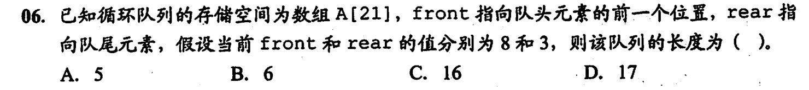

答：C

存储空间是数组A[21],说明空间大小是MaxSize = 21；

rear指向队尾元素，front指向队头元素前一个位置 ==  rear指向队尾元素下一个的位置，front指向队头元素

所以 长度length = rear + MaxSize - front


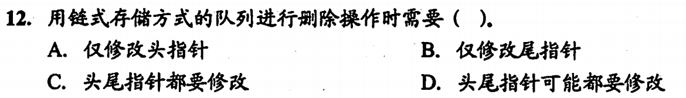

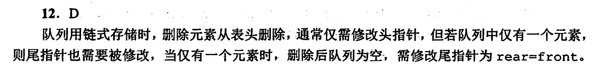

一般情况下队列不为空，删除操作只要修改头指针：head -> next  = head -> next -> next;

但是只有一个元素的时候，尾指针也要修改: head -> next = NULL; rear = head;


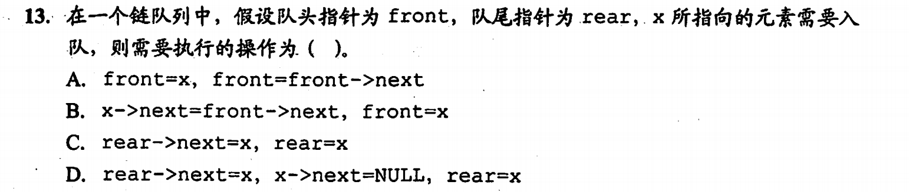

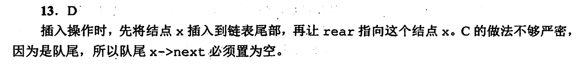

读题要认真！！！！！！！做法要严谨！！！！！！ 在复习一遍：

入队操作有三步: rear -> next = x; x -> next = NULL; rear = x;


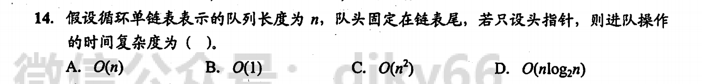

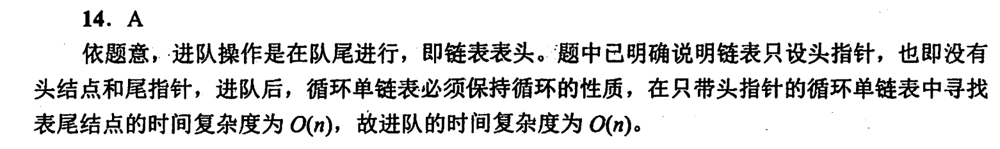

进队操作在队尾！！！！！！出队操作在队头！！！！

出队是O(1), 入队是O(n)


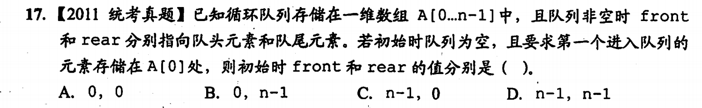

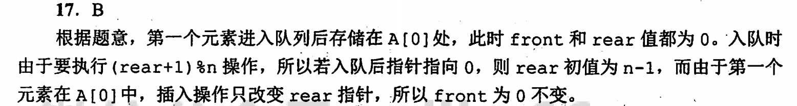


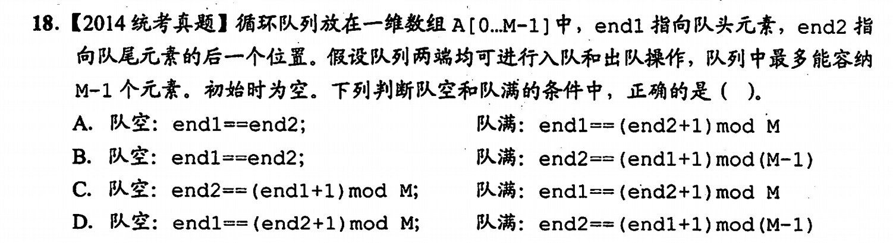

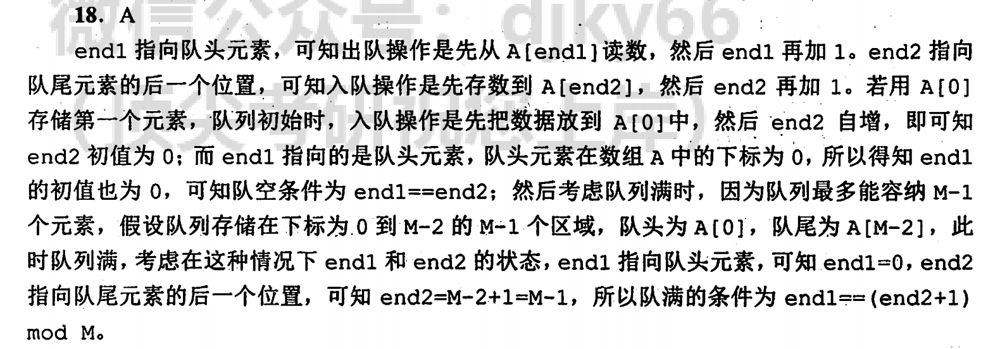

答：A

若存放一个元素A[0]，end1为0，end2为1，所以没有元素（队空）的时候，end1==end2

若队满，end1 = 0，end2 = m-1，所以条件为end1 == (end2+1) mod M


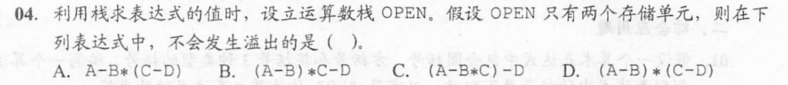

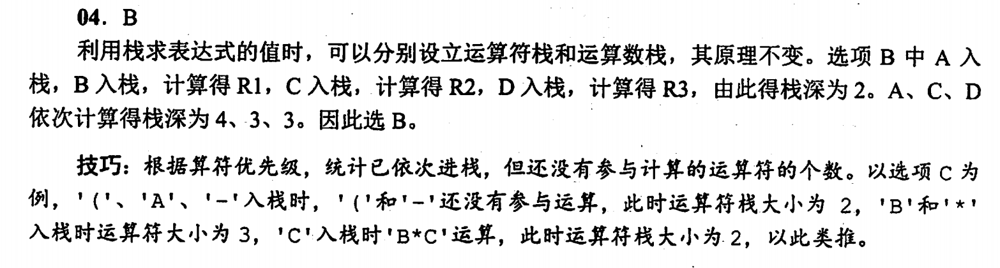

答：A. ABCD- * -    B. AB-C * D-     C. ABC * -D-    D. AB-CD-*

将ABCD四个后缀表达式写出来，会发现只有B最多两个数存在栈里


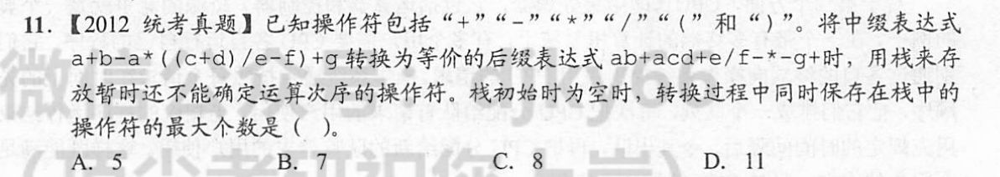

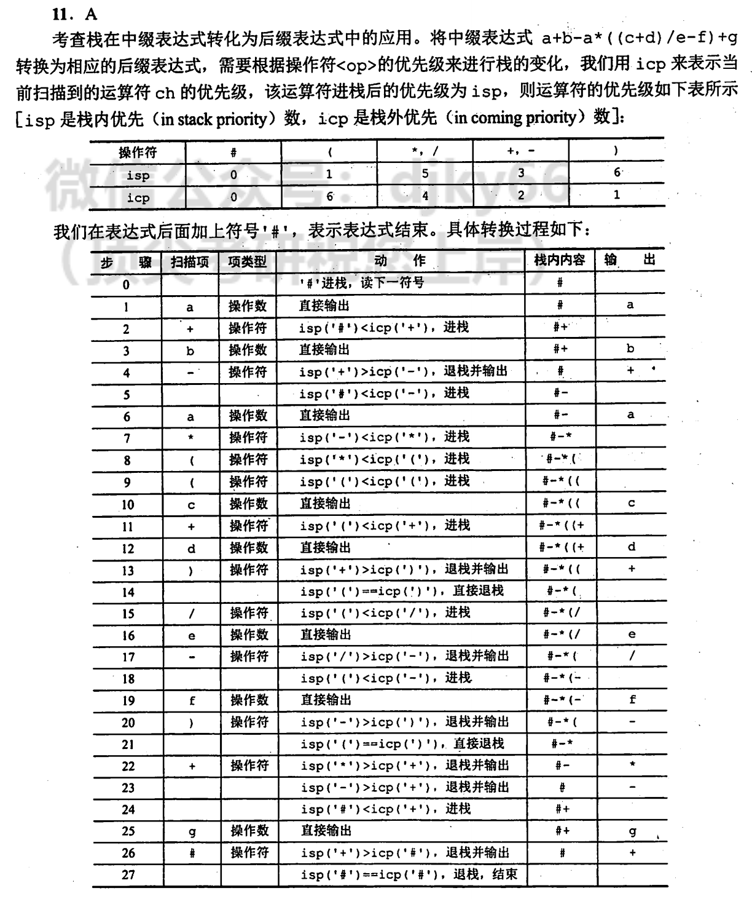

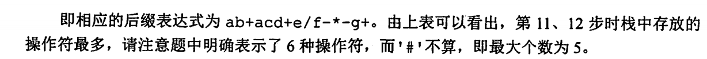


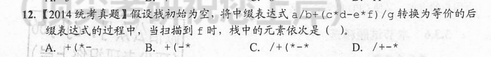

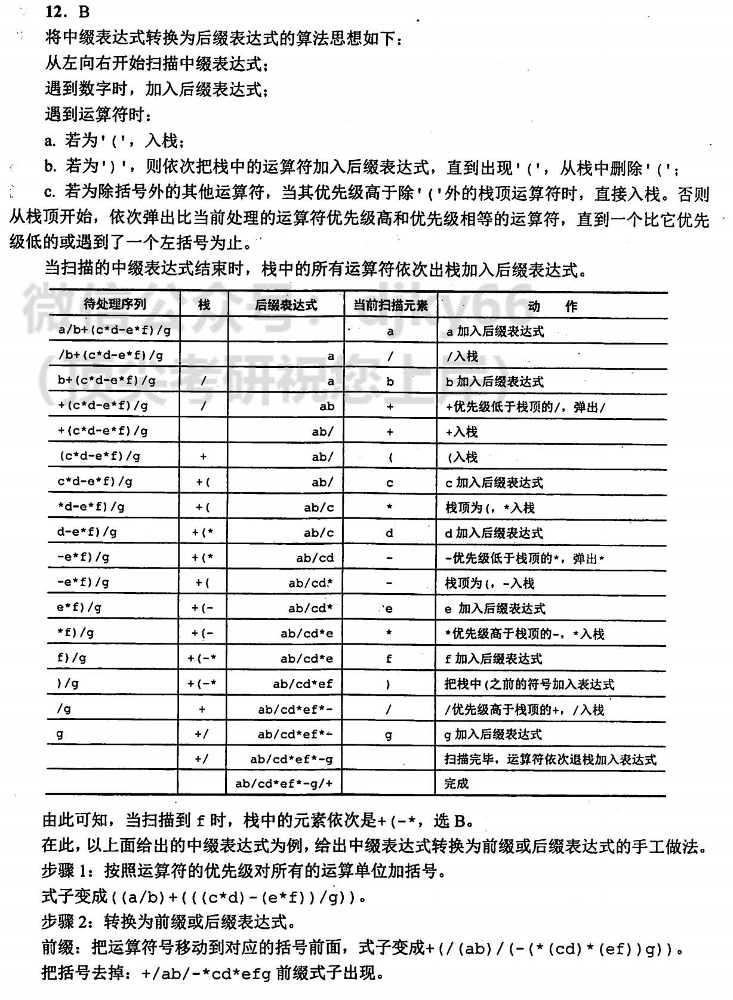

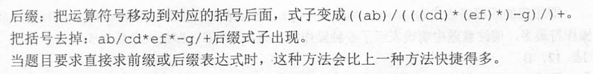

