# 线性表

## 做题总结

### 技巧

- 一定要读完所有选项，考虑周全
- 每个选项加以验证，有些明显感觉错的选项可能是判断失误
- ......

### 易错点

- p、q所指指针：p、q是指针，其实就是所指的元素，不是指后继节点
- 数组排序的最好时间复杂度：O(nlog2n)      链表排序的最好时间复杂度：O(n2)
- 顺序存储结构同样适用于图和树
- 顺序表长度为n的意思应该是存了n个 不是数组长度为n       因为顺序表只能一个接一个的存取
- 取线性表第i个元素的时间与i的大小：顺序表    无关；链表    有关
- 在长度为n的有序单链表中插入一个新节点并且保持有序，时间复杂度是O(N)
- 长度为n的单链表接到长度为m的单链表后面，时间复杂度是O(M)
- 各种结构优点：
  - 顺序表：表长可估计，查询（搜索）操作较多（或者只删除、增加表尾元素）
  - 单链表：表长难以预估，经常要增加/删除元素
  - 双链表：访问前后相邻节点更加灵活，方便插入和删除数据
  - 循环单链表：带有尾指针的循环单链表访问头节点和尾节点很方便（可是删除最后一个元素不方便）
  - 循环双链表：插入和删除最后一个元素很方便
- 有时候会使用带有尾指针的循环单链表，这样访问头节点和尾节点就很方便
- **带头节点的循环单链表**当head->next->next = head时，长度可能为0或1
- **设有头指针和尾指针的单链表**执行删除最后一个元素的操作与链表长度有关，因为要进行遍历寻找尾节点前一个节点
- **带头节点的双循环链表**在末尾插入和删除节点最方便
- **只有头节点没有尾节点的循环双链表**删除第一个元素，删除最后一个元素，在第一个元素前面插入新元素，在最后一个元素之后插入新元素最方便


## 知识总结

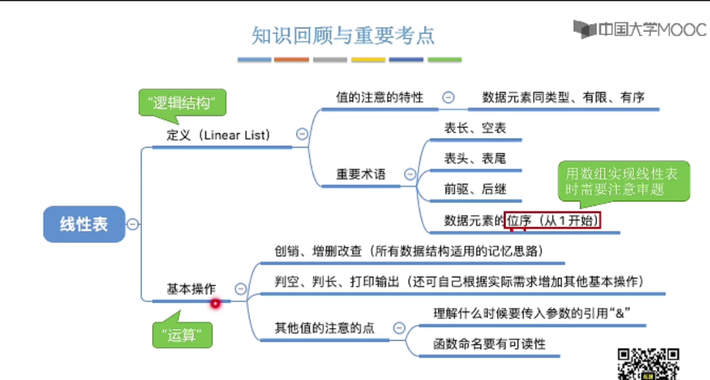

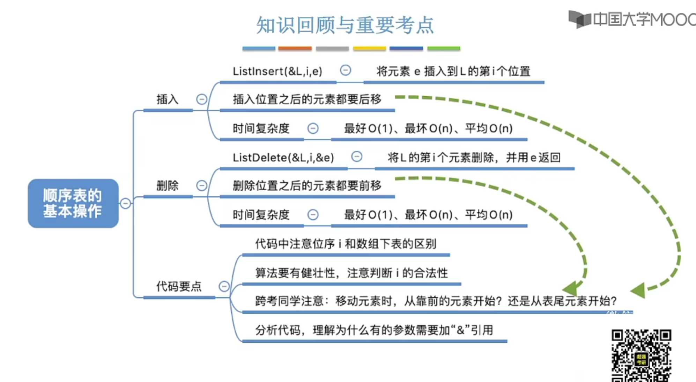

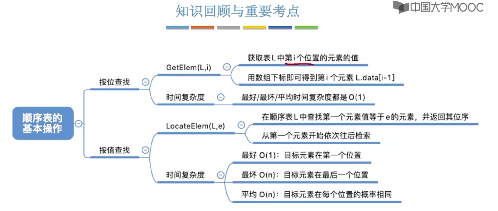

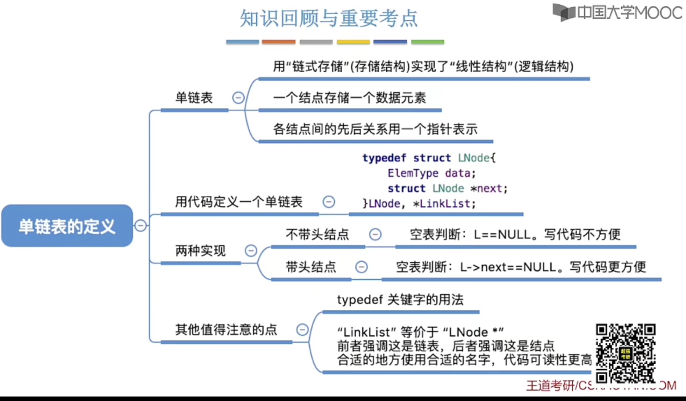

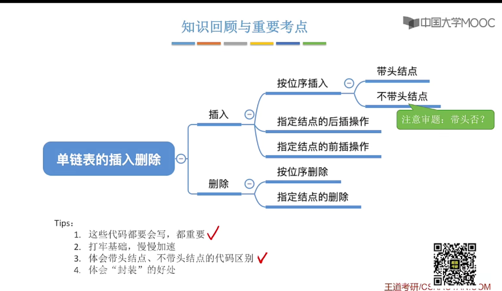

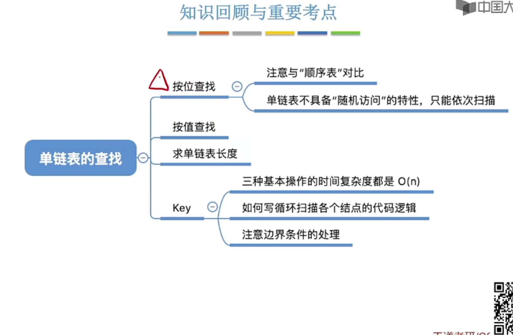

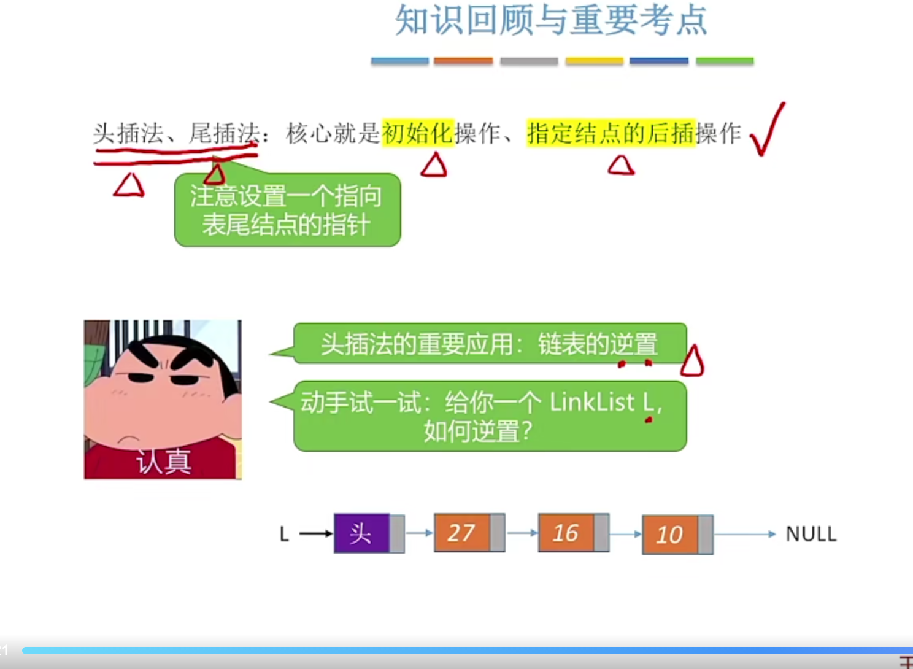

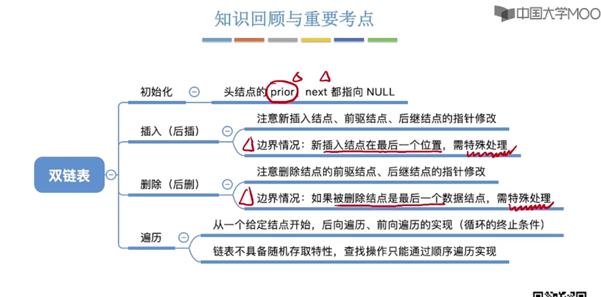

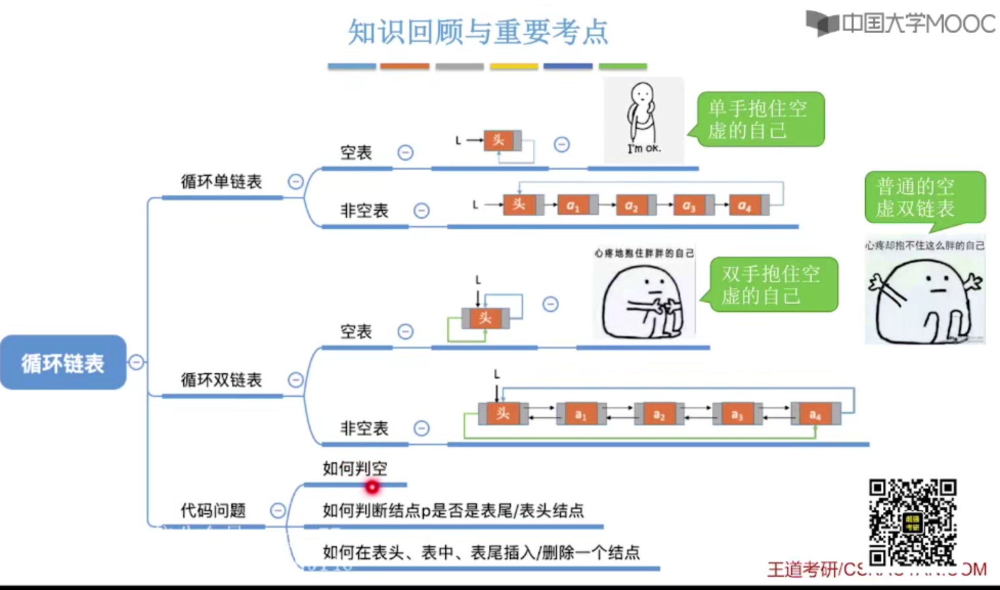


## 顺序表

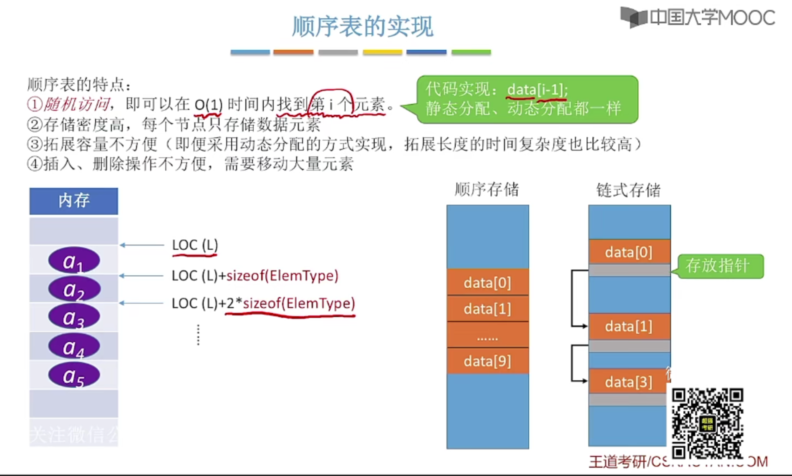

### 静态实现

```c++
#include <stdio.h>
#define MaxSize 10
typedef struct{
    int data[MaxSize];
    int length;
}SqList;

void InitList(SqList &L){
    for(int i = 0; i < MaxSize; i ++)
        L.data[i] = 0;
    
    L.length = 0;
}

int main(){
    SqList l;
    InitList(l);
    for(int i = 0; i < MaxSize; i ++) {
        printf("%d\n", l.data[i]);
    }
}
    
```

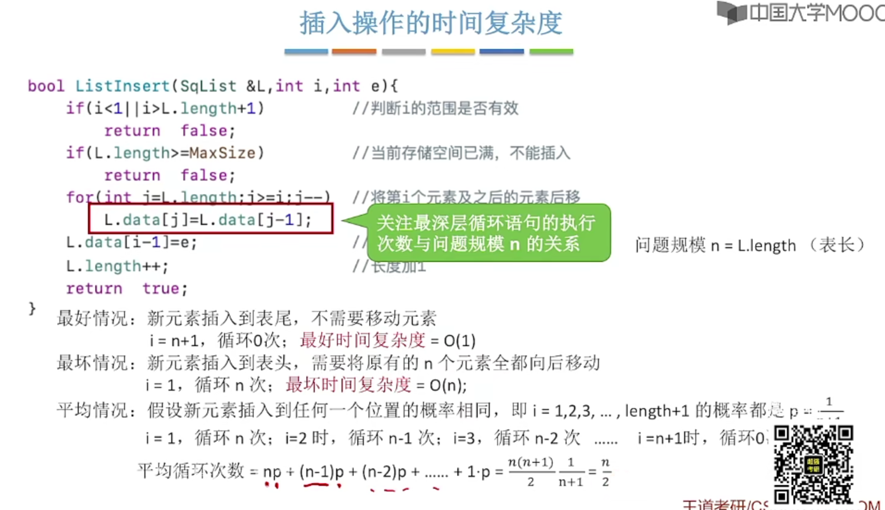

### 动态实现

```c++
#define InitSize 10
#include <stdio.h>
#include <stdlib.h>

typedef struct{
    int *data;
    int MaxSize;
    int length;
}SeqList;

void InitList(SeqList &L){
    //申请一片连续的存储空间
    L.data = (int *)malloc(InitSize * sizeof(int));
    L.length = 0;
    L.MaxSize = InitSize;
}

//增加动态数组长度
void IncreaseSize(SeqList &L, int len){
    //数据备份
    int *p=L.data;
    //空间申请
    L.data = (int *)malloc((L.MaxSize+len) * sizeof(int));
    //数据复制
    for(int i = 0; i <L.length;i++){
        L.data[i]=p[i];
    }
    //长度增加
    L.MaxSize=L.MaxSize+len;
    //空间释放
    free(p);
}

int main(){
    SeqList l;
    InitList(l);
    IncreaseSize(l,5);
    printf("%d", l.MaxSize);
    return 0;
}
```


## 链表

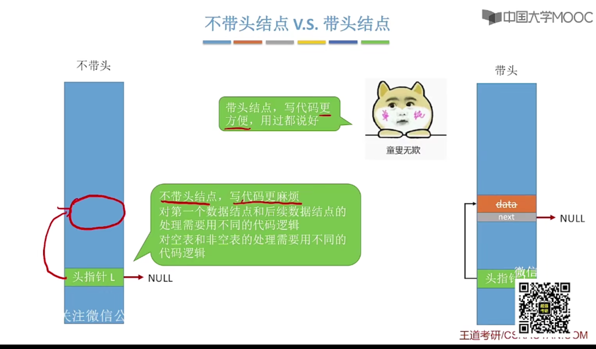


### 单链表（带头节点和不带头节点）

#### 结构体定义

```C++
typedef struct LNode{
    ElemType data;
    struct LNode *next;
}LNode, *LinkList;
```

#### 初始化

```C++
//初始化链表(不带头节点)
bool InitList(LinkList &L){
    L = NULL;
    return true;
}

//初始化链表（带头节点）
bool InitList2(LinkList &L){
    L = (LNode *) malloc(sizeof(LNode));
    if(L==NULL) return false;
    L -> next = NULL;
    return true;
}
```

#### 创建链表传入值

#### 头插法

```C++
//头插法可以实现链表逆置
//逆向建立单链表 头插法（带头节点）
LinkList List_HeadInsert(LinkList &L){
    LNode *s;
    int x;
    L = (LinkList)malloc(sizeof(LNode));
    L ->next = NULL;
    scanf("%d", &x);
    while(x != 9999){
        s = (LNode *)malloc(sizeof(LNode));
        s -> data = x;
        s ->next = L ->next;
        L ->next = s;
        scanf("%d", &x);
    }
    return L;
}
```

#### 尾插法

```C++
//正向建立单链表 尾插法
LinkList List_TailInsert2(LinkList &L){
    ElemType x;

    //建立头节点
    L = (LinkList)malloc(sizeof(LNode));
    L ->next = NULL;
    //r为表尾节点
    LNode *s, *r = L;

    scanf("%d", &x);
    while(x != 9999){
        //s为一个新申请的节点
        s = (LNode *)malloc(sizeof(LNode));
        s ->data = x;
        r ->next = s;
        //r指向新的表尾节点s
        r = s;
        scanf("%d", &x);
    }

    //尾节点指针后续
    r ->next = NULL;
    return L;

}

```

#### 判断是否为空

```c++
//判断是否空表（不带头节点）
bool Empty(LinkList L){
    //return (L == NULL);
    if(L == NULL) return true;
    else return false;
}

//判断是否为空表（带头节点）
bool Empty2(LinkList L){
    return (L ->next == NULL);
}
```

#### 求长度

```C++
//求表长度(有头节点)
int Length2(LinkList L){
    int len = 0;
    LNode *p = L;
    while(p ->next != NULL){
        len ++;
        p = p->next;
    }
    return len;
}
```

#### 查询

#### 按值查询

```c++
//按值查找，找到数据==e的节点(有头节点)
LNode *LocateElem(LinkList L, ElemType e){
    LNode *p = L ->next;
    while(p != NULL && p->data != e) p = p->next;
    return p;
}

//按值查找，找到数据==e的节点的位置
int LocateElem2(LinkList L, ElemType e){
    int i = 1;
    LNode *p = L ->next;
    while(p != NULL && p->data != e) p = p->next, i++;
    if(i > Length2(L)) return 0;
    else return i;
}


```

#### 按位查找

```C++
//按位查找,返回第i个元素（带头节点）
LNode *GetElem2(LinkList L, int i){
    if(i < 0) return NULL;
    LNode *p;
    int j = 0;
    p = L;
    while(p != NULL && j < i){
        p = p -> next;
        j ++;
    }
    return p;
}
LNode *GetElem3(LinkList L, int i){
    int j = 1;
    LNode *p = L -> next;
    if(i == 0) return L;
    if(i < 1) return L;
    while(p != 0 && j<i){
        p = p->next;
        j++;
    }
    return p;

}
```

#### 插入操作

```C++
//前插操作
bool InsertPriorNode(LNode *p, ElemType e){
    if(p == NULL) return false;
    
    LNode *s = (LNode *)malloc(sizeof(LNode));
    if(s == NULL) return false;

    s ->next = p ->next;
    s ->data = p ->data;
    p ->next = s;
    p ->data = e;
    return true;
}

//后插操作
bool InsertNextNode(LNode *p, ElemType e){
    if(p == NULL) return false;

    LNode *s = (LNode *)malloc(sizeof(LNode));
    if(s == NULL) return false;//内存分配失败

    s ->data = e;
    s ->next = p -> next;
    p ->next = s;
    return true;
}
```

#### 在第i个位置插入

```C++
//在第i个位置插入e（带头节点）
bool ListInsert(LinkList &L, int i, ElemType e){
    if(i <1) return false;
    //判断第一个节点单独操作
    if(i ==1){
        LNode *s = (LNode *)malloc(sizeof(ElemType));
        s -> data = e;
        s -> next = L;
        L = s;
        return true;
    }

    //搜索
    LNode *p;
    int j = 1;
    p = L;
    while(p != NULL && j < i - 1){
        p = p -> next;
        j ++;
    }

    //插入
    if(p == NULL) return false;
    LNode *s = (LNode *)malloc(sizeof(ElemType));
    s ->data = e;
    s ->next = p -> next;
    p ->next = s;
    return true;
}

//在第i个位置插入e（带头节点）
bool ListInsert2(LinkList &L, int i, ElemType e){
    //判断合法性
    if(i < 1) return false;

		//搜索操作
    //指针p指向扫描的节点，j指向位序
    LNode *p;
    int j = 0;
    p = L;
    while(p != NULL && j < i-1){
        p = p->next;
        j++;
    }

    //检验第i-1个的节点是否为空
    if(p == NULL) return false;

    //插入操作
    LNode *s = (LNode *) malloc(sizeof(LNode));
    s -> data = e;
    s -> next = p ->next;
    p -> next = s;
    return true;
}

//在第i个位置插入e（带头节点）
bool ListInsertPlus2(LinkList &L, int i, ElemType e){
    //判断合法性
    if(i < 1) return false;

    //搜索操作
    LNode *p = GetElem2(L, i-1);

    //插入
    return InsertNextNode(p,e); 
}
```

#### 删除

```C++
//删除指定节点
bool DeleteNode(LNode *p){
    if(p == NULL) return false;
    LNode *q = p ->next;

    //如果p节点是最后一个节点，存在bug（空指针异常）
    p -> next = q -> next;
    p -> data = q ->data;
    free(q);
    return true;
}
```

#### 查找删除某个节点并返回值

```C++
//删除第i个节点并返回数据（有头节点）
bool ListDelete2(LinkList &L, int i, ElemType &e){
    //判断合法性
    if(i < 1) return false;

    // //搜索操作
    // LNode *p = GetElem2(L, i-1);

    //寻找第i-1个节点
    LNode *p;
    int j = 0;
    p = L;
    while(p != NULL && j < i -1){
        p = p->next;
        j++;
    }

    if(p == NULL) return false;
    if(p ->next == NULL) return false;

    //删除并且返回数据
    LNode *q = p ->next;
    e = q ->data;
    p ->next = q ->next;
    free(q);
    return true;
}
```

#### 总代码（可执行）

```C++
#include <stdio.h>
#include <stdlib.h>

#define ElemType int

/*
    单链表的局限性：无法逆向检索，有时候不太方便
*/

typedef struct LNode{
    ElemType data;
    struct LNode *next;
}LNode, *LinkList;

//初始化链表(不带头节点)
bool InitList(LinkList &L){
    L = NULL;
    return true;
}

//初始化链表（带头节点）
bool InitList2(LinkList &L){
    L = (LNode *) malloc(sizeof(LNode));
    if(L==NULL) return false;
    L -> next = NULL;
    return true;
}

//求表长度(有头节点)
int Length2(LinkList L){
    int len = 0;
    LNode *p = L;
    while(p ->next != NULL){
        len ++;
        p = p->next;
    }
    return len;
}

//判断是否空表（不带头节点）
bool Empty(LinkList L){
    //return (L == NULL);
    if(L == NULL) return true;
    else return false;
}

//判断是否为空表（带头节点）
bool Empty2(LinkList L){
    return (L ->next == NULL);
}


//按值查找，找到数据==e的节点
LNode *LocateElem(LinkList L, ElemType e){
    LNode *p = L ->next;
    while(p != NULL && p->data != e) p = p->next;
    return p;
}

//按值查找，找到数据==e的节点的位置
int LocateElem2(LinkList L, ElemType e){
    int i = 1;
    LNode *p = L ->next;
    while(p != NULL && p->data != e) p = p->next, i++;
    if(i > Length2(L)) return 0;
    else return i;
}

//按位查找,返回第i个元素（带头节点）
LNode *GetElem2(LinkList L, int i){
    if(i < 0) return NULL;
    LNode *p;
    int j = 0;
    p = L;
    while(p != NULL && j < i){
        p = p -> next;
        j ++;
    }
    return p;
}
LNode *GetElem3(LinkList L, int i){
    int j = 1;
    LNode *p = L -> next;
    if(i == 0) return L;
    if(i < 1) return L;
    while(p != 0 && j<i){
        p = p->next;
        j++;
    }
    return p;

}


//前插操作
bool InsertPriorNode(LNode *p, ElemType e){
    if(p == NULL) return false;
    
    LNode *s = (LNode *)malloc(sizeof(LNode));
    if(s == NULL) return false;

    s ->next = p ->next;
    s ->data = p ->data;
    p ->next = s;
    p ->data = e;
    return true;
}

//后插操作
bool InsertNextNode(LNode *p, ElemType e){
    if(p == NULL) return false;

    LNode *s = (LNode *)malloc(sizeof(LNode));
    if(s == NULL) return false;//内存分配失败

    s ->data = e;
    s ->next = p -> next;
    p ->next = s;
    return true;
}

//在第i个位置插入e（带头节点）
bool ListInsert(LinkList &L, int i, ElemType e){
    if(i <1) return false;
    //判断第一个节点单独操作
    if(i ==1){
        LNode *s = (LNode *)malloc(sizeof(ElemType));
        s -> data = e;
        s -> next = L;
        L = s;
        return true;
    }

    //搜索
    LNode *p;
    int j = 1;
    p = L;
    while(p != NULL && j < i - 1){
        p = p -> next;
        j ++;
    }

    //插入
    if(p == NULL) return false;
    LNode *s = (LNode *)malloc(sizeof(ElemType));
    s ->data = e;
    s ->next = p -> next;
    p ->next = s;
    return true;

    //插入
    //return InsertNextNode(p,e);
}

//在第i个位置插入e（带头节点）
bool ListInsert2(LinkList &L, int i, ElemType e){
    //判断合法性
    if(i < 1) return false;

    // //搜索操作
    // LNode *p = GetElem2(L, i-1);

    //指针p指向扫描的节点，j指向位序
    LNode *p;
    int j = 0;
    p = L;
    while(p != NULL && j < i-1){
        p = p->next;
        j++;
    }

    //插入
    //return InsertNextNode(p,e); 

    //检验第i-1个的节点是否为空
    if(p == NULL) return false;

    //插入操作
    LNode *s = (LNode *) malloc(sizeof(LNode));
    s -> data = e;
    s -> next = p ->next;
    p -> next = s;
    return true;
}

//在第i个位置插入e（带头节点）
bool ListInsertPlus2(LinkList &L, int i, ElemType e){
    //判断合法性
    if(i < 1) return false;

    //搜索操作
    LNode *p = GetElem2(L, i-1);

    //插入
    return InsertNextNode(p,e); 
}

//删除第i个节点并返回数据（有头节点）
bool ListDelete2(LinkList &L, int i, ElemType &e){
    //判断合法性
    if(i < 1) return false;

    // //搜索操作
    // LNode *p = GetElem2(L, i-1);

    //寻找第i-1个节点
    LNode *p;
    int j = 0;
    p = L;
    while(p != NULL && j < i -1){
        p = p->next;
        j++;
    }

    if(p == NULL) return false;
    if(p ->next == NULL) return false;

    //删除并且返回数据
    LNode *q = p ->next;
    e = q ->data;
    p ->next = q ->next;
    free(q);
    return true;
}

//删除指定节点
bool DeleteNode(LNode *p){
    if(p == NULL) return false;
    LNode *q = p ->next;

    //如果p节点是最后一个节点，存在bug（空指针异常）
    p -> next = q -> next;
    p -> data = q ->data;
    free(q);
    return true;
}

//正向建立单链表 尾插法
LinkList List_TailInsert2(LinkList &L){
    ElemType x;

    //建立头节点
    L = (LinkList)malloc(sizeof(LNode));
    L ->next = NULL;
    //r为表尾节点
    LNode *s, *r = L;

    scanf("%d", &x);
    while(x != 9999){
        //s为一个新申请的节点
        s = (LNode *)malloc(sizeof(LNode));
        s ->data = x;
        r ->next = s;
        //r指向新的表尾节点s
        r = s;
        scanf("%d", &x);
    }

    //尾节点指针后续
    r ->next = NULL;
    return L;

}

//头插法可以实现链表逆置
//逆向建立单链表 头插法（带头节点）
LinkList List_HeadInsert(LinkList &L){
    LNode *s;
    int x;
    L = (LinkList)malloc(sizeof(LNode));
    L ->next = NULL;
    scanf("%d", &x);
    while(x != 9999){
        s = (LNode *)malloc(sizeof(LNode));
        s -> data = x;
        s ->next = L ->next;
        L ->next = s;
        scanf("%d", &x);
    }
    return L;
}

//打印整个链表
void PrintList(LinkList L){
    LNode *p = L -> next;
    while(!Empty(p)){
        printf("%d  ", p->data);
        p = p->next;
    }
    printf("\n");
}

int main(){

    LinkList l;
    l = List_TailInsert2(l);
    PrintList(l);
    printf("Select what you want: \n");
    printf("    1.Search\n    2.Insert\n    3.Delete\n");
    int choise;
    scanf("%d", &choise);
    while(choise != 0){
        if(choise == 1){
            printf("        1.Search by value, please enter the value you want:\n        2. Search by location, please enter the location you want:\n");
            int choise2, a, b;
            scanf("%d%d", &choise2, &a);
            if(choise2 == 1){
                b = LocateElem2(l,a);
                printf("The location is %d\n", b);
            } 
            else if(choise2 == 2){
                b = GetElem2(l, a) -> data;
                printf("The value is %d\n", b);
            } 
            else printf("Error enter!\n");
        }
        else if(choise == 2){
            printf("        Please enter the loaction and the value you want to Insert\n");
            int a, b;
            scanf("%d%d", &a, &b);
            if(ListInsert2(l, a, b)) printf("Insert Successfull!!\n");
            else printf("Error Insert!!\n");
        }
        else if(choise == 3){
            printf("        Please enter the loaction you want to delete:\n");
            int loc, value;
            scanf("%d", &loc);
            if(ListDelete2(l, loc, value)) printf("The value deleted is %d, delete successfully!!\n", value);
            else printf("Error delete!!!\n");
        }
        PrintList(l);
        printf("Select what you want: \n");
        printf("    1.Search\n    2.Insert\n    3.Delete\n    0.exit\n");
        scanf("%d", &choise);
    }
    

}
```


### 双链表

#### 结构体定义

```C++
typedef struct DNode{
    ElemType data;
    struct DNode *prior,*next;
}DNode, *DLinkList;
```

#### 初始化

```C++
//初始化
bool InitDLinkList(DLinklist &L){
    L = (DNode *) malloc(sizeof(DNode));
    if(L==NULL) return false;
    L -> prior = NULL;
    L -> next = NULL;
    return true;
}
```

#### 插入

```C++
//插入 将p节点之后插入s节点
bool InsertNextDNode(DNode *p, DNode *s){
    if(p == NULL || s == NULL) return false;
    s ->next = p ->next;
    if(p->next != NULL) p->next->prior = s;
    s ->prior = p;
    p ->next = s;
    return true;
}
```

#### 删除

```C++
//删除 删除p节点的后继节点
bool DeleteNextDNode(DNode *p){
    if(p == NULL) return false;
    DNode *q = p ->next;
    if(q == NULL) return false;
    p->next = q ->next;
    if(q ->next != NULL) q ->next ->prior = p;
    free(q);
    return true;
}
```

#### 销毁

```C++
//销毁双链表
void DestroyList(DLinkList &L){
    //循环释放各个数据节点
    while(L ->next != NULL) DeleteNextDNode(L);
    free(L);
    L=NULL;
}
```

#### 遍历

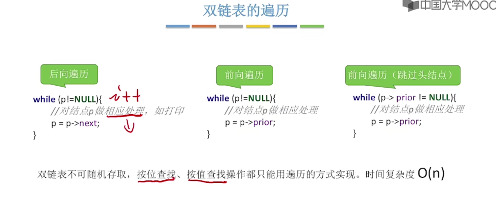

```C++
//遍历
//后向遍历
void Traverse(DLinkList L){
    while(p != NULL){
        //对节点p做相应处理
        p = p->next;
    }
    //前向遍历
    while(p!=NULL){
        //对节点p做相应处理
        p = p ->prior;
    }
    //前向遍历（跳过头节点）
    while(p->prior != NULL){
        p = p->prior;
    }
}
```

#### 总代码（不可执行）

```C++
#include <stdio.h>
#include <stdlib.h>

#define ElemType int

typedef struct DNode{
    ElemType data;
    struct DNode *prior,*next;
}DNode, *DLinkList;

//初始化
bool InitDLinkList(DLinklist &L){
    L = (DNode *) malloc(sizeof(DNode));
    if(L==NULL) return false;
    L -> prior = NULL;
    L -> next = NULL;
    return true;
}

//插入 将p节点之后插入s节点
bool InsertNextDNode(DNode *p, DNode *s){
    if(p == NULL || s == NULL) return false;
    s ->next = p ->next;
    if(p->next != NULL) p->next->prior = s;
    s ->prior = p;
    p ->next = s;
    return true;
}

//删除 删除p节点的后继节点
bool DeleteNextDNode(DNode *p){
    if(p == NULL) return false;
    DNode *q = p ->next;
    if(q == NULL) return false;
    p->next = q ->next;
    if(q ->next != NULL) q ->next ->prior = p;
    free(q);
    return true;
}

//销毁双链表
void DestroyList(DLinkList &L){
    //循环释放各个数据节点
    while(L ->next != NULL) DeleteNextDNode(L);
    free(L);
    L=NULL;
}

//遍历
//后向遍历
void Traverse(DLinkList L){
    while(p != NULL){
        //对节点p做相应处理
        p = p->next;
    }
    //前向遍历
    while(p!=NULL){
        //对节点p做相应处理
        p = p ->prior;
    }
    //前向遍历（跳过头节点）
    while(p->prior != NULL){
        p = p->prior;
    }
}

int main(){
    DLinkList L;
    InitDLinkList(L);

}
```

### 循环链表

#### 循环单链表

```C++
#include <stdio.h>
#include <stdlib.h>

#define ElemType int

/*
    循环单链表：从一个节点出发可以找到其他任何一个节点
*/

typedef struct LNode{
    ElemType data;
    struct LNode *next;
}LNode, *LinkList;

//初始化一个循环单链表
bool InitList(LinkList &L){
    L = (LNode *)malloc(sizeof(LNode));
    if(L==NULL) return false;

    //头节点next指针指向头节点
    L ->next = L;

    return true;
}

//判断循环单链表是否为空
bool Empty(LinkList &L){
    return (L->next == L);
}

//判断节点p是否为循环单链表的表尾节点
bool isTail(LinkList L, LNode *p){
    if(p ->next == L) return true;
    else return false;
}

int main(){
    LinkList l;
    InitList(l);
    printf("%d", Empty(l));

    LNode *p = (LNode *)malloc(sizeof(LNode));
    p = l;
    printf("%d", isTail(l,p));
}
```

#### 循环单链表

```C++
#include <stdio.h>
#include <stdlib.h>

#define ElemType int

/*
    循环双链表
*/

typedef struct DNode{
    ElemType data;
    struct DNode *prior, *next;
}DNode, DLinkList;

//初始化空的循环双链表
bool InitDLinkList(DLinkList &L){
    L = (DNode *)malloc(sizeof(DNode));
    if(L == NULL) return false;
    L ->prior = L;
    L ->next = L;
    return true;
}

//判空
bool Empty(LinkList L){
    return (L ->next == L);
}

//判断是否是尾节点
bool isTail(DLinkList L, DNode *p){
    return (p -> next == L);
}

//在p节点之后插入s节点
bool InsertNextDNode(DNode *p, DNode *s){
    s -> next = p -> next;
    s -> prior = p;
    p -> next -> prior = s;
    p -> next = s; 
    return true;
}

//删除p的后继节点q
bool DeleteNextDNode(DNode *p){
    DNode *q = p ->next;
    p->next = q ->next;
    q ->next ->prior = p;
    free(q);
    return true;
}

int main(){
    DLinkList l;
    InitDLinkList(l);
}
```

### 静态链表

```C++
#include <stdio.h>
#include <stdlib.h>

#define ElemType int
#define MaxSize 10

/*
    静态链表
*/
typedef struct {
    ElemType data;
    int next;
} SLinkList[MaxSize];

void testSLinkList(){
    SLinkList a;
}

//等价于
typedef Node{
    ElemType data;
    int next;
};
typedef struct Node SLinkList[MaxSize];

void testSLinkList(){
    struct Node a[MaxSize];
}


```

[【数据结构】C++实现之静态链表](https://blog.csdn.net/qq_32643313/article/details/105339069)

#### 1、概念
静态链表，也是线性存储结构的一种，它兼顾了顺序表和链表的优点于一身，可以看做是顺序表和链表的升级版。使用静态链表存储数据，数据全部存储在数组中（和顺序表一样），但存储位置是随机的，数据之间"一对一"的逻辑关系通过一个整形变量（称为"游标"，和指针功能类似）维持（和链表类似）。

#### 2、存储结构

```C++
struct Component{
	ElemType data;
	int cur;        //代表游标，为0时无指向
};
typedef Component StaticLinkList[MAXSIZE];   //结构体数组

```

#### 3、初始化
数组中的第一个元素和最后一个元素作为特殊元素处理，不存放数据。通常把数组中未存放数据的元素称为备用链表。而数组的第一个元素，即下表为0的元素的cur存放备用链表的第一个结点的下标；数组中最后一个元素，即下标为（MAXSIZE － 1）的元素的cur存放第一个有数值的元素的下标，相当于单链表中头结点的作用。

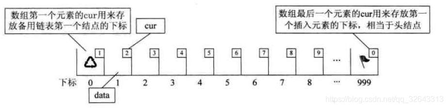

```C++
/*初始化数组线性表，也是将数组链接成备用链表，其中space[0].cur代表头指针*/
Status InitList(StaticLinkList &space)    
{
	for (int i = 0; i < MAXSIZE - 1; i++)
		space[i].cur = i + 1;
	space[MAXSIZE - 1].cur = 0;		//目前静态链表为空，所以最后一元素的cur=0
	return OK;
}
```

#### **4、静态链表插入操作**
1）插入前我们需要考虑，由于要多存入一个元素，那么就要考虑分配空间问题。即从链表中备用空间里拿出一空间，具体如下：

```C++
/*静态链表返回空闲空间下标，也是进行插入元素的准备操作（类似动态链表的分配空间）*/
int Malloc_SL(StaticLinkList space)		//返回分配的结点下标，否则返回0
{
	int i = space[0].cur;				//当前数组第一个元素的cur的值，该值代表备用链表起始位置
	if (space[0].cur)
	{
		space[0].cur = space[i].cur;	//由于要出空闲链表中拿一个空间出来，因此需要将它相邻的空间的下标给头节点的cur
	}
	return i;
}
```

2）插入新元素，具体我们这里举例将在“乙” “丁”中间插入“丙”

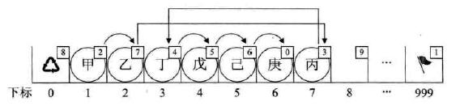

```C++
/*静态链表的插入操作*/
Status Listinsert(StaticLinkList &L, int i, ElemType e)
{
	/*在L链表中第i个元素前面插入新的数据元素*/
	int k, j;
	k = MAXSIZE - 1;		//k为最后一个元素的下标
	if (i<1 || i>ListLength(L) + 1)    //插入位置错误，异常抛出
		return ERROR;
	j = Malloc_SL(L);
	if (j)
	{
		L[j].data = e;                      //将新值放入刚刚知道的空闲下标的数组元素值中

		/*静态链表插入新值时，不会改变插入值在数组中的位置，只会跟新插入前后数据的游标cur值*/
		for (int n = 1; n <= i - 1; n++)	//此时k为第i元素之前的下标
			k = L[k].cur;                  
		L[j].cur = L[k].cur;	//把第i前元素的cur赋值给新元素的cur
		L[k].cur = j;			//再更新第i前元素的cur
		return OK;
	}
	return ERROR;
}

```

#### **5、静态链表删除操作**
1）删除时，需要考虑第一删除位置合不合理？
2）删除元素数据后，数据空间的回收问题，即怎么将它恢复到备用链表中？
3）删除元素的目标链表实际元素数据长度？多长问题
4）就是删除元素的前后元素游标怎么变化?下面以删除“甲”为例

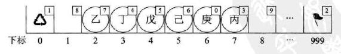

```C++
//将删除节点空间进行回收，回收为备用链表中
void Free_SL(StaticLinkList &space, int k)  //k表示删除元素再链表中的下标
{
	/*如何回收？即将该节点作为备用链表的第1节点*/
	space[k].cur = space[0].cur;          //将头节点中的指向备用链表的第一节点下标赋值为当前节点的游标值
	space[0].cur = k;   //更新头节点游标值
}


/*返回静态链表中数据元素的个数*/
int ListLength(StaticLinkList L)
{
	int count = 0;			//计数器
	int i = L[MAXSIZE - 1].cur;   //得到链表中第1有值元素的下标
	while (i)
	{
		i = L[i].cur;
		count++;
	}
	return count;
}

/*删除L中第i元素的数据e*/
Status ListDelete(StaticLinkList &L, int i)
{
	int j, k;
	if (i<1 || i>ListLength(L))
		return ERROR;
	k = MAXSIZE - 1;
	for (j = 1; j <= i - 1; j++)	//找到第i元素之前元素的下标
		k = L[k].cur;
	j = L[k].cur;                 //第i元素之前元素的游标
	L[k].cur = L[j].cur;		//将第i元素之后的元素的下标 交给 第i前元素的游标
	Free_SL(L, j);
	return OK;
}


```

#### 6.  完整代码

```C++
#include"iostream"
using namespace std;
/*
线性表的操作包括如下几种
（1） InitList(&L)		初始化，构造一个空的线性表
（2） ListEmpty(&L)	判断线性表是否为空,true or flase
（3） ClearList(&L)	清空线性表中的内容
（4） GetElem(&L，i，e)	返回线性表i位置上的元素值，通过e返回
（5） LocateElem(&L,e)		在线性表中找到与e相同的元素，成功则返回其序号，否则返回0表示失败
（9） Listinsert(&L,i,e)	如果线性表存在了，而且i符合条件，则在i位置插入一个元素e
（10）ListDelete(&L,i,)	删除i位置上的元素
（5） ListLength(L)	返回线性表的长度
*/

#define MAXSIZE 1000
#define OK 1
#define ERROR 0
typedef int Status;
typedef int ElemType;
struct Component{
	ElemType data;
	int cur;        //代表游标，为0时无指向
};

typedef Component StaticLinkList[MAXSIZE];   //typedef可以掩饰复合类型，如指针和数组


/*初始化数组线性表，也是将数组链接成备用链表，其中space[0].cur代表头指针*/
Status InitList(StaticLinkList &space)    
{
	for (int i = 0; i < MAXSIZE - 1; i++)
		space[i].cur = i + 1;
	space[MAXSIZE - 1].cur = 0;		//目前静态链表为空，所以最后一元素的cur=0
	return OK;
}


/*静态链表返回空闲空间下标，也是进行插入元素的准备操作（类似动态链表的分配空间）*/
int Malloc_SL(StaticLinkList space)			//返回分配的结点下标，否则返回0
{
	int i = space[0].cur;					//当前数组第一个元素的cur的值，该值代表备用链表起始位置
	if (space[0].cur)
	{
		space[0].cur = space[i].cur;		//由于要出空闲链表中拿一个空间出来，因此需要将它相邻的空间的下标给头节点的cur
	}
	return i;
}

/*返回静态链表中数据元素的个数*/
int ListLength(StaticLinkList L)
{
	int count = 0;			//计数器
	int i = L[MAXSIZE - 1].cur;   //得到链表中第1有值元素的下标
	while (i)
	{
		i = L[i].cur;
		count++;
	}
	return count;
}


/*静态链表的插入操作*/
Status Listinsert(StaticLinkList &L, int i, ElemType e)
{
	/*在L链表中第i个元素前面插入新的数据元素*/
	/*注意：在开展插入操作时，静态链表不能为空链表,至少长度>=1*/
	int k, j;
	k = MAXSIZE - 1;		//k为最后一个元素的下标
	if (i<1 || i>ListLength(L) + 1)    //插入位置错误，异常抛出
		return ERROR;
	j = Malloc_SL(L);
	if (j)
	{
		L[j].data = e;                      //将新值放入刚刚知道的空闲下标的数组元素值中

		/*静态链表插入新值时，不会改变插入值在数组中的位置，只会跟新插入前后数据的游标cur值*/
		for (int n = 1; n <= i - 1; n++)	//此时k为第i元素之前的下标
			k = L[k].cur;                  
		L[j].cur = L[k].cur;	//把第i前元素的cur赋值给新元素的cur
		L[k].cur = j;			//再更新第i前元素的cur
		return OK;
	}
	return ERROR;
}


//将删除节点空间进行回收，回收为备用链表中
void Free_SL(StaticLinkList &space, int k)  //k表示删除元素再链表中的下标
{
	/*如何回收？即将该节点作为备用链表的第1节点*/
	space[k].cur = space[0].cur;          //将头节点中的指向备用链表的第一节点下标赋值为当前节点的游标值
	space[0].cur = k;   //更新头节点游标值
}


/*删除L中第i元素的数据e*/
Status ListDelete(StaticLinkList &L, int i)
{
	int j, k;
	if (i<1 || i>ListLength(L))
		return ERROR;
	k = MAXSIZE - 1;
	for (j = 1; j <= i - 1; j++)	//找到第i元素之前元素的下标
		k = L[k].cur;
	j = L[k].cur;                 //第i元素之前元素的游标
	L[k].cur = L[j].cur;		//将第i元素之后的元素的下标 交给 第i前元素的游标
	Free_SL(L, j);
	return OK;
}


int main()
{
	StaticLinkList  mylist;
	InitList(mylist);				 //初始化静态链表，空闲链表此时，默认头节点为0

	int h = Malloc_SL(mylist);
	mylist[h].cur = 0;				 //初始链表元素存储头节点h=1,
	mylist[h].data = 50;
	mylist[999].cur = h;			//更新数组最后元素的指向的第1元素下标，cur=1

	Listinsert(mylist,1,1);
	Listinsert(mylist, 2, 2);
	Listinsert(mylist, 2, 3);

	//遍历并输出该链表上的所有数据
	cout << "遍历并输出该链表上的所有数据：" << endl;
	int i = mylist[999].cur;
	while (i)
	{
		cout << mylist[i].data << "  ";
		i = mylist[i].cur;
	}
	cout << endl;

	cout << "please hello world!" << endl;


	ListDelete(mylist, 2);         //删除元素
	//遍历并输出该链表上的所有数据
	cout << "遍历并输出该链表上的所有数据：" << endl;
	i = mylist[999].cur;
	while (i)
	{
		cout << mylist[i].data << "  ";
		i = mylist[i].cur;
	}
	cout << endl;

	system("pause");
	return 0;
}
}

```

## 顺序表和链表的比较

### 1.逻辑结构

都属于线性表，都是线性结构

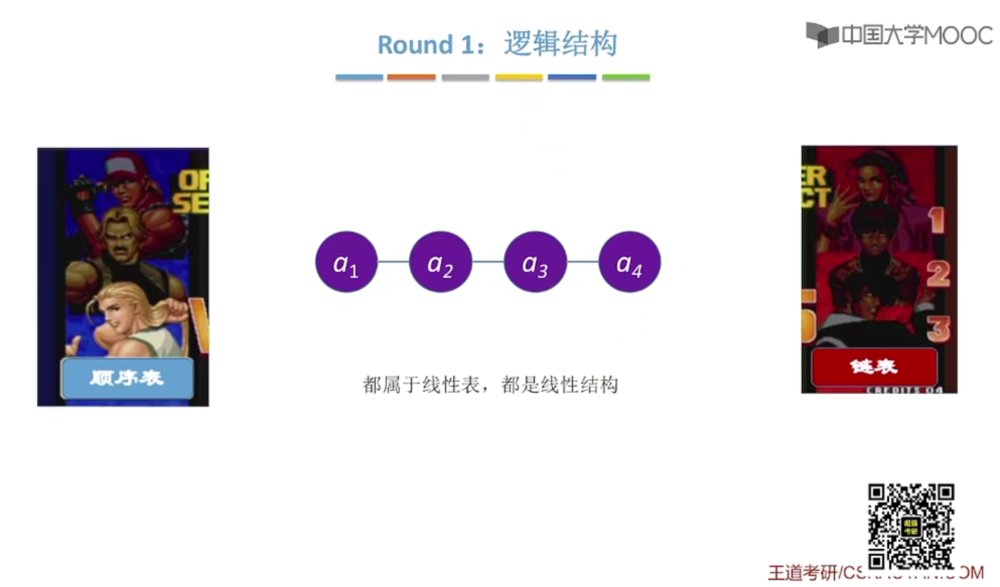

### 2.存储结构

- 顺序表：**（顺序存储结构）**
- 优点：支持随机存取，存储密度高
- 缺点：大片连续空间分配不方便，改变容量不方便


- 链表：**(链式存储结构)**
- 优点：离散的小空间分配方便，改变容量方便
- 缺点：不可随机存取，存储密度低

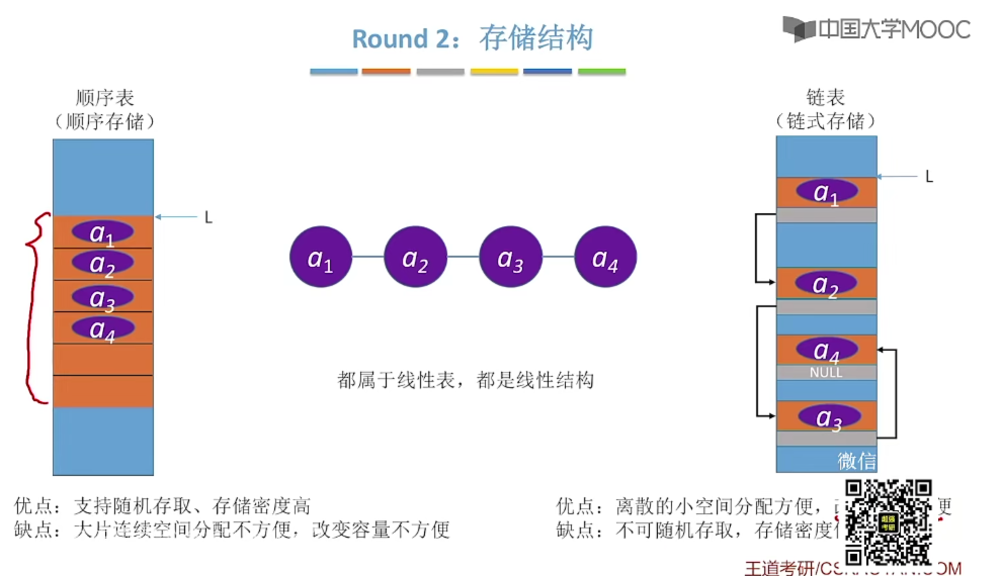

### 3.基本操作

> 创建 销毁 增删改查

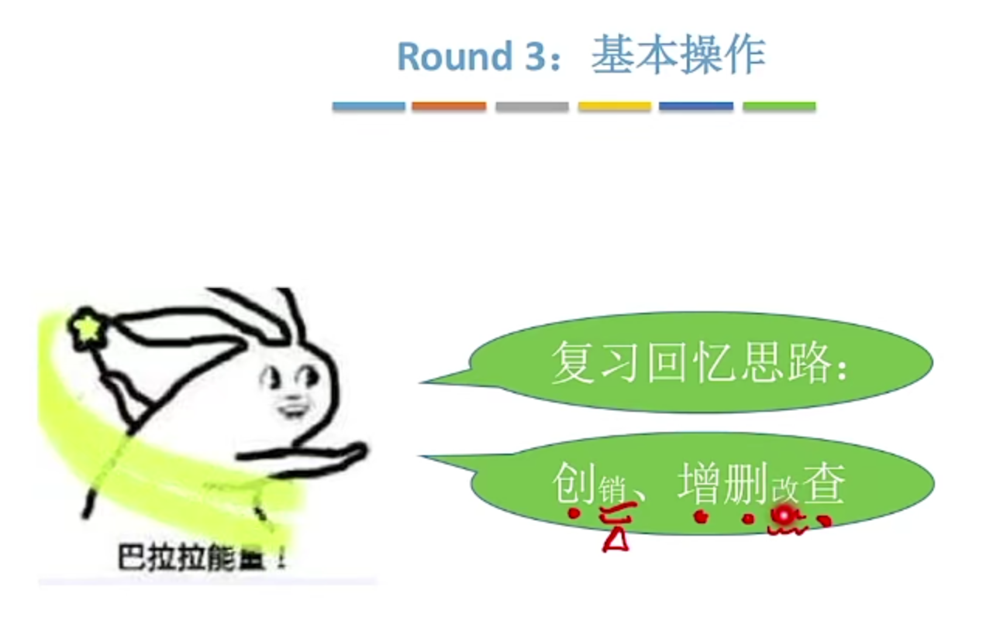

#### 创建

- 顺序表（静态分配：静态数组   动态分配：动态数组）
- 需要预分配大片连续空间。若分配空间过小，则之后不方便拓展容量；若分配空间过大，则浪费内存资源


- 链表
- 只需分配一个头节点（也可以不要头节点，只声明一个头指针）之后方便拓展

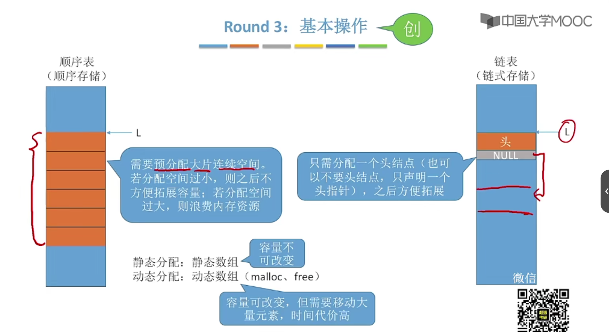

#### 销毁

- 顺序表（静态分配：静态数组   动态分配：动态数组）
- 静态分配：静态数组             系统自动回收空间
- 动态分配：动态数组             需要手动free


- 链表
- 依次删除各个节点（free）

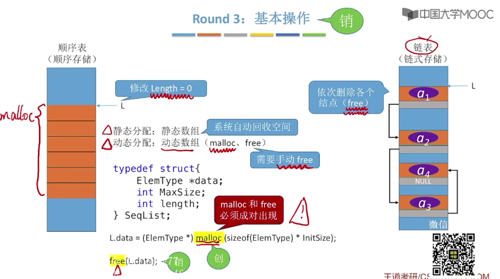

#### 增删

- 顺序表（顺序存储）
- 插入/删除元素要将后续元素都后移/前移
- 时间复杂度O(n)时间开销主要来自移动元素（若数据元素很大，则移动的时间代价很高）


- 链表（链式存储）
- 插入/删除元素只需修改指针即可
- 时间复杂度O(n)，时间开销主要来自查找目标元素（查找元素的时间代价低）

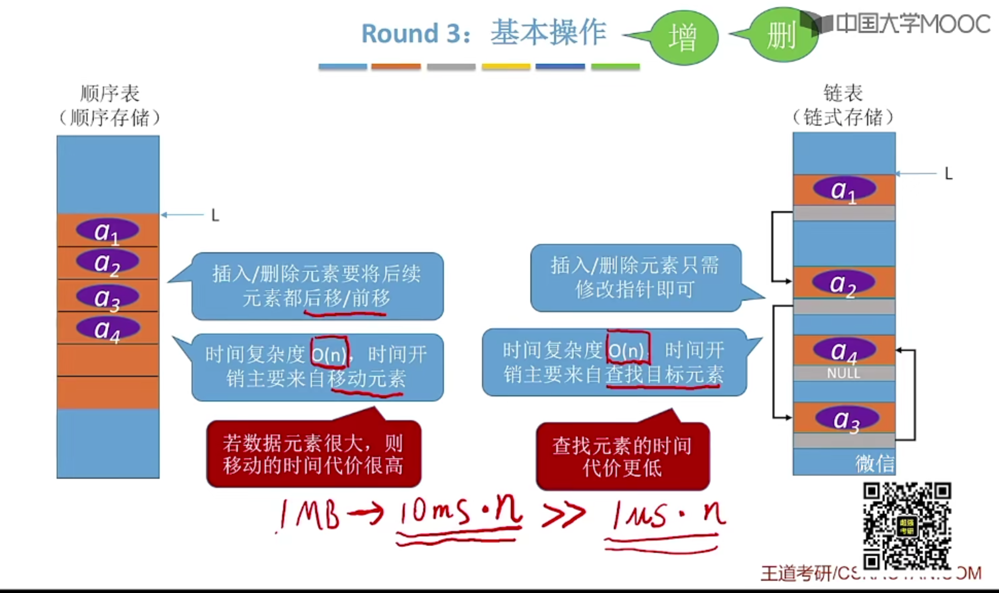

#### 查

- 顺序表（顺序存储）
- 按位查找 O(1)
- 按值查找 O(n) 若表内元素有序，可以在O(log2n)时间内找到


- 链表
- 按位查找：O(n)
- 按值查找：O(n)

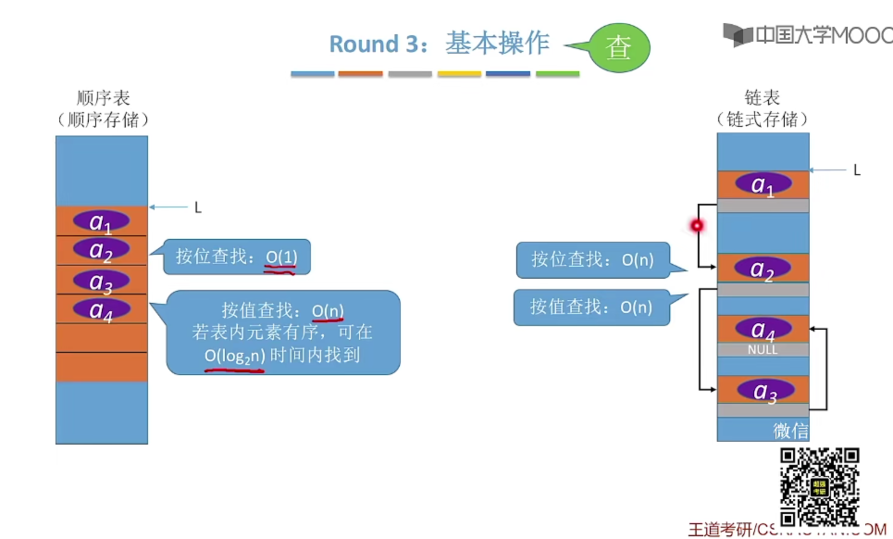

#### 用顺序表还是链表？

- 查：顺序表							表长可估计，查询（搜索）操作较多（或者只删除、增加表尾元素）

- 创建、增、删：链表             表长难以预估，经常要增加/删除元素

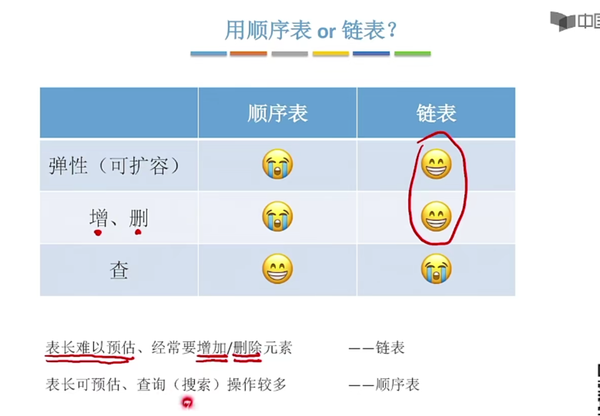

## 题目

### 选择题

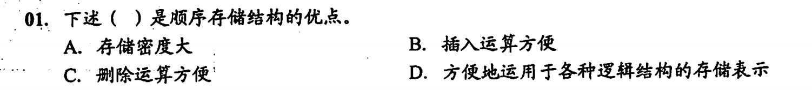

答：A

​		顺序存取结构即顺序表，该题考查顺序表和链表的不同。顺序表不像链表那样，要在节点中存放指针域，因此存储密度更大。

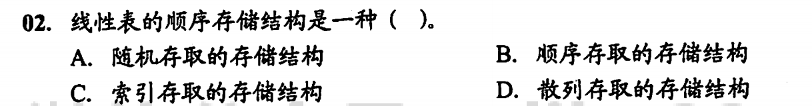

答：A

​		存取方式是指读写方式，顺序表是一种支持随机存取的存储结构，根据起始地址加上元素序号，可以很方便地访问任意一个元素，这就是随机存取的概念。

[数据结构考研:随机存取、顺序存取、随机存储和顺序存储的区别/详细解释(计算机/软件工程/王道论坛)](https://blog.csdn.net/wq6ylg08/article/details/103358596)

#### **1.存取结构:随机存取和顺序存取 **
#### **1.1随机存取**
随机存取（直接存取,Random Access）指的是当存储器中的数据被读取或写入时，**所需要的时间与该数据所在的物理地址无关**。

**随机存取的微观现实例子就是编程语言中的数组。**
随机存取的宏观现实例子就是我们的随机存取存储器(RAM:Random Access Memory)，通俗的说也就是我们电脑的内存条。因为RAM利用电容存储电荷的原理保存信息，所以RAM可以高速存取，且与物理地址无关。

#### **1.2顺序存取**
顺序存取(Sequential Access)是一种按记录的逻辑顺序进行读、写操作的存取方法，**所需要的时间与该数据所在的物理地址有关**。顺序存取表现为:**在存取第N个数据时，必须先访问前（N-1）个数据**。
**顺序存取的微观现实例子就是数据结构中的链表**。
顺序存取的现实例子就是我们的录音磁带、光盘、机械硬盘里面的磁盘。磁带、光盘、磁盘上的数据分别存储在不同扇区、不同磁道上，磁盘的读写磁头通过切换不同扇区和磁道来读取物理地址不连续的数据时，该过程中要经过不同扇区和不同磁道上的无关数据，磁盘的读写磁头在切换不同扇区和磁道所需时间也不同，故为顺序存取。

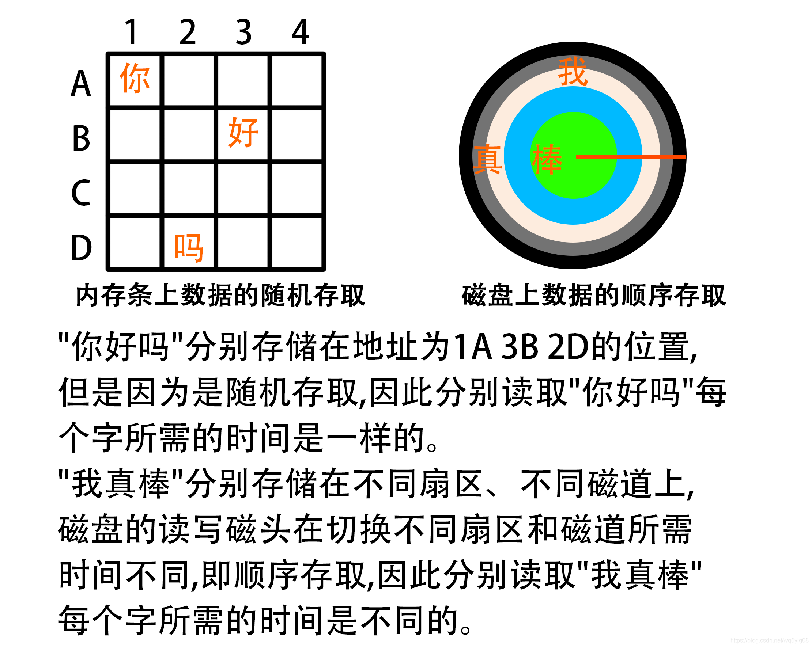

#### 2.存储结构:顺序存储、随机存储

存储结构是数据元素三大组成要素之一，下图是博主对数据元素三要素所画的思维导图。

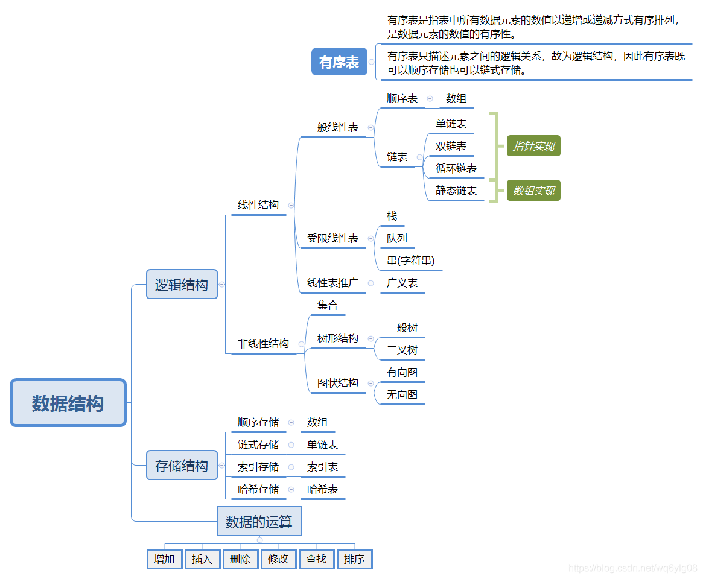

#### 2.1顺序存储
- **顺序存储是把逻辑上相邻的数据元素存储在物理位置上相邻的存储单元中，数据元素之间的逻辑关系由存储单元的邻接关系来体现。**

- 顺序存储的主要优点：
  - 节省存储空间。因为分配给数据的存储单元全用存放数据元素（不考虑c/c++语言中数组需指定大小的情况），数据元素之间的逻辑关系没有占用额外的存储空间。
  - 可实现对数据元素的随机存取(直接存取)。即每一个数据元素对应一个元素下标，由该元素下标可以直接计算出来数据元素的物理存储地址。

- 顺序存储的主要缺点：
  - 不便于数据修改。对数据元素的插入、删除运算时，可能要移动一系列的数据元素。
  - 产生磁盘碎片。因为顺序存储只能使用相邻的一整块存储单元，因此会产生较多的磁盘碎片


顺序存储的典型实例就是编程语言中的`数组`。例如，使用[顺序表](https://so.csdn.net/so/search?q=顺序表&spm=1001.2101.3001.7020)存储集合 {1,2,3,4,5}，数据最终的存储状态如下图所示：

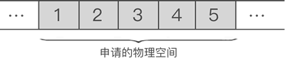

数组中的所有元素存储在一个连续性的内存块中，并通过数组的首地址和元素下标来访问。因此一个数组就是由1个数组首地址和N个数组元素构成，数组不需要像链表一样，链表的每个节点必须存储下一个结点的物理地址，在存储同样多的数据下，数组比链表节省空间。

数组可通过数组的首地址和元素下标来直接存取数组中的没每一个元素，而不需要像链表一样，在存取第N个链表结点的数据时，必须先访问前（N-1）个链表结点。

但对数组的数据元素的插入、删除运算时，可能要移动一系列的数据元素，特别的麻烦，因此顺序存储结构的数组不便于修改。


#### 2.2随机存储
**在计算机中用一组任意的存储单元存储线性表的数据元素（这组存储单元可以是连续的，也可以是不连续的）。**

**它不要求逻辑上相邻的元素在物理位置上也相邻，而是借助指示元素存储地址的指针来表示元素之间的逻辑关系。**

- 顺序存储的主要优点：

  - 不会产生磁盘碎片。因为随机存储不要求逻辑上相邻的元素在物理位置上也相邻，而是借助指示元素存储地址的指针来表示元素之间的逻辑关系，因此不会产生磁盘碎片。

  - 数据修改方便。对数据元素的插入、删除运算时，随机存储不必移动结点，只要改变结点中的指针。

- 顺序存储的主要缺点：
  - 占用空间大。随机存储的每个结点都由数据域和指针域组成，所以相同空间内假设全存满，顺序存储比随机存储可存更多数据。
  - 查找结点时链式存储要比顺序存储慢，且只能实现顺序存取。


**2.2.1 随机存储——链式存储**

链式存储是随机存储最典型的代表，因此链式存储的定义、优点和缺点就是2.2随机存储中的定义、优点和缺点。

**2.2.2 随机存储——索引存储**
除建立存储结点信息外，还建立附加的索引表来标识结点的地址，索引表由若干索引项组成，索引项的一般形式是(关键字，地址)。

索引存储的主要优点：检索速度快。
索引存储的主要缺点：增加了附加的索引表,会占用较多的存储空间。

**2.2.3 随机存储——散列存储**
散列存储，又称Hash存储，是一种将数据元素的存储位置与关键码之间建立确定对应关系的查找技术，即根据元素的关键字直接计算出该元素的存储地址。

- 散列存储的主要优点：检索、增加和删除节点的操作更快。
- 散列存储的主要缺点：若散列函数不好，则可能出现元素存储单元的冲突。

- 散列法存储的基本思想是：由节点的关键码值决定节点的存储地址。散列技术除了可以用于查找外，还可以用于存储。

特点：

散列是数组存储方式的一种发展，相比数组，散列的数据访问速度要高于数组，因为可以依据存储数据的部分内容找到数据在数组中的存储位置，进而能够快速实现数据的访问，理想的散列访问速度是非常迅速的，而不像在数组中的遍历过程，采用存储数组中内容的部分元素作为映射函数的输入，映射函数的输出就是存储数据的位置，这样的访问速度就省去了遍历数组的实现，因此时间复杂度可以认为为O(1)，而数组遍历的时间复杂度为O(n)。


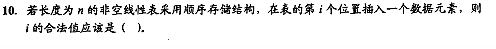


答案： B

线性表元素的序号是从1开始，而在第n+1个位置插入，相当于在表尾追加

长度为n的意思应该是存了n个 不是数组长度为n（呜呜呜呜呜呜）


#### 前驱结点

**前驱结点是指在链表或树等数据结构中，某个节点的前面一个节点。具体来说：**

1. 在链表中，每个节点通常包含一个数据元素和一个指向下一个节点的指针。前驱结点是指在链表中，某个节点的前一个节点，即指向该节点的指针指向的节点。
2. 在树的二叉搜索树（Binary Search Tree）中，前驱结点是指中序遍历顺序中，某个节点的前面一个节点。在中序遍历中，节点按照从小到大的顺序进行访问，前驱结点即是在这个顺序中的前一个节点。

前驱结点的概念主要用于确定节点在某种特定顺序中的前一个节点，可以在某些操作中起到辅助作用。在链表和树等数据结构中，我们可以通过相应的指针或遍历方式来找到节点的前驱结点


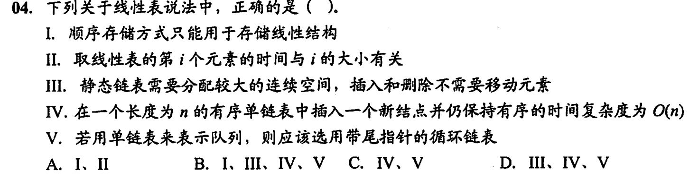

答案：D

​          顺序存储结构同样适用于图和树

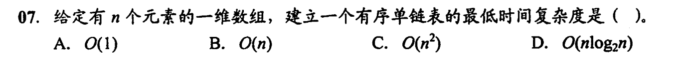

答：D

​       若先建立链表，然后依次插入建立有序表，则每插入一个元素就需要遍历链表寻找插入位置，即直接插入排序，时间复杂度O(N2)

​       若先讲数组进行排序，然后建立链表，建立链表的时间复杂度是O(N)，数组排序的最好时间复杂度是O(Nlog2N)，总时间复杂度是O(Nlog2N)

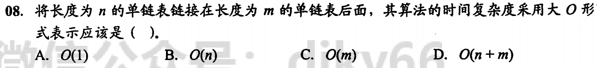

答：C

​		需要先遍历找到长度为m的单链表的尾节点，然后将其next域指向另一个单链表的首节点

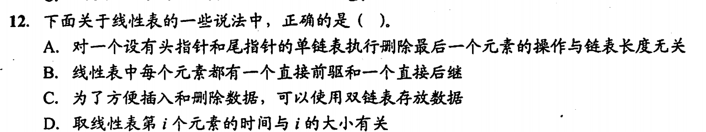

答：C

​		**设有头指针和尾指针的单链表执行删除最后一个元素的操作与链表长度有 关，因为要进行遍历寻找尾节点前一个节点**

​		D选项没有考虑顺序表，数组存放的元素存取与i无关

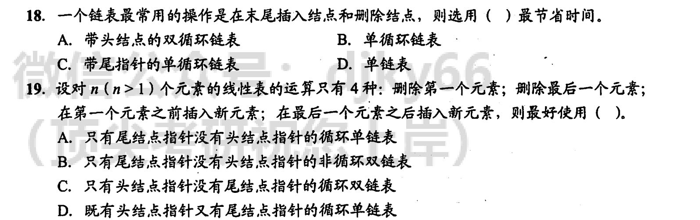

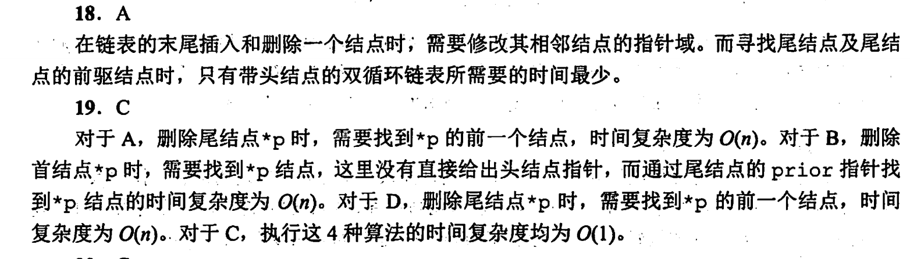

### 论述题


#### 顺序表 VS 链表


#### 顺序表动态数组实现 VS 静态数组实现


